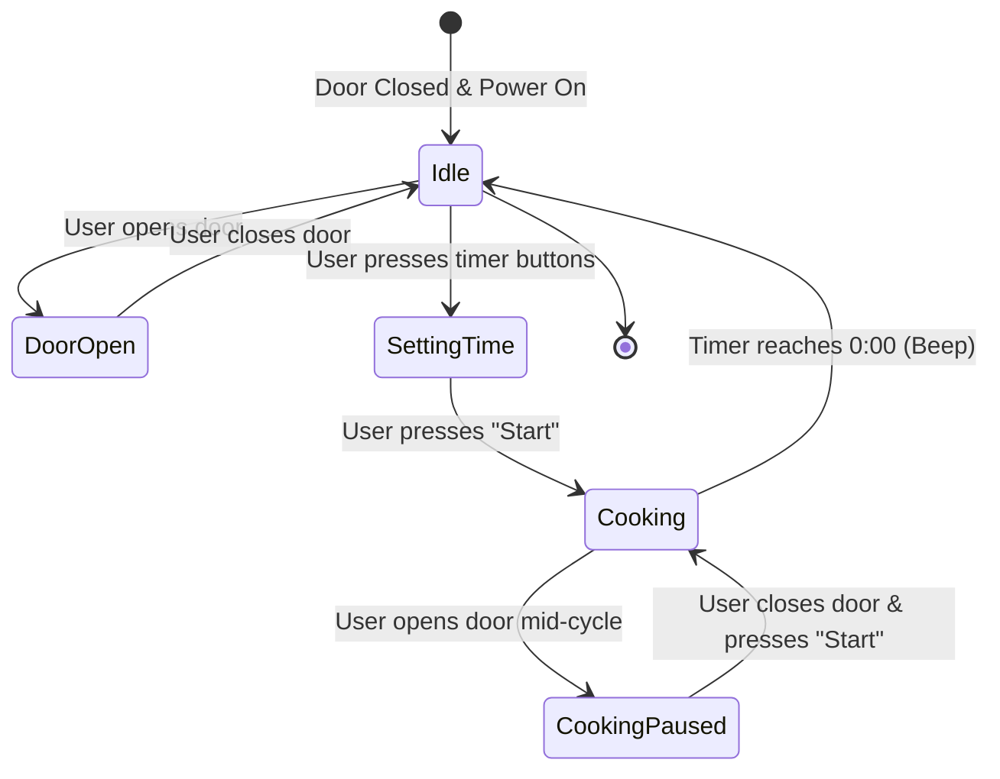
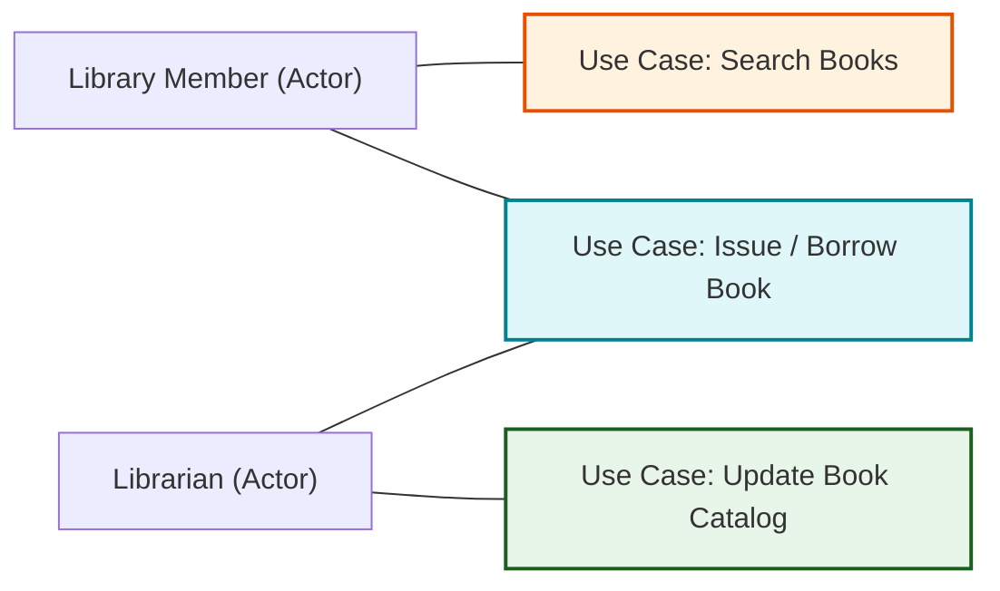

# Unit 2: System Modeling, Architectural Design, & Object-Oriented Design
*(All University Exam Questions & Complete Solutions for Unit 2)*

---

## 1. Short Answer Questions (Part A)

### 1.1 List and identify the worst type of coupling technique and state the reason. *(Sept 2023)*
**Answer:** The worst type of coupling is **Content Coupling (Pathological Coupling)**.
*Reason:* Content coupling occurs when one software module directly accesses, modifies, or depends on the internal private data or internal control flow of another module. This completely violates encapsulation and information hiding principles, making code changes extremely bug-prone.

---

### 1.2 List two purposes of Use Case Diagrams. *(Aug 2025)*
**Answer:**
1.  **Define System Boundaries & Scope:** Illustrates interactions between external actors (users/systems) and internal system services.
2.  **Stakeholder Communication:** Provides a clear, non-technical visual summary of user requirements.

---

### 1.3 What are the benefits of designing and documenting software architecture?
**Answer:** Stakeholder communication, System analysis of NFRs, Large-scale pattern reuse.

---

### 1.4 The Gang of Four defined four essential elements of design patterns. Which are they?
**Answer:** Pattern Name, Problem Description, Solution Description, Consequences.

---

## 2. Long Answer Questions (Part B)

### Question 2.1: Façade Pattern and Iterator Pattern (GoF Design Patterns) *(Aug 2025)*
#### Q: Elaborate the Façade Pattern and Iterator Pattern with examples.
**Answer:**
*   **Façade Pattern (Structural Pattern):**
    *   *Concept:* Provides a unified, simplified high-level interface to a set of interfaces in a complex subsystem, shielding client code from complex internal subsystem interactions.
    *   *Example:* A `HomeTheaterFacade` providing a single `watchMovie()` method that internally orchestrates `Amplifier.on()`, `DvdPlayer.play()`, and `Projector.down()`.
*   **Iterator Pattern (Behavioral Pattern):**
    *   *Concept:* Provides a way to access elements of an aggregate object (like a list or tree) sequentially without exposing its underlying internal data representation.
    *   *Example:* Java `Iterator` interface (`hasNext()`, `next()`) traversing an internal LinkedList or Array list without exposing pointer structures.

---

### Question 2.2: State Machine Diagram for Microwave & Activity Diagram for Order Processing *(Aug 2025)*
#### Q: Construct a State Machine Diagram for a Microwave Operation and an Activity Diagram for an Order Processing System.
**Answer:**

#### Microwave Operation State Machine Diagram:

---

### Question 2.3: Use Case Diagram for Library Management System *(Aug 2025)*
#### Q: Draw a Use Case Diagram for a Library Management System covering issue, search, and update operations.
**Answer:**

---

### Question 2.4: System Analysis vs. System Design *(Sept 2023)*
#### Q: Compare System Analysis and System Design.
**Answer:**

| Dimension | System Analysis | System Design |
| :--- | :--- | :--- |
| **Primary Focus** | Problem Domain (*"What should the system do?"*). | Solution Domain (*"How will the system be built?"*). |
| **Key Output** | Software Requirements Specification (SRS) & Use Cases. | System Architecture, Class Diagrams, Database Schemas. |
| **Stakeholder Orientation** | Customer and business end-user oriented. | Software developer and architect oriented. |

---

### Question 2.5: Advantages and Disadvantages of OOAD *(Sept 2023)*
#### Q: Discuss the advantages and disadvantages of OOAD in Software Engineering.
**Answer:**
*   **Advantages:**
    1.  *High Modularity & Encapsulation:* Internal object state is protected, reducing global coupling.
    2.  *Improved Code Reuse:* Inheritance and polymorphism allow extending existing class structures effortlessly.
    3.  *Domain Alignment:* Object classes map directly to real-world business entities.
*   **Disadvantages:**
    1.  *Execution Performance Overhead:* Polymorphism and dynamic binding introduce minor runtime overhead.
    2.  *Complexity for Simple Systems:* Simple procedural scripts become over-engineered when structured as complex class hierarchies.
