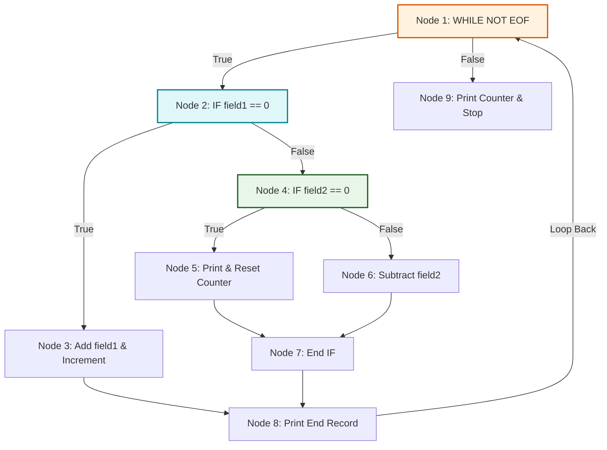

# Unit 3: Software Testing, Software Evolution, & Component-Based SE
*(All University Exam Questions & Complete Solutions for Unit 3)*

---

## 1. Short Answer Questions (Part A)

### 1.1 White-box testing can also be classified as structural testing. Justify with reasons. *(Sept 2023)*
**Answer:** White-box testing is called **structural testing** because the test engineer has full visibility into the internal source code structure. Test cases are derived directly from the control flow graph, loops, internal logic paths, statements, and decision conditions of the software.

---

### 1.2 Give two examples of Legacy System Replacement. *(Aug 2025)*
**Answer:**
1.  **Replacing a 30-year-old COBOL Mainframe Core Banking System** with a modern distributed cloud microservices architecture.
2.  **Replacing an obsolete client-server legacy ERP system** with a web-based SAP S/4HANA enterprise cloud application.

---

### 1.3 Finding and fixing program defects is called ________.
**Answer:** **Debugging**.

---

### 1.4 Write the primary goal of the release testing process.
**Answer:** To convince the supplier and customer that the system is dependable, satisfies specified requirements, and is suitable for operational release.

---

### 1.5 Define Refactoring.
**Answer:** Modifying code structure to improve maintainability without altering external behavior.

---

## 2. Long Answer Questions (Part B)

### Question 2.1: Basis Path Testing Steps & Cyclomatic Complexity Calculation

#### Q: Mention the steps of Path Testing. Calculate the Cyclomatic Complexity for the given control flow graph.

```pascal
WHILE NOT EOF LOOP
    Read Record;
    IF field1 equals 0 THEN
        Add field1 to Total
        Increment Counter
    ELSE
        IF field2 equals 0 THEN
            Print Total, Counter
            Reset Counter
        ELSE
            Subtract field2 from Total
        END IF
    END IF
    Print "End Record"
END LOOP
Print Counter
```

**Adjacency List:**
*   `1 = [2, 9]` *(Node 1: WHILE condition. True -> 2, False -> 9)*
*   `2 = [4, 3]` *(Node 2: IF field1 == 0. True -> 3, False -> 4)*
*   `3 = [8]` *(Node 3: Add/Increment block -> 8)*
*   `4 = [5, 6]` *(Node 4: IF field2 == 0. True -> 5, False -> 6)*
*   `5 = [7]` *(Node 5: Print/Reset block -> 7)*
*   `6 = [7]` *(Node 6: Subtract block -> 7)*
*   `7 = [8]` *(Node 7: End IF 2 join block -> 8)*
*   `8 = [1]` *(Node 8: Print "End Record" -> Loop back to 1)*
*   `9 = []` *(Node 9: Exit loop -> Print Counter -> Stop)*

---

### Step-by-Step Answer:

#### PART 1: Four Steps of Basis Path Testing
1.  **Draw Program Control Flow Graph (CFG):** Convert source code statements and conditional decisions into nodes and directed edges.
2.  **Compute Cyclomatic Complexity ($V(G)$):** Determine the number of linearly independent paths using graph parameters ($E, N, P$) or predicate node counts.
3.  **Identify Independent Path Set:** List the $V(G)$ independent paths, ensuring each path traverses at least one new edge not covered by previous paths.
4.  **Derive Test Cases:** Prepare explicit input data parameters and expected output assertions to force execution along every independent path.

---

#### PART 2: Control Flow Graph (CFG) Visualization



---

#### PART 3: Cyclomatic Complexity Computation ($V(G)$)

*   **Graph Parameters:**
    *   Number of Nodes ($N$) = **9** *(Nodes 1 through 9)*
    *   Number of Edges ($E$) = **11** *(1->2, 1->9, 2->4, 2->3, 3->8, 4->5, 4->6, 5->7, 6->7, 7->8, 8->1)*
    *   Connected Components ($P$) = **1**

#### Formula 1 (Edge-Node Method):
$$V(G) = E - N + 2P = 11 - 9 + 2(1) = \mathbf{4}$$

#### Formula 2 (Predicate Node Method):
Predicate nodes are nodes with out-degree $> 1$ (decision nodes: **Node 1**, **Node 2**, **Node 4**).
$$V(G) = \text{Predicate Nodes} + 1 = 3 + 1 = \mathbf{4}$$

#### Formula 3 (Enclosed Regions Method):
$$V(G) = \text{Bounded Regions} + 1 = 3 + 1 = \mathbf{4}$$

$$\mathbf{Cyclomatic\ Complexity\ V(G) = 4}$$

---

#### PART 4: Four Linearly Independent Execution Paths

1.  **Path 1 (Immediate EOF / Empty File):**
    $$1 \rightarrow 9$$
2.  **Path 2 (field1 equals 0):**
    $$1 \rightarrow 2 \rightarrow 3 \rightarrow 8 \rightarrow 1 \rightarrow 9$$
3.  **Path 3 (field1 != 0 AND field2 equals 0):**
    $$1 \rightarrow 2 \rightarrow 4 \rightarrow 5 \rightarrow 7 \rightarrow 8 \rightarrow 1 \rightarrow 9$$
4.  **Path 4 (field1 != 0 AND field2 != 0):**
    $$1 \rightarrow 2 \rightarrow 4 \rightarrow 6 \rightarrow 7 \rightarrow 8 \rightarrow 1 \rightarrow 9$$

---

### Question 2.2: Four Types of Interface Errors
#### Q: Elaborate the types of Interface Errors with suitable examples.
**Answer:** Parameter Mismatch, Parameter Misinterpretation, Timing Errors (race conditions), Shared Memory Corruption.

---

### Question 2.3: Manual Testing vs. Automated Testing Procedures
#### Q: Illustrate Manual Testing and Automated Testing procedures with examples.
**Answer:** Manual QA click scripts vs. JUnit `assertEquals()` test suites.
