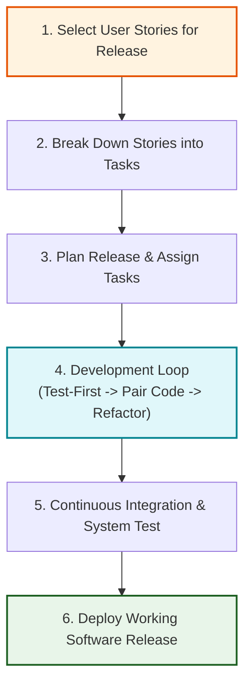
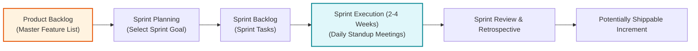

# Unit 5: Agile Software Development, Kanban, & Agile Coaching
*(All University Exam Questions & Complete Solutions for Unit 5)*

---

## 1. Short Answer Questions (Part A)

### 1.1 List the principles of Kanban. *(Aug 2025)*
**Answer:**
1.  **Visualize Workflow:** Use visual boards with cards representing work items.
2.  **Limit Work in Progress (WIP):** Set explicit bounds on active tasks in each workflow state.
3.  **Manage Flow:** Track and optimize the movement of items across states.
4.  **Make Process Policies Explicit:** Define clear criteria for moving tasks between states.
5.  **Implement Feedback Loops:** Conduct regular stand-ups and continuous reviews.
6.  **Improve Collaboratively:** Continuously evolve processes using empirical measurement.

---

### 1.2 List any four Agile development methods. *(Aug 2025)*
**Answer:**
1.  **Scrum**, 2. **Extreme Programming (XP)**, 3. **Kanban**, 4. **Feature-Driven Development (FDD)**.

---

### 1.3 What is Extreme Programming (XP)?
**Answer:** An agile methodology that pushes recognized practices (testing, code review, refactoring) to extreme levels via continuous iterations and developer collaboration.

---

### 1.4 What does it mean to be an agile team?
**Answer:** A self-organizing, cross-functional group that delivers working software in short iterations and embraces requirement changes.

---

## 2. Long Answer Questions (Part B)

### Question 2.1: Extreme Programming (XP) Release Cycle Diagram *(Aug 2025)*
#### Q: Summarize the Extreme Programming Release Cycle with a neat diagram.
**Answer:**

*   **Story Selection:** User stories are evaluated and chosen for the release.
*   **Task Breakdown:** Stories are broken down into specific developer tasks.
*   **Development Loop:** Programmers execute **Test-First Development**, **Pair Programming**, and **Refactoring** continuously.
*   **Release Deployment:** Software passes continuous integration tests and is deployed to operational users.

---

### Question 2.2: Terminologies of a Sprint Cycle with Diagram *(Aug 2025)*
#### Q: Discuss the terminologies of a Sprint Cycle with a neat diagram.
**Answer:**

1.  **Product Backlog:** Prioritized list of all features, user stories, and bug fixes managed by Product Owner.
2.  **Sprint Planning:** Meeting where team selects backlog items for upcoming sprint.
3.  **Sprint Backlog:** Detailed set of tasks committed by the team for the current sprint duration.
4.  **Daily Stand-up:** 15-minute daily sync reviewing completed work, planned tasks, and blockers.
5.  **Sprint Review & Retrospective:** Reviewing delivered features with stakeholders and evaluating team process improvements.

---

### Question 2.3: Role of Kanban in Improving, Measuring, and Managing Workflow *(Aug 2025)*
#### Q: Summarize the role of Kanban in improving, measuring and managing workflow.
**Answer:**
*   **Improving Workflow:** Eliminates bottlenecks by setting explicit **Work-in-Progress (WIP)** limits on each column, preventing team overload.
*   **Measuring Workflow:** Tracks quantitative metrics such as **Lead Time** (time from request to delivery) and **Cycle Time** (time from work start to completion) using cumulative flow diagrams.
*   **Managing Workflow:** Makes workflow states completely transparent on physical/digital Kanban boards, allowing continuous process optimization.
