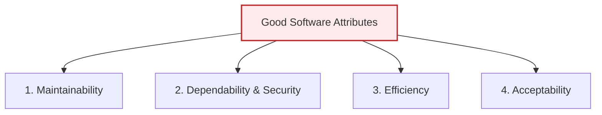
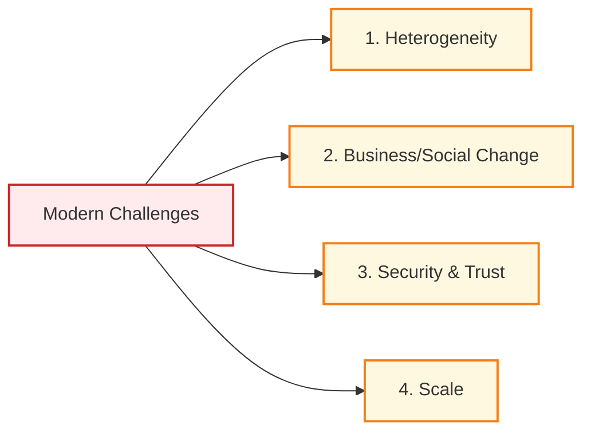

# Introduction to Software Engineering

## 1. Professional Software Development

Professional Software Development is the process of developing software for business or organizational use by professional teams, including maintenance, documentation, and long-term support.

### 1.1 Key Distinctions of Professional Software

- **Target Audience:** Built for use by people other than the developer.
- **Team-Based:** Typically developed by collaborative teams rather than isolated individuals.
- **Maintenance & Evolution:** Professional software is maintained and continuously modified throughout its lifecycle.
- **Beyond Code:** Professional software consists of the executable code **plus** all associated documentation (user/system guides), libraries, support websites, and configuration files required to make the software useful.

### 1.2 Two Types of Software Products

Professional software products generally fall into two categories:

| Product Type                      | Control of Specification                                                                                | Examples                                                                                                           |
| :-------------------------------- | :------------------------------------------------------------------------------------------------------ | :----------------------------------------------------------------------------------------------------------------- |
| **Generic Products**              | **The Developer / Software Vendor** (Can adapt the specification if development bottlenecks occur).     | Databases, word processors, mobile apps, specialized vertical tools (dental records packages, library catalogs).   |
| **Customized (Bespoke) Software** | **The Customer / Client** (The developer must build strictly according to the client's specifications). | Air traffic control software, military targeting, custom embedded device controllers, business-specific workflows. |

> [!NOTE]
> **The Blurred Line (ERP Systems):** The distinction between generic and custom software is blurring. Modern systems often use a generic product base (e.g., Enterprise Resource Planning systems like SAP and Oracle) which is then heavily customized to fit an organization’s business rules.

---

## 2. Essential Attributes of Good Software

Good software must deliver the required features and performance, but it also must be maintainable, dependable, and usable. These are called **non-functional attributes**:

1.  **Maintainability:**
    - _Core Principle:_ Software must be written so it can evolve to meet the changing needs of customers.
    - _Why:_ Software change is inevitable as business and organizational environments evolve.
2.  **Dependability and Security:**
    - _Core Principle:_ Includes reliability (does it run correctly?), safety (does it avoid physical harm?), and security (does it block hackers?).
    - _Why:_ Software must not cause physical, reputational, or economic damage in the event of system failure.
3.  **Efficiency:**
    - _Core Principle:_ Software should not waste system resources (CPU cycles, memory, disk space, network bandwidth).
    - _Why:_ Promotes responsiveness, fast processing, and optimal infrastructure cost utilization.
4.  **Acceptability:**
    - _Core Principle:_ Software must be understandable, usable, and compatible with other tools the target users already use.
    - _Why:_ If users find the UI confusing or incompatible, the software will not be adopted, regardless of its features.

---

## 3. What is Software Engineering?

**Software Engineering** is an engineering discipline concerned with all aspects of software production from initial system conception through to deployment, operation, and maintenance.

### 3.1 Key Components of the Definition

- **Engineering Discipline:** Engineers apply theories, methods, and tools selectively to solve problems under organizational, financial, and time constraints. They seek practical compromises rather than absolute perfection.
- **All Aspects of Software Production:** Covers technical coding as well as project management, tool development, methodologies, and quality assurance.

### 3.2 Root Causes of "Software Failures"

Despite advanced methods, software projects still fail. This is typically due to two factors:

1.  **Increasing System Complexity:** As new engineering methods allow us to build larger systems, the demands scale up even faster (faster delivery, higher scale, previously "impossible" features).
2.  **Failure to Use Software Engineering Methods:** Many companies write professional code informally without adopting engineering methods (e.g., skipping validation, lack of architecture), resulting in poor reliability and high maintenance costs.

---

## 4. Software Engineering vs. Related Fields

| Software Engineering  | Computer Science                   |
| --------------------- | ---------------------------------- |
| Practical development | Theoretical study                  |
| Builds software       | Studies algorithms and computation |
| Focus on customers    | Focus on theory                    |

| Systems Engineering             | Software Engineering |
| ------------------------------- | -------------------- |
| Hardware + Software + Processes | Software only        |
| Broader discipline              | Sub-discipline       |

---

## 5. Fundamental Software Process Activities

All software development models share four core activities (the **Software Process**):

1.  **Software Specification:** Customers and engineers define what the software must do and identify its operational constraints.
2.  **Software Development:** Designing the system architecture and writing the source code.
3.  **Software Validation:** Checking the software (testing, reviews) to ensure it performs correctly and meets the customer’s requirements.
4.  **Software Evolution:** Modifying the software to adapt to new requirements and market changes.

---

## 6. Key Modern Challenges in Software Engineering

Software engineers face four major technical challenges in the 21st century:

1.  **Heterogeneity:** Building software that operates reliably across distributed networks involving different hardware platforms (desktop, web, mobile, wearables) and integrating new software with older legacy systems.
2.  **Business and Social Change:** Evolving methodologies to reduce the time required to deliver value, enabling businesses to react to rapid market shifts.
3.  **Security and Trust:** Securing software systems against malicious attacks and protecting user data privacy over networks.
4.  **Scale:** Developing software that can scale from small embedded microcontrollers up to global, Internet-scale cloud systems serving billions of requests.
