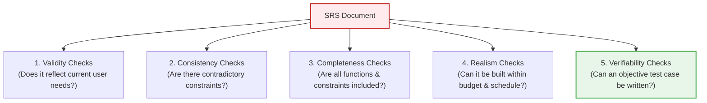
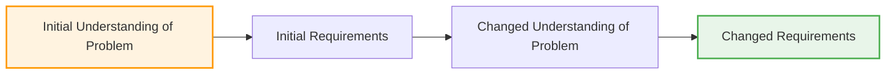
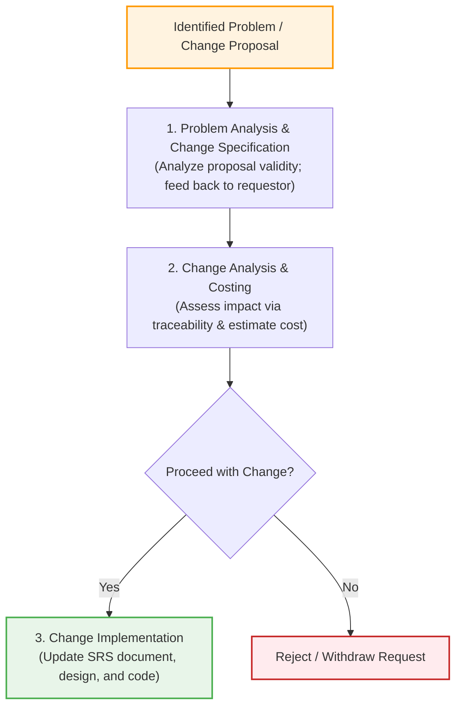

# Requirements Validation and Change Management
*(Based on Ian Sommerville, "Software Engineering" - Chapter 4)*

Requirements errors discovered late in software development or after deployment cause massive rework costs because the design, implementation, documentation, and test suites must all be modified and retested.

---

## 1. Requirements Validation
**Requirements validation** is the process of checking that the written requirements define the system the customer *actually* wants.

### 1.1 The 5 Essential Requirements Validation Checks
During validation, every requirement in the SRS document must undergo five checks:

1.  **Validity Checks:** Verifies that the system functions reflect real user needs (which may have shifted since initial elicitation).
2.  **Consistency Checks:** Ensures no two requirements state contradictory operational rules or constraints.
3.  **Completeness Checks:** Verifies that all system services, operational constraints, and edge cases specified by stakeholders are included.
4.  **Realism Checks:** Uses technical and financial knowledge to ensure the system can actually be built within the proposed technology stack, budget, and deadline.
5.  **Verifiability Checks:** Ensures requirements are written so that test engineers can devise objective, pass/fail test cases to prove compliance.

### 1.2 The 3 Requirements Validation Techniques
*   **Requirements Reviews:** Formal inspections where a joint team of customers and developers systematically read the SRS document line-by-line to detect errors, omissions, and ambiguities.
*   **Prototyping:** Building executable UI/system models and allowing end-users to experiment with them to confirm if expectations match implementation.
*   **Test-Case Generation:** Writing validation tests from the requirements document *before* coding starts. If a requirement is difficult or impossible to write a test case for, it indicates the requirement is vague or poorly specified and must be rewritten.

---

## 2. Requirements Evolution and Change

### 2.1 "Wicked" Problems and Requirements Drift
Large software systems address **"wicked" problems**—problems so complex they cannot be fully defined up-front. 

As development progresses, stakeholders' understanding of the problem deepens, causing requirements to evolve continuously throughout the software lifecycle.

### 2.2 Enduring vs. Volatile Requirements

| Requirement Type | Definition | Example |
| :--- | :--- | :--- |
| **Enduring Requirements** | Core, stable requirements derived from the fundamental, slow-to-change domain activities of an organization. | In a hospital system, patient registration and prescribing medications. |
| **Volatile Requirements** | Highly dynamic requirements that change frequently based on supporting business workflows, government policies, or hardware upgrades. | Specific tax rate calculation formulas or changing multi-factor authentication card policies. |

---

## 3. Requirements Management Planning
Requirements management establishes formal procedures to track evolving requirements and assess change impacts.

### 3.1 Four Decisions in RM Planning
1.  **Requirements Identification:** Assigning a unique identifier (e.g., `REQ-SYS-104`) to every single requirement for cross-referencing.
2.  **Change Management Process:** Defining the formal sequence of activities required to approve or reject a change proposal.
3.  **Traceability Policies:** Defining links between dependent requirements, and between requirements and design/code modules.
4.  **Tool Support:** Selecting software tools (e.g., IBM DOORS, Jira) to store requirements, automate traceability analysis via Natural Language Processing (NLP), and track change requests.

---

## 4. The 3-Stage Requirements Change Management Process
After the requirements document is baseline-approved, all change requests must follow a strict 3-stage process:

1.  **Problem Analysis and Change Specification:** The change request is evaluated to verify it is valid. If vague, it is returned to the requestor for clarification or withdrawal.
2.  **Change Analysis and Costing:** Traceability records are used to calculate the cost and ripple-effect modifications required in the SRS, design, and source code. Management decides whether the business benefits outweigh implementation costs.
3.  **Change Implementation:** The SRS document is modified first in a modular fashion, followed by software design and code updates.

> [!CAUTION]
> **Emergency Change Hazard:** When an urgent fix is needed, developers are often tempted to change the code first and update the SRS document later. This almost always leads to the SRS and implementation drifting out of sync. Emergency code fixes **must** have their SRS specifications updated immediately after deployment.
