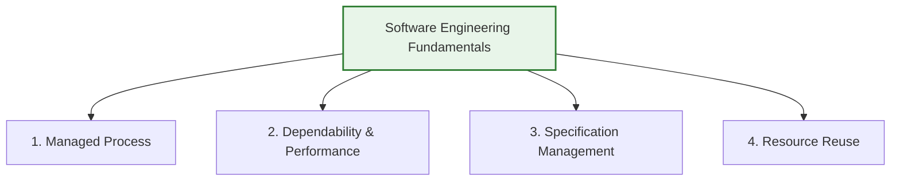

# Software Engineering Diversity and Ethics

_(Based on Ian Sommerville, "Software Engineering" - Chapter 1)_

## 1. Software Engineering Diversity

There are no universal software engineering methods or tools suitable for all systems and organizations. Software engineering is highly diverse, and the specific approach used depends on the type of application, the organization, and the development team.

### 1.1 The Eight Types of Software Applications

Most software systems fall into one of these eight application categories:

| Application Type                     | Description                                                                                                                                     | Examples                                                                           |
| :----------------------------------- | :---------------------------------------------------------------------------------------------------------------------------------------------- | :--------------------------------------------------------------------------------- |
| **1. Stand-Alone Applications**      | Local systems running on a PC or mobile app that include all functionality and do not require network connectivity.                             | Office suites, CAD programs, photo editors, local note-taking apps.                |
| **2. Interactive Transaction-Based** | Remote execution systems accessed via web browser or mobile client, usually storing and updating large data sets.                               | E-commerce sites, cloud email, photo-sharing services, online banking portals.     |
| **3. Embedded Control Systems**      | Software installed in read-only memory (ROM) to manage and control physical hardware devices. (Numerically the most common).                    | Anti-lock brakes (ABS), microwave oven controllers, mobile phone firmware.         |
| **4. Batch Processing Systems**      | Business systems designed to process large quantities of inputs in batches to generate outputs, running automatically without user interaction. | Payroll systems, monthly utility billing, bank statement generation.               |
| **5. Entertainment Systems**         | Software built for personal recreation, where user interaction quality and responsiveness are the primary attributes.                           | Video games, console systems, interactive multimedia programs.                     |
| **6. Modeling and Simulation**       | Computationally intensive software designed by scientists and engineers to model physical or scientific phenomena.                              | Weather forecasting models, nuclear simulation software, flight simulators.        |
| **7. Data Collection and Analysis**  | Systems that collect sensor data from hostile/remote environments and send it to database systems for big-data cloud analytics.                 | Seismic activity sensors, engine health monitoring telemetry packages.             |
| **8. Systems of Systems**            | Large-scale enterprise integrations composed of multiple independent software systems (generic ERPs + legacy tools).                            | National healthcare records integration, comprehensive airport management systems. |

> [!TIP]
> **Blurred Boundaries:** System categories often overlap. A mobile game utilizes _entertainment_ design but is constrained by _embedded_ platform limits. A business travel portal uses _interactive_ interfaces for submissions but processes payouts using _batch processing_.

---

## 2. Four Software Engineering Fundamentals

Despite the diversity of applications, four fundamental engineering principles apply to **all** software systems:

1.  **Managed Development Process:**
    - The project must be developed using a planned, understood process. The organization must define what is produced, by whom, and when.
2.  **Dependability and Performance:**
    - The software must run reliably without failures, be secure against attack, operate safely, and use hardware resources efficiently.
3.  **Requirements Specification Management:**
    - Developers must understand what the software is expected to do, managing customer expectations while delivering within budget and schedule.
4.  **Resource Reuse:**
    - Developers should maximize efficiency by reusing existing software libraries, frameworks, or open-source components rather than writing new code from scratch.

---

## 3. Internet Software Engineering

The rise of web browsers, SaaS (Software as a Service), and cloud computing has dramatically altered how business applications are constructed.

### 3.1 Key Impacts of Web-Based Delivery

- **Centralized Deployment:** Deploying software on a central web server (or cloud) instead of individual client PCs reduces installation costs and makes updates instantaneous.
- **Cost Savings:** Using standard web browsers as client user interfaces reduces the high costs associated with custom UI development.
- **Cloud Computing:** Transitioning to sharing large computer clusters ("the cloud") where customers pay based on usage or access software for free in exchange for viewing ads.

### 3.2 Dominant Software Engineering Practices for Web Systems

1.  **Software Reuse:** Systems are assembled from pre-existing frameworks and components rather than coded from scratch.
2.  **Incremental Delivery:** It is impractical to lock down all requirements up-front; instead, web systems are developed and deployed in small, frequent cycles.
3.  **Service-Oriented Architecture:** Assembling systems out of independent, web-accessible services.
4.  **Rich Client Technologies:** Using browser frameworks (AJAX, HTML5) to build responsive, application-like user interfaces.

---

## 4. Professional Responsibility and Ethics

Software engineering is performed within a social and legal framework. Professional responsibility demands behaving in an honest and morally responsible way.

### 4.1 Four Key Areas of Professional Responsibility

- **Confidentiality:** Respect the confidentiality of clients and employers even without a signed non-disclosure agreement (NDA).
- **Competence:** Do not misrepresent your level of skill or accept work that falls outside your technical expertise.
- **Intellectual Property Rights:** Be aware of copyright, patent, and trademark laws. Protect the IP of your employer and respect the IP of others (e.g., open-source licenses).
- **Computer Misuse:** Never use your skills to access, modify, or disrupt other people's systems without authorization (no hacking, spreading malware, or wasting company computing resources).

### 4.2 ACM/IEEE Joint Code of Ethics (The 8 Principles)

The Association for Computing Machinery (ACM) and the Institute of Electrical and Electronics Engineers (IEEE) jointly developed a Code of Ethics and Professional Practice. It establishes that software engineers must commit to making software design, development, testing, and maintenance a beneficial and respected profession.

In accordance with their commitment to the health, safety, and welfare of the public, software engineers must adhere to the following **Eight Principles**:

Principles of the ACM/IEEE Code of Ethics

1. Public

Software engineers shall act consistently with the public interest. They should ensure that software is safe, reliable, properly tested, and does not harm people, privacy, or the environment.

2. Client and Employer

Software engineers shall act in the best interests of their clients and employers, while remaining consistent with the public interest. They should maintain confidentiality, work within their competence, avoid illegal software, and disclose conflicts of interest.

3. Product

Software engineers shall ensure that their software products meet the highest professional standards. They should strive for high quality, reasonable cost and schedule, and perform proper testing, debugging, and validation.

4. Judgment

Software engineers shall maintain integrity and independence in their professional judgment. They should avoid bribery, dishonest practices, and always consider public safety while making technical decisions.

5. Management

Software engineering managers shall promote an ethical approach to software development and maintenance. They should follow good management practices, provide fair remuneration, and support employees who raise ethical concerns.

6. Profession

Software engineers shall uphold the integrity and reputation of the software engineering profession. They should support professional organizations, encourage ethical practices, and report violations of the code.

7. Colleagues

Software engineers shall be fair and supportive of their colleagues. They should assist in professional development, give proper credit for others' work, and review work objectively and constructively.

8. Self

Software engineers shall engage in lifelong learning and continuously improve their professional knowledge and skills. They should produce accurate, honest documentation and strive to develop high-quality software.

---

## 5. Common Ethical Dilemmas in Software Projects

Tricky exam questions often ask how an engineer should resolve these standard ethical situations:

1.  **Senior Management Disagreement:**
    - _Dilemma:_ Management plans to take an action you disagree with in principle (e.g., locking in a sub-par technology).
    - _Resolution:_ Argue your case objectively within the company. If it violates safety or legality, resignation in protest may be required.
2.  **Reporting Project Issues:**
    - _Dilemma:_ You suspect a project is failing, but warning management early might be an overreaction.
    - _Resolution:_ Maintain transparency. Report concerns as soon as data indicates a trend, rather than waiting until it is too late to fix.
3.  **Whistleblowing on Safety-Critical validation:**
    - _Dilemma:_ An employer cuts corners, falsifying safety test records to meet a delivery deadline.
    - _Resolution:_ The public interest (safety) overrides client/employer interest. You must exhaust internal escalation channels first, but if ignored, publicizing the risk (whistleblowing) is ethically justified.
4.  **Military & Weapons Systems Development:**
    - _Dilemma:_ Personal moral opposition to military or nuclear weapons development.
    - _Resolution:_ Inform employers of your views before accepting employment. Employers should not force or pressure employees to work on systems that violate their personal ethics.
