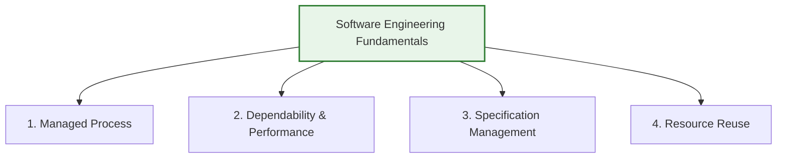
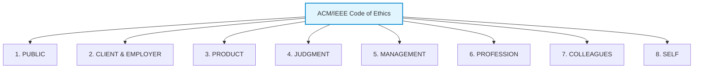

# Software Engineering Diversity and Ethics
*(Based on Ian Sommerville, "Software Engineering" - Chapter 1)*

## 1. Software Engineering Diversity
There are no universal software engineering methods or tools suitable for all systems and organizations. Software engineering is highly diverse, and the specific approach used depends on the type of application, the organization, and the development team.

### 1.1 The Eight Types of Software Applications
Most software systems fall into one of these eight application categories:

| Application Type | Description | Examples |
| :--- | :--- | :--- |
| **1. Stand-Alone Applications** | Local systems running on a PC or mobile app that include all functionality and do not require network connectivity. | Office suites, CAD programs, photo editors, local note-taking apps. |
| **2. Interactive Transaction-Based** | Remote execution systems accessed via web browser or mobile client, usually storing and updating large data sets. | E-commerce sites, cloud email, photo-sharing services, online banking portals. |
| **3. Embedded Control Systems** | Software installed in read-only memory (ROM) to manage and control physical hardware devices. (Numerically the most common). | Anti-lock brakes (ABS), microwave oven controllers, mobile phone firmware. |
| **4. Batch Processing Systems** | Business systems designed to process large quantities of inputs in batches to generate outputs, running automatically without user interaction. | Payroll systems, monthly utility billing, bank statement generation. |
| **5. Entertainment Systems** | Software built for personal recreation, where user interaction quality and responsiveness are the primary attributes. | Video games, console systems, interactive multimedia programs. |
| **6. Modeling and Simulation** | Computationally intensive software designed by scientists and engineers to model physical or scientific phenomena. | Weather forecasting models, nuclear simulation software, flight simulators. |
| **7. Data Collection and Analysis** | Systems that collect sensor data from hostile/remote environments and send it to database systems for big-data cloud analytics. | Seismic activity sensors, engine health monitoring telemetry packages. |
| **8. Systems of Systems** | Large-scale enterprise integrations composed of multiple independent software systems (generic ERPs + legacy tools). | National healthcare records integration, comprehensive airport management systems. |

> [!TIP]
> **Blurred Boundaries:** System categories often overlap. A mobile game utilizes *entertainment* design but is constrained by *embedded* platform limits. A business travel portal uses *interactive* interfaces for submissions but processes payouts using *batch processing*.

---

## 2. Four Software Engineering Fundamentals
Despite the diversity of applications, four fundamental engineering principles apply to **all** software systems:

1.  **Managed Development Process:**
    *   The project must be developed using a planned, understood process. The organization must define what is produced, by whom, and when.
2.  **Dependability and Performance:**
    *   The software must run reliably without failures, be secure against attack, operate safely, and use hardware resources efficiently.
3.  **Requirements Specification Management:**
    *   Developers must understand what the software is expected to do, managing customer expectations while delivering within budget and schedule.
4.  **Resource Reuse:**
    *   Developers should maximize efficiency by reusing existing software libraries, frameworks, or open-source components rather than writing new code from scratch.

---

## 3. Internet Software Engineering
The rise of web browsers, SaaS (Software as a Service), and cloud computing has dramatically altered how business applications are constructed.

### 3.1 Key Impacts of Web-Based Delivery
*   **Centralized Deployment:** Deploying software on a central web server (or cloud) instead of individual client PCs reduces installation costs and makes updates instantaneous.
*   **Cost Savings:** Using standard web browsers as client user interfaces reduces the high costs associated with custom UI development.
*   **Cloud Computing:** Transitioning to sharing large computer clusters ("the cloud") where customers pay based on usage or access software for free in exchange for viewing ads.

### 3.2 Dominant Software Engineering Practices for Web Systems
1.  **Software Reuse:** Systems are assembled from pre-existing frameworks and components rather than coded from scratch.
2.  **Incremental Delivery:** It is impractical to lock down all requirements up-front; instead, web systems are developed and deployed in small, frequent cycles.
3.  **Service-Oriented Architecture:** Assembling systems out of independent, web-accessible services.
4.  **Rich Client Technologies:** Using browser frameworks (AJAX, HTML5) to build responsive, application-like user interfaces.

---

## 4. Professional Responsibility and Ethics
Software engineering is performed within a social and legal framework. Professional responsibility demands behaving in an honest and morally responsible way.

### 4.1 Four Key Areas of Professional Responsibility
*   **Confidentiality:** Respect the confidentiality of clients and employers even without a signed non-disclosure agreement (NDA).
*   **Competence:** Do not misrepresent your level of skill or accept work that falls outside your technical expertise.
*   **Intellectual Property Rights:** Be aware of copyright, patent, and trademark laws. Protect the IP of your employer and respect the IP of others (e.g., open-source licenses).
*   **Computer Misuse:** Never use your skills to access, modify, or disrupt other people's systems without authorization (no hacking, spreading malware, or wasting company computing resources).

### 4.2 ACM/IEEE Joint Code of Ethics (The 8 Principles)
The Association for Computing Machinery (ACM) and the Institute of Electrical and Electronics Engineers (IEEE) jointly developed a Code of Ethics and Professional Practice. It establishes that software engineers must commit to making software design, development, testing, and maintenance a beneficial and respected profession. 

In accordance with their commitment to the health, safety, and welfare of the public, software engineers must adhere to the following **Eight Principles**:

1.  **1. PUBLIC:**
    *   *Rule:* Software engineers shall act consistently with the public interest.
    *   *Obligations:* This is the overriding principle. Engineers must approve software only if they have a well-founded belief that it is safe, meets specifications, passes tests, and does not diminish quality of life, privacy, or harm the environment.
2.  **2. CLIENT AND EMPLOYER:**
    *   *Rule:* Software engineers shall act in a manner that is in the best interests of their client and employer, consistent with the public interest.
    *   *Obligations:* Provide service in areas of their competence, maintain confidentiality of business information, avoid using illegal or unlicensed software, and ensure that any conflicts of interest are declared.
3.  **3. PRODUCT:**
    *   *Rule:* Software engineers shall ensure that their products and related modifications meet the highest professional standards possible.
    *   *Obligations:* Strive for high quality, acceptable cost, and a reasonable schedule. Ensure that goals and objectives are clear and realistic, and verify that system testing, debugging, and validation are thorough.
4.  **4. JUDGMENT:**
    *   *Rule:* Software engineers shall maintain integrity and independence in their professional judgment.
    *   *Obligations:* Temper all technical judgments by the need to support and maintain public safety and welfare. Do not engage in deceptive financial practices, refuse to participate in bribery, and disclose conflicts of interest.
5.  **5. MANAGEMENT:**
    *   *Rule:* Software engineering managers and leaders shall subscribe to and promote an ethical approach to the management of software development and maintenance.
    *   *Obligations:* Ensure managers commit to good project management practices, ensure developers are informed of standards, provide fair remuneration, and do not punish employees who raise ethical concerns (protect whistleblowers).
6.  **6. PROFESSION:**
    *   *Rule:* Software engineers shall advance the integrity and reputation of the profession consistent with the public interest.
    *   *Obligations:* Help the public understand software engineering, participate in professional organizations, support other members in following the code, and report any violations of the code.
7.  **7. COLLEAGUES:**
    *   *Rule:* Software engineers shall be fair to and supportive of their colleagues.
    *   *Obligations:* Assist colleagues in professional development, credit others' work fairly, review others' work in an objective and constructive manner, and give a fair hearing to the opinions and concerns of colleagues.
8.  **8. SELF:**
    *   *Rule:* Software engineers shall participate in lifelong learning regarding the practice of their profession and shall promote an ethical approach to the practice of the profession.
    *   *Obligations:* Keep technical skills up to date, improve ability to create high-quality and reliable software, and produce accurate, honest documentation.

---

## 5. Common Ethical Dilemmas in Software Projects
Tricky exam questions often ask how an engineer should resolve these standard ethical situations:

1.  **Senior Management Disagreement:**
    *   *Dilemma:* Management plans to take an action you disagree with in principle (e.g., locking in a sub-par technology).
    *   *Resolution:* Argue your case objectively within the company. If it violates safety or legality, resignation in protest may be required.
2.  **Reporting Project Issues:**
    *   *Dilemma:* You suspect a project is failing, but warning management early might be an overreaction.
    *   *Resolution:* Maintain transparency. Report concerns as soon as data indicates a trend, rather than waiting until it is too late to fix.
3.  **Whistleblowing on Safety-Critical validation:**
    *   *Dilemma:* An employer cuts corners, falsifying safety test records to meet a delivery deadline.
    *   *Resolution:* The public interest (safety) overrides client/employer interest. You must exhaust internal escalation channels first, but if ignored, publicizing the risk (whistleblowing) is ethically justified.
4.  **Military & Weapons Systems Development:**
    *   *Dilemma:* Personal moral opposition to military or nuclear weapons development.
    *   *Resolution:* Inform employers of your views before accepting employment. Employers should not force or pressure employees to work on systems that violate their personal ethics.
