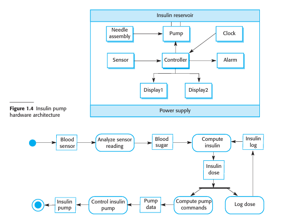
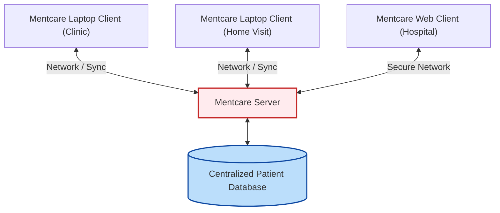
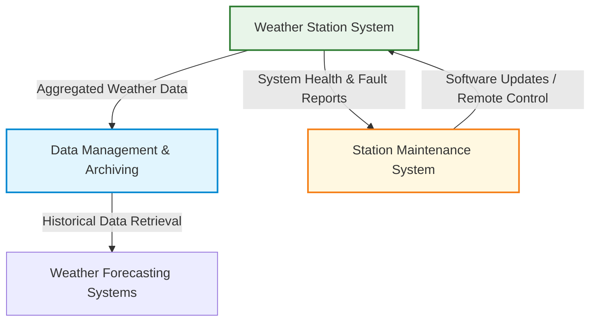
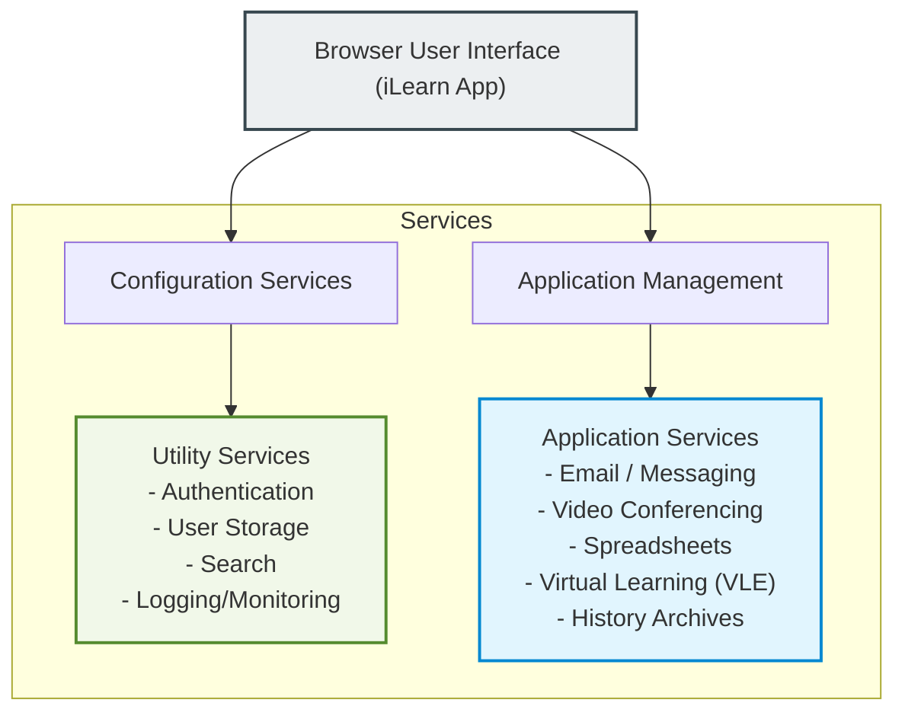

# Software Engineering Case Studies
*(Based on Ian Sommerville, "Software Engineering" - Chapter 1)*

To illustrate software engineering concepts (such as safety, dependability, requirements engineering, reuse, and design), the textbook uses four distinct case studies representing different system types.

---

## 1. Embedded System: Insulin Pump Control System
An insulin pump is a safety-critical, software-controlled medical system that simulates the operation of a human pancreas. It monitors blood sugar levels and delivers a controlled dose of insulin to patients suffering from diabetes.

### 1.1 Medical Context & System Logic
*   **The Problem (Diabetes):** The pancreas fails to produce sufficient insulin. Insulin is needed to metabolize glucose (sugar) in the blood.
*   **Risks of Failure:**
    *   *Too much insulin (Low Blood Glucose / Hypoglycemia):* Short-term brain malfunctioning, unconsciousness, coma, or death.
    *   *Too little insulin (High Blood Glucose / Hyperglycemia):* Long-term damage to eyes, kidneys, and heart.
*   **Operation:** A microsensor measures electrical conductivity in the blood (which is proportional to blood glucose). The controller analyzes the reading, computes the required insulin dose (accounting for the time of the last injection), and sends pulses to the pump (1 pulse = 1 unit of insulin) to deliver it via a needle.

### 1.2 System Architecture & Activity Model
Here is the hardware architecture and activity flow of the insulin pump system:

*   **Essential High-Level Requirements:**
    1.  **Availability:** The system must always be available to deliver insulin when required.
    2.  **Reliability:** The system must perform reliably and deliver the precise, correct dose of insulin needed to counteract the current blood sugar level.

---

## 2. Information System: Mentcare (Mental Health Care System)
Mentcare is a medical information system that manages patient databases, consultations, and treatments for patients with mental health conditions who attend clinics regularly.

### 2.1 Key Design & Deployment Features
*   **Offline/Disconnected Capabilities:** Clinics are held in remote community centers or local practices without secure networks. Mentcare runs on laptops, allowing clinicians to download local copies of patient records, work disconnected, and synchronize updates back to the centralized database when secure access is restored.
*   **Care Management & History Summaries:** Allows doctors to quickly understand a patient's history, previous diagnoses, and prescriptions, even if meeting them for the first time.
*   **Patient Monitoring & Alerts:** Automatically monitors records to issue warnings (e.g., if a patient misses a critical follow-up, or to track compulsory safety checks required by law for sectioned patients).
*   **Administrative Reporting:** Generates monthly management reports (numbers treated, drugs prescribed, and costs) for health authority managers.

### 2.2 System Organization & Constraints

*   **The Privacy vs. Availability Conflict:**
    *   *Privacy:* Easiest to maintain when there is only **one centralized copy** of the data.
    *   *Availability:* Requires keeping **multiple local copies** of patient records on clinical laptops, which increases the risk of data leakage if a laptop is lost or stolen.
*   **Strict Legislative Frameworks:** The system must comply with data protection acts (privacy) and mental health laws (detaining/sectioning patients who pose a danger to themselves or others). The system must log all decisions for judicial review.

---

## 3. Sensor-Based Data Collection: Wilderness Weather Station
To monitor climate change in remote, uninhabited wilderness areas, the government deploys hundreds of self-contained weather stations. These stations collect temperature, barometric pressure, rainfall, sunshine, and wind speed/direction.

### 3.1 Sub-System Architecture

*   **1. Weather Station System:** Collects weather parameters locally, aggregates readings to compress data, and transmits it via satellite.
*   **2. Data Management and Archiving System:** Collects data from all active stations, processes it, and stores it in an archive database for forecasting models.
*   **3. Station Maintenance System:** Monitors weather station health (battery levels, hardware faults) and pushes remote software updates.

### 3.2 Key Non-Data Engineering Challenges
Because the stations are deployed in hostile, remote areas with narrow satellite bandwidth, the software is complex:
*   **Power Management:** Must run entirely on batteries charged by solar/wind. The software must shut down generators in extreme storms to prevent wind damage.
*   **Fault Reporting & Reconfiguration:** Must detect instrument failures automatically and swap to redundant backup sensors.
*   **Data Aggregation:** Collects readings every minute (e.g., temperature) but aggregates them into hourly or daily summaries to conserve narrow satellite bandwidth.

---

## 4. Support Environment: iLearn Digital Learning Environment
iLearn is a distributed, service-oriented framework designed for school students (ages 3 to 18) that embeds various educational, administrative, and communication tools.

### 4.1 System Architecture & Services
iLearn operates entirely on a **Service-Oriented Architecture (SOA)**, where all components are accessed as web services:

1.  **Utility Services:** Application-independent systems developed specifically for iLearn (e.g., authentication, database search, user storage, system logging).
2.  **Application Services:** Specific educational tools (conferencing, spreadsheets, virtual learning environments for homework, historical archives). Often external resources freely available online or purchased.
3.  **Configuration Services:** Adapts the iLearn layout based on the student's age and controls permissions (what can be shared between students, teachers, and parents).

### 4.2 Two Levels of Service Integration
*   **Integrated Services:** Expose an API (Application Programming Interface), enabling direct service-to-service communication. For example, a single login to the iLearn *Authentication Service* grants access to all other integrated tools without reauthenticating.
*   **Independent Services:** Accessed directly through a web browser with no API connection. They act in isolation; sharing data requires manual copy-pasting, and users must log in to each tool separately.
