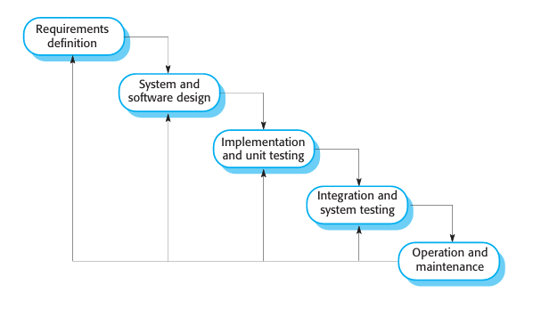
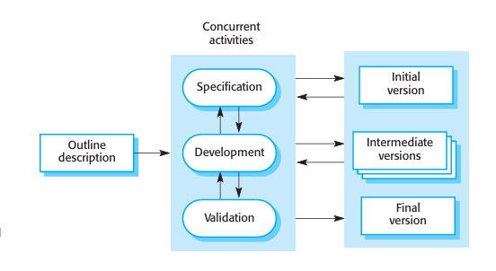
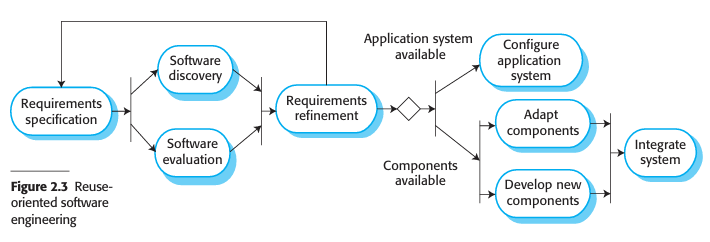

# Software Process Models
*(Based on Ian Sommerville, "Software Engineering" - Chapter 2)*

A **software process** is a structured set of activities that leads to the production of a software system. Because there are many different types of software systems, there is **no universal software process**. 

---

## 1. Fundamentals of Software Processes

### 1.1 Core Process Description Elements
When describing a software process, we must look beyond the activities themselves and define:
*   **Products (Deliverables):** The tangible outcomes of an activity (e.g., a software architecture document, test plan, or executable code).
*   **Roles:** The responsibilities of the people involved in the process (e.g., project manager, system architect, programmer, quality assurance tester).
*   **Preconditions & Postconditions:** Conditions that must be true before and after an activity is executed (e.g., *Precondition:* Requirements document approved by client. *Postcondition:* UML system models reviewed and signed off).

### 1.2 Plan-Driven vs. Agile Processes
*   **Plan-Driven Processes:** All process activities are planned in advance, and progress is measured against this static plan. (Best for critical, large systems where coordination is vital).
*   **Agile Processes:** Planning is incremental, continuous, and evolutionary. The process adapts dynamically to changing customer or product requirements. (Best for business applications and software products).

---

## 2. The Waterfall Model (Software Life Cycle)
The Waterfall model was the first published SDLC model, derived from traditional hardware engineering processes. It is a strictly **plan-driven process** that structures development into sequential, distinct phases.

### 2.1 The Five Waterfall Phases
1.  **Requirements Analysis and Definition:** Establishing system services, constraints, and goals through consultation with users, resulting in a finalized system specification document.
2.  **System and Software Design:** Allocating requirements to hardware or software systems and establishing the overall system architecture, identifying fundamental software abstractions and relationships.
3.  **Implementation and Unit Testing:** Realizing the software design as a set of programs or code units, verifying that each unit meets its internal specification.
4.  **Integration and System Testing:** Integrating individual code units and testing the system as a whole to ensure it meets requirements before delivery to the customer.
5.  **Operation and Maintenance:** Installing the system in production. Maintenance involves fixing undiscovered bugs, improving performance, and evolving the system as new requirements arise.

### 2.2 Critical Reality: Linear Flow vs. Feedback Loops
*   **In Theory:** One phase must completely finish and be signed off before the next phase begins.
*   **In Practice:** Software stages overlap and feed back information to each other (e.g., coding reveals design errors, design reveals requirements inconsistencies). 
*   **Requirements Freezing:** Because changes are expensive under a linear model, developers and customers often prematurely "freeze" requirements. This leads to systems that do not meet the users' actual needs or designs that rely on sloppy "hacks" to work around frozen constraints.

### 2.3 Suitability: When to use the Waterfall Model?
1.  **Embedded Systems:** Software interfacing with rigid, physical hardware systems.
2.  **Critical Systems:** Safety-critical or security-critical software (e.g., aerospace, medical devices) where thorough, documentable safety analyses must be completed up-front.
3.  **Large Multi-Partner Engineering Systems:** Projects developed by multiple companies where clear interface specifications are required to allow independent subsystem development.

### 2.4 Variant: Formal System Development
*   A mathematical model of the specification is created and refined using mathematical transformations into executable code (e.g., using the **B-Method**).
*   Used for extreme safety-critical systems to construct a mathematically provable security or safety case. It is rarely used elsewhere due to the high cost of mathematical specification.

---

## 3. Incremental Development
Incremental development interleaves the activities of specification, development, and validation. The system is built as a series of versions (increments), with each version adding functionality to the previous one.

### 3.1 Plan-Driven vs. Agile Incremental Development
*   **Plan-driven:** The system increments are planned out and scheduled in advance.
*   **Agile:** Early increments are planned, but later increments are defined dynamically based on development progress and customer feedback.

### 3.2 Advantages & Disadvantages of Incremental Development

| Advantages | Disadvantages |
| :--- | :--- |
| **Reduced Cost of Requirements Changes:** The amount of rework on specifications and documentation is significantly less than in the Waterfall model. | **Process is Invisible:** Managers cannot easily measure progress through physical documentation because creating detailed specs for every rapid build is not cost-effective. |
| **Easier Customer Feedback:** Customers find it easier to evaluate operational software demonstrations than to review complex design specifications. | **System Structure Degradation:** Continuous modifications lead to "messy" code and poor software architecture. Adding new features becomes progressively harder unless regular **refactoring** is done. |
| **Early Delivery of Value:** Customers can start using and benefiting from the core system increments early in the lifecycle. | **Scale Incompatibility:** Large, complex systems require a stable, planned architecture developed up-front, making pure incrementalism difficult for multi-team projects. |

---

## 4. Integration and Configuration (Reuse-Oriented SE)
Reuse-oriented software engineering relies on composing systems using pre-existing, reusable software components or off-the-shelf application systems.

### 4.1 Three Types of Reusable Components
1.  **Stand-Alone Application Systems (COTS):** Off-the-shelf software packages configured for a new environment (e.g., ERP systems like SAP).
2.  **Object Collections/Packages:** Component libraries integrated within a framework (e.g., Java Spring).
3.  **Web Services:** Independent services accessed over the Internet via web protocols.

### 4.2 The Five Stages of Reuse-Oriented Development
1.  **Requirements Specification:** Outlining the essential system requirements and desired features.
2.  **Software Discovery and Evaluation:** Searching for and evaluating reusable components to see if they meet the core requirements.
3.  **Requirements Refinement:** Modifying the requirements to align with the capabilities of the discovered components. If a compromise is impossible, developers search for alternative components.
4.  **Application System Configuration:** Configuring the selected off-the-shelf software systems for production.
5.  **Component Adaptation and Integration:** Modifying components, developing custom "glue code" for new features, and integrating them into the system.

### 4.3 Trade-offs of Reuse-Oriented SE
*   **Pros:** Reduces code development effort, lowers project costs and risks, and enables much faster delivery.
*   **Cons:** Inevitable compromises must be made on requirements (the software dictates the business process, rather than the business dictating the software). Control over long-term evolution is lost, as upgrades depend on external component vendors.

---

## 5. Universal & Hybrid Process Models

### 5.1 Barry Boehm’s Spiral Model
*   **Risk-Driven Process:** Rather than a linear sequence of activities, the process is modeled as a spiral. 
*   Each loop in the spiral represents a phase of the project (innermost = feasibility, next = requirements, next = design, etc.).
*   It combines change avoidance with change tolerance by incorporating explicit risk assessment and risk management activities in every loop.

### 5.2 Rational Unified Process (RUP)
RUP is a flexible, universal process model that can be customized to resemble any of the generic SDLC models. It is described from three perspectives:
1.  **Dynamic Perspective (Phases over time):**
    *   *Inception:* Establish the business case.
    *   *Elaboration:* Develop system architecture and requirements.
    *   *Construction:* Implement and code the software.
    *   *Transition:* Deploy the system to the customer environment.
2.  **Static Perspective (Process Activities):** Shows the workflows (e.g., modeling, analysis, design).
3.  **Practice Perspective:** Suggests good industry practices (e.g., develop iteratively, manage requirements, visually model systems).

---

## 6. Software Development Tools (CASE)
Software development tools are programs designed to support process activities by automating repetitive tasks and organizing information.
*   **Examples:** Requirements management tools, design editors, refactoring tools, compilers, debuggers, bug trackers, and system builders.
*   **Interactive Development Environments (IDEs):** Combine these individual tools into a single, integrated framework (e.g., Eclipse, VS Code) allowing tools to communicate and operate seamlessly.
