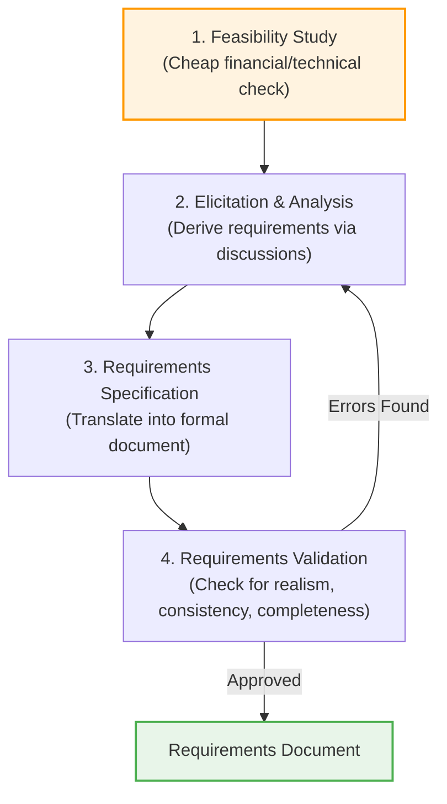
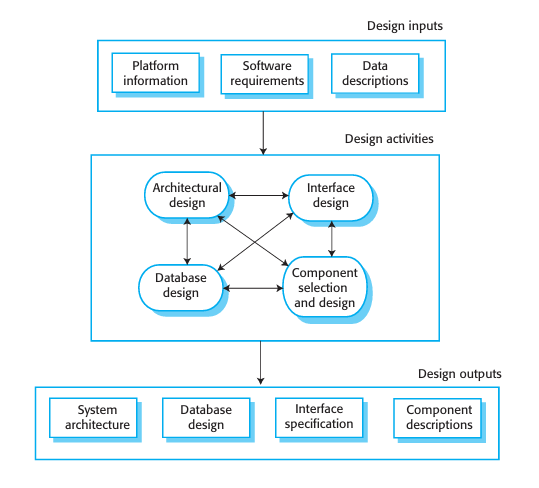
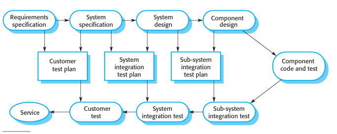
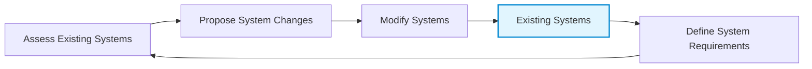

# Process Activities
*(Based on Ian Sommerville, "Software Engineering" - Chapter 2)*

Real software processes are interleaved sequences of technical, collaborative, and managerial activities designed to specify, design, implement, and test a software system.

---

## 1. Software Specification (Requirements Engineering)
**Requirements Engineering** is the process of understanding and defining what services are required from the system and identifying operational/development constraints.

### 1.1 The Four Stages of Requirements Engineering
1.  **Feasibility Study:** A short-term, low-cost study conducted before launching the project to assess if the software is technically and financially realistic and if a market/need actually exists.
2.  **Requirements Elicitation and Analysis:** Deriving requirements by observing existing systems, interviewing users/stakeholders, conducting task analysis, and building prototypes.
3.  **Requirements Specification:** Translating analysis notes into a formal requirements document. This includes requirements at two levels:
    *   *User Requirements:* High-level, abstract statements written in natural language for the customer and end-users.
    *   *System Requirements:* Detailed functional descriptions of services and behaviors written for developers.
4.  **Requirements Validation:** Checking the requirements document for **realism**, **consistency**, and **completeness** to discover errors before design starts.

---

## 2. Software Design and Implementation
This process translates the specification into an executable system.

### 2.1 General Model of the Design Process
Designers do not achieve a final design immediately; they work in iterative stages, generating new information that constantly refines previous decisions.

### 2.2 The Four Core Design Activities
1.  **Architectural Design:** Identifying the overall structure of the system, its principal subsystems/modules, their relationships, and how they are distributed.
2.  **Database Design:** Defining system data structures and how they are represented in a database (either designing a new DB or mapping to an existing database).
3.  **Interface Design:** Specifying unambiguous interfaces between system components. Clear interfaces allow developers to work on individual components in parallel without needing to know how other components are implemented.
4.  **Component Selection and Design:** Searching for reusable components and, if unavailable, designing new custom software components.

### 2.3 Testing vs. Debugging
Programmers test code to find bugs and debug to fix them. These are two distinct processes:
*   **Testing (Defect Detection):** Running programs with simulated data to establish the **existence** of defects.
*   **Debugging (Defect Correction):** Locating and correcting the source code errors. It involves forming hypotheses about why the output is incorrect, testing those hypotheses (using code traces, print statements, or interactive debuggers), and applying fixes.

---

## 3. Software Validation (Verification & Validation)
**Verification and Validation (V&V)** demonstrates that a system conforms to its specification and meets the expectations of the customer. While V&V includes reviews and inspections, the principal technique is **testing**.

### 3.1 The Three Stages of Testing
1.  **Component (Unit) Testing:** Individual functions, classes, or modules are tested independently by the developer who wrote them. Automated frameworks like JUnit are commonly used.
2.  **System Testing:** Components are integrated to form a complete system. This phase focuses on discovering component interface problems, unexpected interactions between subsystems, functional/non-functional requirement compliance, and testing emergent properties.
3.  **Customer Testing:** The final stage before acceptance. The customer tests the system using real operational data.
    *   *Beta Testing:* For general software products, the system is released to a select group of potential customers who use it in real-world scenarios and report bugs before the official release.

### 3.2 The plan-driven V-Model
In plan-driven processes, testing is structured directly alongside the specification and design stages. This relationship is represented by the **V-Model**, showing which test plans are created during which development phases:

*   **Requirements Specification** defines the **Customer Test Plan** (Customer Test validation).
*   **System Specification** defines the **System Integration Test Plan**.
*   **System Design** defines the **Sub-system Integration Test Plan**.
*   **Component Design** leads directly into **Component Coding and Testing**.

---

## 4. Software Evolution (Maintenance)
The flexibility of software is its greatest asset; modifying software code is significantly cheaper than redesigning physical hardware.

*   **Development and Maintenance Continuum:** Historically, development (creative) and maintenance (dull) were treated as separate phases. Today, this distinction is irrelevant. Very few systems are written entirely from scratch. 
*   It is more realistic to view software engineering as a continuous **evolutionary process** where systems are modified repeatedly throughout their lifetime to meet changing customer needs and regulatory environments.
