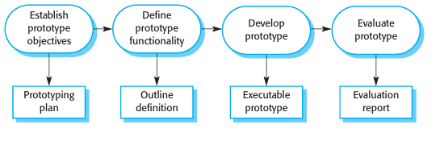
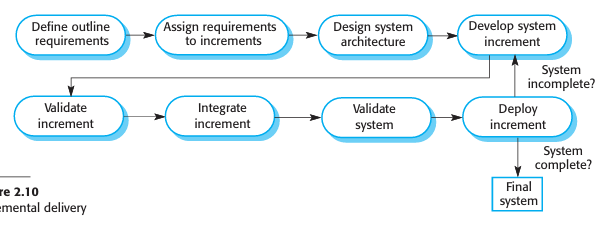
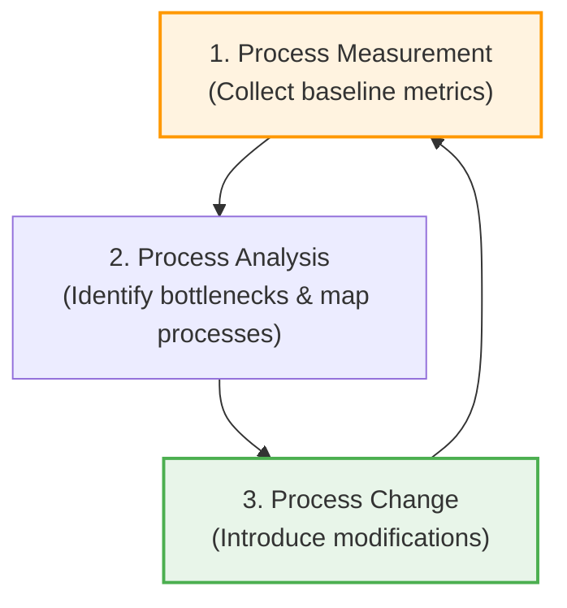
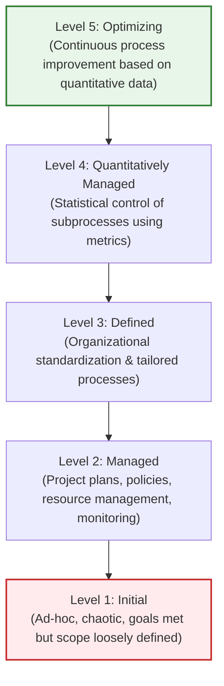

# Coping with Change and Process Improvement

\*(Based on Ian Sommerville, "Software Engineering" - Coping with Change refers to the strategies used in software engineering to reduce the cost of changes caused by changing business needs, competition, or new technologies

---

## 1. Strategies for Coping with Change

To minimize the costs of rework, software processes utilize two primary strategies:

1.  **Change Anticipation:** The process includes activities designed to predict and resolve changes _before_ major development begins. (e.g., prototyping to clarify requirements early).
2.  **Change Tolerance:** The process and architecture are designed so that modifications can be made easily at low cost. (e.g., incremental development where changes are confined to future or isolated increments).

---

## 2. System Prototyping (Change Anticipation)

A **prototype** is an early, simplified version of a software system used to demonstrate concepts, explore design alternatives, and uncover requirements errors.

### 2.1 The Prototype Development Process

A structured prototyping lifecycle ensures that objectives are clear and cost-managed:

1.  **Establish Prototype Objectives:** Define what the prototype is testing (e.g., UI usability, database performance, or concept validation). _The same prototype cannot satisfy all goals._
2.  **Define Prototype Functionality:** Decide what to leave out to save time and money.
3.  **Develop Prototype:** Implement the system rapidly.
4.  **Evaluate Prototype:** Collect feedback from users and stakeholders.

### 2.2 What to Leave Out of a Prototype?

To keep prototyping fast and inexpensive, developers should:

- Relax non-functional requirements (e.g., tolerate slower response times, high memory usage).
- Ignore edge-case error handling and security policies.
- Reduce standards of code reliability and program quality.

### 2.3 Evaluation Challenges

- **Atypical Testers:** Test users may not represent the final end-users.
- **Behavior Adaptation:** If a prototype is slow, users will adjust their behavior to avoid slow features. When given the faster final system, they will use it differently, exposing new requirements gaps.
- **Throwaway Prototypes:** Prototypes should be discarded after evaluation, not modified into the final system, because their code structure is weak, undocumented, and lacks proper error checks.

---

## 3. Incremental Delivery (Change Tolerance)

Incremental Delivery is a process in which completed increments are deployed to the customer's live environment, allowing customers to use the software while further increments are developed.

### 3.1 The Incremental Delivery Process

The customer prioritizes services from most to least critical. Increments are developed and delivered based on these priorities:

1.  **Define Outline Requirements:** Gather high-level needs.
2.  **Assign Requirements to Increments:** Map high-priority items to early builds.
3.  **Design System Architecture:** Establish a stable framework first.
4.  **Develop, Validate, & Integrate Increment:** Requirements for the _current_ increment are frozen during its active build phase.
5.  **Deploy Increment:** Release it to the customer for live usage.

### 3.2 Advantages & Problems of Incremental Delivery

| Advantages                                                                                                                                        | Problems                                                                                                                                                                                                   |
| :------------------------------------------------------------------------------------------------------------------------------------------------ | :--------------------------------------------------------------------------------------------------------------------------------------------------------------------------------------------------------- |
| **Real-Use Prototyping:** Customers gain real operational experience, which informs requirements for later increments with no throwaway code.     | **Replacing Legacy Systems:** Users who are accustomed to a complete legacy system will resist using an incomplete new system. Parallel operations are hard due to different DB structures.                |
| **Early Value Realization:** Customers do not have to wait for the entire software suite to deploy to gain business value from the core features. | **Common Facilities Dilemma:** Because requirements are defined incrementally, it is difficult to identify common utility components (e.g., shared auth) needed by all subsystems up-front.                |
| **Regression Safety:** High-priority services are delivered in early increments and integrated repeatedly, meaning they receive the most testing. | **Contractual Mismatches:** Traditional procurement contracts require complete specifications up-front. Incremental delivery requires flexible contracts, which bureaucratic organizations find difficult. |

---

## 4. Software Process Improvement

Process improvement enhances product quality, reduces costs, and accelerates delivery by understanding and refining existing processes.

### 4.1 The Process Improvement Cycle

Process improvement is a long-term, continuous activity:

- **Process Measurement:** Collects quantitative data about the process or product (e.g., defect rates, lead times) to establish a baseline.
- **Process Analysis:** Evaluates the mapped process against characteristics like _rapidity_ and _robustness_ to identify weaknesses.
- **Process Change:** Proposes and implements concrete changes (e.g., introducing Test-Driven Development or UML modeling) to address weaknesses.

---

## 5. SEI Capability Maturity Model (CMMI)

Capability Maturity Model Integration (CMMI) is a framework used to assess and improve an organization's software development processes through five maturity levels.

1.  **Level 1: Initial**
    - Processes are ad-hoc, chaotic, and disorganized.
2.  **Level 2: Managed**
    - Projects are planned, monitored, and managed using documented procedures.
3.  **Level 3: Defined**
    - Processes are standardized across the organization and adapted from organizational standards.
4.  **Level 4: Quantitatively Managed**
    - Processes are measured and controlled using statistical and quantitative techniques.
5.  **Level 5: Optimizing**
    - The organization focuses on continuous process improvement using feedback and quantitative data.
