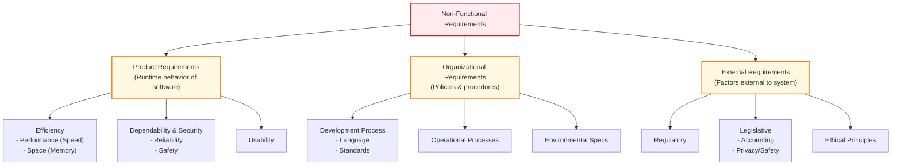

# Requirements Engineering Fundamentals
*(Based on Ian Sommerville, "Software Engineering" - Chapter 4)*

**Requirements Engineering (RE)** is the process of discovering, analyzing, documenting, and validating the services a system must provide and the operational constraints under which it must run.

---

## 1. Levels of Requirements

### 1.1 User vs. System Requirements
Requirements must be specified at different levels of detail because they are read by different audiences.

| Level | Definition | Format | Target Readers |
| :--- | :--- | :--- | :--- |
| **User Requirements** | High-level statements of the services the system should provide and its constraints. | Natural language + simple diagrams. | Client managers, end-users, client engineers, contractor managers, system architects. |
| **System Requirements** | Detailed descriptions of system functions, services, and operational constraints. Defines *exactly* what is to be implemented. | Detailed functional specification, often acting as a contract. | System end-users, client engineers, system architects, software developers. |

### 1.2 Mentcare Example: Expanding User to System Requirements
*   **User Requirement:**
    *   *“The Mentcare system shall generate monthly management reports showing the cost of drugs prescribed by each clinic during that month.”*
*   **System Requirements Expansion:**
    *   *1.1* On the last working day of each month, a summary of the drugs prescribed, their cost, and the prescribing clinics shall be generated.
    *   *1.2* The system shall generate the report for printing after 17:30 on the last working day of the month.
    *   *1.3* A report shall be created for each clinic listing individual drug names, total prescriptions, doses prescribed, and total cost.
    *   *1.4* If drugs are available in different dose units (e.g., 10mg, 20mg), separate reports shall be created for each dose unit.
    *   *1.5* Access to drug cost reports shall be restricted to authorized users listed on a management access control list.

---

## 2. System Stakeholders
A **stakeholder** is any person or organization who is affected by the system in some way and has a legitimate interest in it. 

### 2.1 Mentcare System Stakeholders Example
1.  **Patients:** Whose medical records and treatment histories are stored in the system.
2.  **Doctors:** Who assess patients, prescribe medication, and review care histories.
3.  **Nurses:** Who schedule clinics and administer treatments.
4.  **Medical Receptionists:** Who coordinate patient appointments.
5.  **IT Staff:** Responsible for system installation, database synchronization, and maintenance.
6.  **Medical Ethics Manager:** Ensures the system complies with patient care ethical standards.
7.  **Health Care Managers:** Who run reports to evaluate clinic performance against government targets.
8.  **Medical Records Staff:** Responsible for long-term database preservation and compliance audits.

---

## 3. Functional Requirements
**Functional requirements** define the specific services, behaviors, and reactions the system must exhibit in response to inputs. They also define what the system **should not** do.

### 3.1 Key Requirements Properties
*   **Completeness:** The requirements must specify **all** services and information needed by the user.
*   **Consistency:** Requirements must not contain contradictions or conflicting statements.
*   *Note:* In practice, achieving 100% completeness and consistency is impossible for large, complex systems due to conflicting stakeholder needs and communication errors.

### 3.2 The Danger of Ambiguity (Imprecision)
Ambiguous requirements allow developers to take implementation shortcuts, which might result in software that does not meet the customer's expectations.
*   *Ambiguous Statement:* *"A user shall be able to search the appointments lists for all clinics."*
*   *Developer Interpretation:* The user must select a specific clinic first, and then the system searches only that clinic's list (easier to implement).
*   *Customer Intention:* The user enters a patient's name, and the system automatically searches all clinics simultaneously (more useful since patients often show up at the wrong clinic).

---

## 4. Domain Requirements
**Domain requirements** are derived from the application domain (e.g., physics, accounting, medicine) rather than user needs. They can define new functional requirements or impose computational constraints.
*   *Example:* A train control system must calculate braking distance based on track friction limits (a physics-domain constraint).
*   *The Pitfall:* If software engineers do not understand the operating domain, they may miss critical requirements or fail to detect conflicts with user-defined requirements.

---

## 5. Non-Functional Requirements (NFRs)
**Non-functional requirements** do not describe what the system does, but constrain characteristics of the system as a whole (e.g., reliability, performance, security). Failing to meet an NFR can render the entire system useless.

### 5.1 Classification Hierarchy of Non-Functional Requirements
To draw this diagram in an exam, remember the three main branches: **Product**, **Organizational**, and **External**.

### 5.2 Mentcare NFR Examples
*   **Product (Availability):** *“The Mentcare system shall be available to all clinics during normal working hours (Mon–Fri, 08:30–17:30). Downtime within normal working hours shall not exceed 5 seconds in any one day.”*
*   **Organizational (Authentication):** *“Users of the Mentcare system shall identify themselves using their health authority identity card.”*
*   **External (Legislative/Privacy):** *“The system shall implement patient privacy provisions as set out in HStan-03-2006-priv.”*

### 5.3 Goal vs. Testable Requirement
Customers often write NFRs as vague **goals** rather than measurable constraints. Goals must be rewritten into **testable requirements** so they can be verified during validation.
*   *Vague Usability Goal:* *"The system should be easy to use by medical staff and minimize errors."*
*   *Testable NFR:* *"Medical staff shall be able to use all system functions after two hours of training. After this training, the average number of errors made by experienced users shall not exceed two per hour of system use."*

### 5.4 Metrics for Specifying Non-Functional Requirements
Use these metrics to specify and quantitatively test NFR properties:

| Property | Metric Examples |
| :--- | :--- |
| **Speed** | Processed transactions/second, Event/User response time, Screen refresh time. |
| **Size** | Megabytes of memory, number of ROM chips. |
| **Ease of Use** | Training time, number of help frames. |
| **Reliability** | Mean time to failure (MTTF), Probability of unavailability, Rate of failure occurrence (ROCOF), Availability. |
| **Robustness** | Time to restart after failure, percentage of events causing failure, probability of data corruption upon failure. |
| **Portability** | Percentage of target-dependent statements, number of target systems. |

### 5.5 NFR Conflicts
Non-functional requirements often conflict with each other or with functional requirements.
*   *Example:* A security requirement dictates that all connections require a physical card reader (Organizational/Security NFR). However, a functional requirements request access from doctors' mobile smartphones which do not have card readers. The design must accommodate alternative identification methods.
