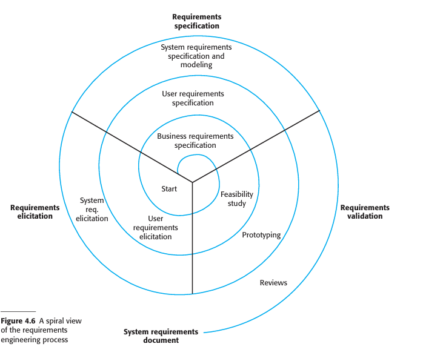
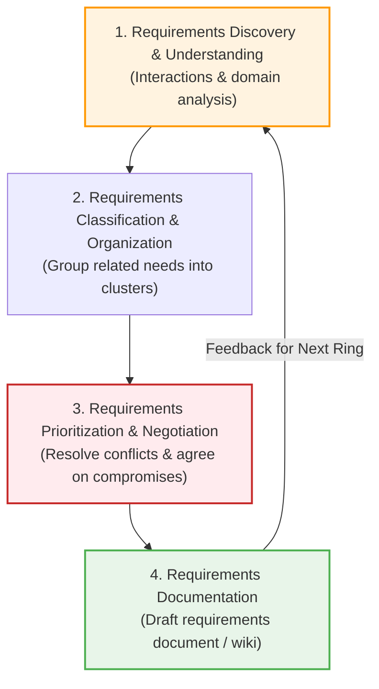
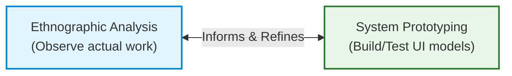

# Requirements Engineering Processes and Elicitation
*(Based on Ian Sommerville, "Software Engineering" - Chapter 4)*

Requirements engineering is an iterative process where activities (elicitation, specification, and validation) are continuously interleaved.

---

## 1. The Spiral View of Requirements Engineering
Requirements engineering is best understood as a spiral process. The output of the process is the system requirements document.

### 1.1 Progression Through the Spiral Rings
*   **Inner Rings (Early Stage):** Focus on understanding high-level business goals, feasibility studies, user requirements, and broad non-functional requirements.
*   **Outer Rings (Later Stage):** Devoted to eliciting detailed system requirements, constructing system models, and defining precise non-functional specifications.
*   **Adaptability:** The number of iterations depends on project scale, budget, and methodology (e.g., exiting early for simple projects or interleaving continuously for agile teams).

---

## 2. Requirements Elicitation and Analysis
Requirements elicitation is the process of interacting with stakeholders to discover how they work and what they need from a new system.

### 2.1 Why Elicitation is Difficult (5 Major Obstacles)
1.  **Unclear Stakeholder Expectations:** Stakeholders often find it hard to articulate what they want or make unrealistic demands due to lack of technical knowledge.
2.  **Domain Jargon:** Stakeholders use specialized, domain-specific terminology that software engineers may misunderstand.
3.  **Conflicting Requirements:** Different stakeholders have different priorities and conflicting needs.
4.  **Organizational Politics:** Requirements may be influenced by managers seeking to expand their organizational influence rather than business needs.
5.  **Dynamic Environments:** Economic, legal, and business priorities shift during the analysis process, constantly introducing new requirements.

### 2.2 Viewpoints
A **viewpoint** is a technique for collecting and organizing requirements from a group of stakeholders who share a common perspective or job role (e.g., doctor viewpoint, receptionist viewpoint, auditor viewpoint). It helps structure information and identify missing requirements.

---

## 3. Requirements Elicitation Techniques

### 3.1 Interviewing
Requirements engineers ask stakeholders questions about their current work and the proposed system.

*   **Closed Interviews:** The stakeholder answers a predefined set of structured questions.
*   **Open Interviews:** No predefined agenda. Broad topics are explored to understand informal needs.
*   *Practical Approach:* A mix of both (starting with specific questions that lead into open discussion).
*   **Interviewing Limitations:**
    *   Fails to capture **implicit domain knowledge** (stakeholders omit basic facts because "it goes without saying").
    *   Inappropriate for uncovering political/organizational power structures.
    *   Stakeholders cannot easily visualize future systems unless shown a prototype.

### 3.2 Ethnography (Observation)
Ethnography is an observational technique where an analyst **immerses** themselves in the working environment to observe day-to-day operations directly.

#### Key Strengths of Ethnography:
1.  **Discovers Implicit Requirements:** Uncovers how people *actually* work rather than how official corporate procedures say they *ought* to work.
    *   *Real-World Example:* Air Traffic Controllers (ATCs) often turn off automated conflict alerts because they issue annoying false alarms during routine flight paths, relying instead on visual awareness of adjacent controller sectors.
2.  **Discovers Cooperative Work Patterns:** Uncovers informal self-organization and awareness between team members covering for each other.

#### Limitations of Ethnography:
*   Focuses purely on present end-user actions; it **cannot identify breakthrough innovations** (e.g., Nokia used ethnography to refine feature phones based on existing habits, whereas Apple ignored current habits to revolutionize smartphones with the iPhone).
*   Ineffective for discovering broad corporate compliance or legal requirements.

---

## 4. Stories and Scenarios
Real-life examples are easier for stakeholders to evaluate than abstract specifications.

### 4.1 Stories vs. Scenarios

| Feature | Story | Scenario |
| :--- | :--- | :--- |
| **Format** | Narrative, high-level text. | Structured document with defined fields. |
| **Purpose** | Sets out the "big picture" of system usage in everyday language. | Details specific execution paths, inputs, outputs, and edge cases. |

### 4.2 The 5 Mandatory Components of a Scenario
When writing a formal scenario for an exam, ensure it contains these five sections:

1.  **Initial Assumption:** What is assumed to be true before the scenario starts (e.g., user logged in, network active).
2.  **Normal Flow of Events:** Step-by-step description of standard, successful interactions.
3.  **What Can Go Wrong (Exceptions):** Description of errors, missing assets, or hardware failures and how the system responds.
4.  **Other Concurrent Activities:** Actions happening in parallel (e.g., a moderator approving photos in real-time).
5.  **System State on Completion:** The status of the system after the scenario finishes (e.g., record marked "Awaiting Moderation").

#### KidsTakePics Scenario Example:
*   *Initial Assumption:* Teacher logged into photo site with images stored locally on a tablet.
*   *Normal Flow:* Selects photos, assigns project name, adds keywords, clicks upload. System appends username to filename and emails moderator.
*   *What Can Go Wrong:* No moderator exists $\rightarrow$ system auto-generates email to administrator to assign one and warns the user of delay. Duplicate file exists $\rightarrow$ prompts to overwrite, rename, or cancel.
*   *Final State:* Selected photos uploaded and tagged as "awaiting moderation."
