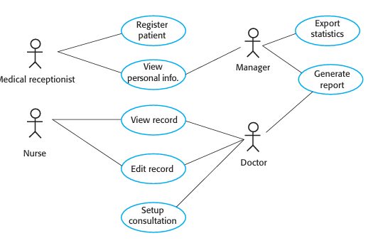
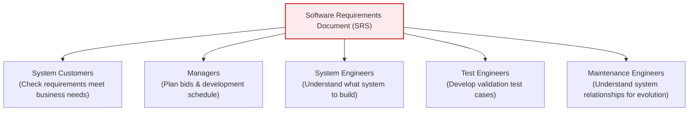

# Requirements Specification and The SRS Document
*(Based on Ian Sommerville, "Software Engineering" - Chapter 4)*

**Requirements specification** is the process of formally writing down user and system requirements into a official requirements document.

---

## 1. Notations for Writing System Requirements

| Notation | Description | Advantages | Disadvantages |
| :--- | :--- | :--- | :--- |
| **Natural Language Sentences** | Requirements are written as numbered sentences in plain text. | Universal, expressive, understandable by non-technical customers. | Potentially vague, ambiguous, and easy to confuse requirements. |
| **Structured Natural Language** | Plain text written on standard forms or templates. | Imposes uniformity and prevents omissions. | Hard to specify complex mathematical computations. |
| **Graphical Notations** | Visual models (UML Use Case and Sequence diagrams) supplemented by text annotations. | Clear overview of system boundaries and actor interactions. | Requires UML literacy; can be too fine-grained for high-level specs. |
| **Mathematical Specifications** | Formal notations based on mathematical concepts (finite-state machines, set theory). | Completely unambiguous and mathematically provable. | Most customers do not understand formal math specs and refuse them as contracts. |

---

## 2. Guidelines for Natural Language Specifications
To minimize misunderstandings when using natural language:

1.  **Invent a Standard Format:** Require all requirements to follow a strict 1-2 sentence template.
2.  **Distinguish Mandatory vs. Desirable Requirements:**
    *   **Shall:** Indicates a *mandatory* requirement that the system **must** support.
    *   **Should:** Indicates a *desirable* feature that is not essential.
3.  **Highlight Key Terms:** Use bolding or typography to emphasize key entities.
4.  **Avoid Software Jargon:** Omit terms like "module", "architecture", or acronyms that confuse business clients.
5.  **Include a Rationale & Source:** Explain *why* the requirement exists and *who* proposed it so future change-impact analysis is possible.

### 2.1 Insulin Pump Natural Language Requirements Example
*   *Requirement 3.2:* **The system shall** measure the blood sugar and deliver insulin, if required, every 10 minutes. *(Rationale: Blood sugar changes are slow, so 10-minute intervals prevent over-dosing while avoiding sugar spikes.)*
*   *Requirement 3.6:* **The system shall** run a self-test routine every minute with conditions and actions defined in Table 1. *(Rationale: Discovers hardware failure immediately to alert the user.)*

---

## 3. Structured (Form-Based) Specifications
A structured specification uses standard templates (cards/forms) to eliminate natural language vagueness.

### 3.1 The 7 Mandatory Fields of a Form-Based Requirement
1.  **Function / Entity Name:** The system service being specified.
2.  **Inputs & Source:** Data inputs and where they originate (e.g., sensor, memory).
3.  **Outputs & Destination:** Data outputs and where they are sent (e.g., motor controller, display).
4.  **Requires:** Information or system entities that must be available for execution.
5.  **Action:** Step-by-step description of the computation or business logic.
6.  **Preconditions & Postconditions:** What must be true *before* execution and what becomes true *after*.
7.  **Side Effects:** Any secondary impacts on system state.

### 3.2 Structured & Tabular Specification Example (Insulin Pump Dose Calculation)

```
Function: Compute insulin dose (Safe Sugar Level)
Description: Computes dose to be delivered when measured sugar is in the safe band (3 to 7 units).
Inputs: Current sugar reading (r2), previous two readings (r0, r1). [Source: Sensor & Memory]
Outputs: CompDose - dose of insulin to deliver. [Destination: Pump Controller]
Action: If sugar is stable or falling, CompDose = 0. If sugar is increasing, CompDose = (r2 - r1)/4 rounded to nearest unit.
Requires: Two previous readings to calculate rate of change.
Precondition: Insulin reservoir contains at least the maximum allowed single dose.
Postcondition: r0 is replaced by r1; r1 is replaced by r2.
Side Effects: None.
```

#### Tabular Computation Rules:
| Condition | Action |
| :--- | :--- |
| Sugar level falling ($r2 < r1$) | `CompDose = 0` |
| Sugar level stable ($r2 = r1$) | `CompDose = 0` |
| Sugar increasing, rate of increase decreasing | `CompDose = 0` |
| Sugar increasing, rate of increase stable or increasing | `CompDose = round((r2 - r1) / 4)`. If rounded result = 0, `CompDose = MinimumDose`. |

---

## 4. UML Use Cases
**Use cases** identify discrete interactions between system users (or external systems) and system services.

### 4.1 Mentcare System Use Case Diagram
Actors are represented as stick figures, interactions as named ellipses, and association lines show connections:



### 4.2 Textual Specification of a Use Case (Setup Consultation)
*   **Actors:** Doctor (Initiator), Online Doctors (Participants).
*   **Description:** Allows two or more doctors in different offices to view the same patient record simultaneously. The initiating doctor selects online colleagues from a dropdown menu. The record displays on all screens, but **only the initiating doctor can edit it**. A text chat window is auto-created to coordinate actions.

---

## 5. The Software Requirements Document (SRS)
The **Software Requirements Specification (SRS)** is the official statement of what developers must implement.

### 5.1 The 5 Reader Groups of an SRS



### 5.2 IEEE Standard SRS Document Structure
The IEEE standard provides a 10-chapter generic template for structuring complex requirements documents:

```mermaid
graph LR
    Ch1["1. Preface"] --> Ch2["2. Introduction"]
    Ch2 --> Ch3["3. Glossary"]
    Ch3 --> Ch4["4. User Requirements"]
    Ch4 --> Ch5["5. System Architecture"]
    Ch5 --> Ch6["6. System Requirements Spec"]
    Ch6 --> Ch7["7. System Models"]
    Ch7 --> Ch8["8. System Evolution"]
    Ch8 --> Ch9["9. Appendices"]
    Ch9 --> Ch10["10. Index"]

    style Ch4 fill:#fff8e1,stroke:#f57f17,stroke-width:2px
    style Ch6 fill:#fff8e1,stroke:#f57f17,stroke-width:2px
    style Ch8 fill:#e8f5e9,stroke:#4caf50,stroke-width:2px
```



1.  **Preface:** Defines expected readership and version history (rationale for changes).
2.  **Introduction:** Business rationale, high-level functions, and strategic goals.
3.  **Glossary:** Definitions of technical terms and domain jargon.
4.  **User Requirements Definition:** Natural language description of services and non-functional requirements.
5.  **System Architecture:** High-level overview showing distribution of functions across subsystems.
6.  **System Requirements Specification:** Detailed functional and non-functional specifications.
7.  **System Models:** Graphical models (object, data-flow, sequence diagrams).
8.  **System Evolution:** Explicitly documents fundamental assumptions and anticipated hardware/user changes to help future maintainers avoid restrictive architectural design decisions.
9.  **Appendices:** Hardware specs and database schema requirements.
10. **Index:** Alphabetical, diagram, and function indexes.
