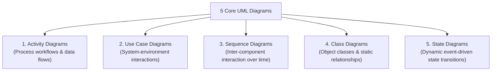
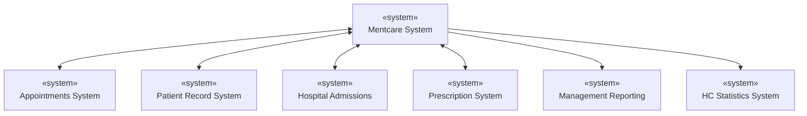
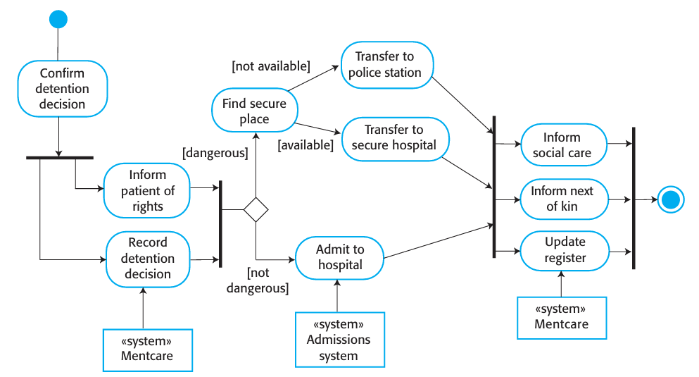
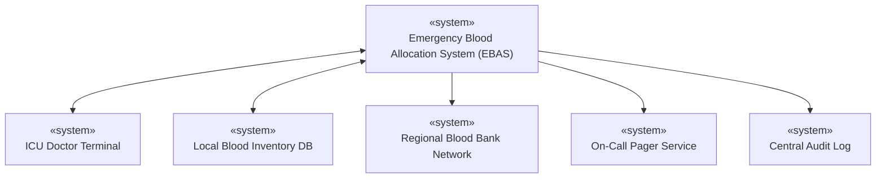
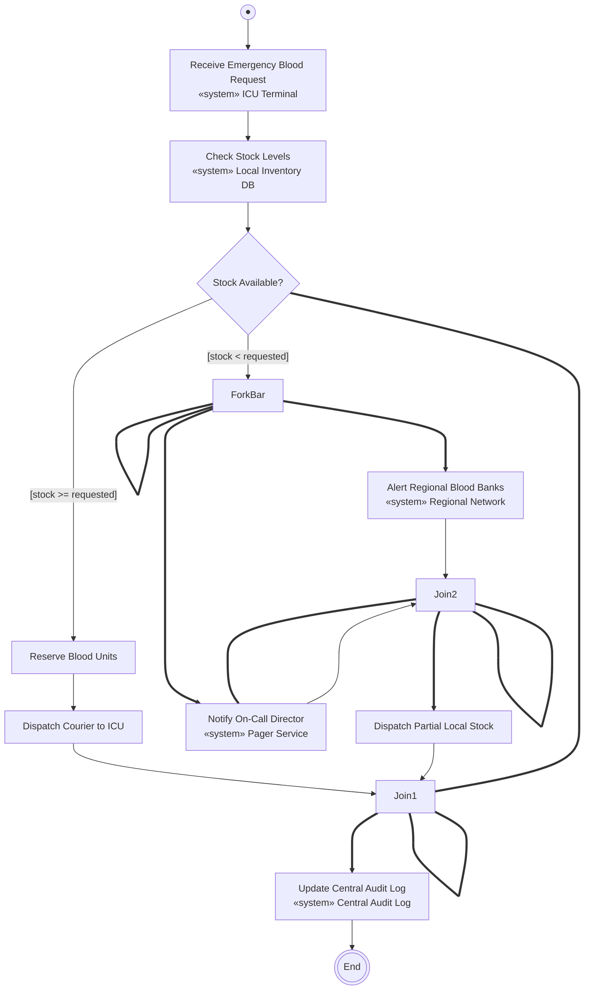

# System Modeling and Context Models

_(Based on Ian Sommerville, "Software Engineering" - Chapter 5)_

**System modeling** is the process of developing abstract graphical models of a software system, where each model presents a distinct perspective or view of the system.

---

## 1. System Modeling Fundamentals

### 1.1 Model Abstraction vs. Alternative Representation

> [!IMPORTANT]
> **Tricky Exam Question:** _"Is a system model a complete representation of a software system?"_
>
> **Answer: NO.** A system model is an **abstraction**, not a complete representation.
>
> - **Abstraction:** Deliberately simplifies a system by leaving out minor details to highlight salient characteristics (e.g., PowerPoint slides summarizing a textbook).
> - **Alternative Representation:** Retains _all_ original information without omitting detail (e.g., translating a textbook from English to Italian).

### 1.2 The Four System Perspectives

When modeling a software system, engineers use four different perspectives:

| Perspective        | Focus                                                                                   | Common UML Diagram                   |
| :----------------- | :-------------------------------------------------------------------------------------- | :----------------------------------- |
| **1. External**    | Models the context or environment in which the system operates.                         | Context Diagrams, Activity Diagrams  |
| **2. Interaction** | Models interactions between a system and its environment, or between system components. | Use Case Diagrams, Sequence Diagrams |
| **3. Structural**  | Models the static organization of system components or data structures.                 | Class Diagrams, Component Diagrams   |
| **4. Behavioral**  | Models the dynamic behavior of the system and how it responds to events.                | State Diagrams, Activity Diagrams    |

### 1.3 Three Ways Graphical Models are Used

1.  **To Stimulate Discussion (Agile Modeling):** Informal, incomplete sketches used on whiteboards to discuss ideas.
2.  **To Document an Existing System:** Accurate, formal models that document specific subsystems for maintenance teams.
3.  **To Drive Code Generation (Model-Driven Engineering):** Rigorous, 100% complete models used by automated tools to generate executable source code.

### 1.4 The 5 Core UML Diagram Types

Although UML defines 13 diagram types, five essential diagrams cover most software engineering needs:

---

## 2. Context Models and System Boundaries

### 2.1 Establishing System Boundaries

Determining **system boundaries** means deciding what is inside the proposed system and what remains outside in its operational environment.

- **Technical Considerations:** Shared databases, network latency, and data duplication (e.g., deciding whether Mentcare should manage its own patient demographics or fetch them from a central hospital database).
- **Non-Technical (Organizational) Factors:** Corporate politics, manager avoidance, budget inflation, or geographic site boundaries often dictate system scope regardless of pure technical elegance.

### 2.2 Mentcare System Context Model Example

A context diagram shows the target system surrounded by related external systems:

> [!NOTE]
> Context diagrams show system dependencies, but they **do not** show _how_ data flows or _when_ interactions happen. Business process models (Activity Diagrams) are used to show operational workflows.

---

## 3. Business Process Modeling with UML Activity Diagrams

UML Activity diagrams describe human and automated business processes.

### 3.1 Beginner's Guide: How to Draw UML Activity Diagrams in Exams

If you are new to UML, follow these 7 simple shape rules to draw any Activity Diagram in an exam:

| UML Element              | Visual Shape                                  | Meaning & Exam Rule                                                                                                                           |
| :----------------------- | :-------------------------------------------- | :-------------------------------------------------------------------------------------------------------------------------------------------- |
| **Initial Node (Start)** | Solid black circle ($\bullet$)                | Marks where the process begins. Always draw this first at the top/left.                                                                       |
| **Activity**             | Rectangle with rounded corners                | Represents an action or task (e.g., _Confirm detention decision_).                                                                            |
| **Control Flow (Arrow)** | Solid arrow ($\rightarrow$)                   | Shows the direction of flow from one activity to the next.                                                                                    |
| **Decision Diamond**     | Diamond ($\diamond$)                          | Used when the path splits based on a condition. Label outgoing arrows with **Guards** in square brackets like `[dangerous]` or `[available]`. |
| **Fork Bar**             | Thick solid bar (1 arrow in, $N$ arrows out)  | **Parallel Execution:** Splitting flow into concurrent tasks happening at the same time.                                                      |
| **Join Bar**             | Thick solid bar ($N$ arrows in, 1 or $N$ out) | **Synchronization:** Waits until ALL incoming parallel tasks finish before allowing the process to move forward.                              |
| **System Object**        | Rectangle with `«system» Name`                | Shows which software system supports that specific step (e.g., `«system» Mentcare`).                                                          |
| **Final Node (End)**     | Solid black dot inside a circle ($\odot$)     | Marks where the process terminates.                                                                                                           |

---

### 3.2 Involuntary Detention Process Example (Textbook Diagram)

Below is the official textbook process diagram for Mentcare involuntary detention:

#### Equivalent UML Activity Diagram (Textbook Flow)

#### Step-by-Step Diagram Breakdown:

1. **Start ($\bullet$):** Initiates with `Confirm Detention Decision`.
2. **First Fork Bar (`Fork1`):** Splitting into two co`waeencurrent tasks: `Inform Patient of Rights` and `Record Detention Decision` (connected to `«system» Mentcare`).
3. **First Join Bar (`Join1`):** Both tasks must complete before reaching the decision diamond (`Risk Level?`).
4. **Decision Diamond (`Risk Level?`):**
   - If `[dangerous]` $\rightarrow$ `Find Secure Place`. If `[available]` $\rightarrow$ `Transfer to Secure Hospital`, else `[not available]` $\rightarrow$ `Transfer to Police Station`.
   - If `[not dangerous]` $\rightarrow$ `Admit to Hospital` (supported by `«system» Admissions System`).
5. **Second Join Bar (`Join2`):** Merges all placement paths and splits concurrently into 3 final tasks (`Inform Social Care`, `Inform Next of Kin`, `Update Register`).
6. **Third Join Bar (`Join3`):** Synchronizes all three final activities before reaching the End Node ($\odot$).

---

## 4. Solved Practical Exam Problem

### Problem Statement

> **Exam Question (10 Marks):**
> _A University Medical Center requires an **Emergency Blood Allocation System (EBAS)**. When an emergency blood request arrives from an ICU doctor:_
>
> 1. _The EBAS checks the local blood inventory._
> 2. _If stock is available, it reserves the units and dispatches a courier._
> 3. _If stock is insufficient, it concurrently triggers two actions: (a) alerts regional blood banks to dispatch emergency supplies, and (b) notifies the on-call medical director._
> 4. _Once all emergency notifications/dispatches are complete, the system updates the central audit log._
>
> **Tasks:**
>
> 1. Draw the **System Context Diagram** for EBAS.
> 2. Draw the **UML Activity Diagram** showing the decision guards and parallel execution bars.

---

### Solution

#### Task 1: EBAS System Context Diagram

#### Task 2: EBAS UML Activity Process Diagram

#### Explanation of Activity Diagram Elements:

1.  **Decision Node (`GuardCheck`):** Evaluates `[stock >= requested]` vs `[stock < requested]`.
2.  **Parallel Fork Bar (`ForkBar`):** When stock is insufficient, it executes `AlertRegional` and `NotifyDirector` concurrently in parallel.
3.  **Synchronization Join Bar (`Join2`):** Waits for both the regional alert and director notification to finish before dispatching partial stock.
4.  **Final Synchronization Join Bar (`Join1`):** Merges both success and emergency branches to ensure `LogAudit` runs before process completion (`EndNode`).
