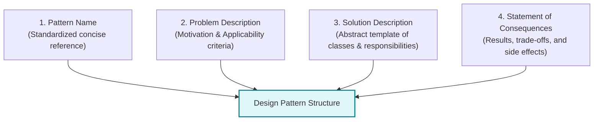
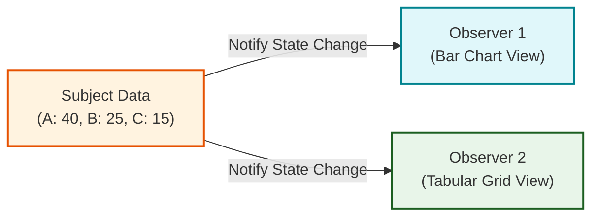
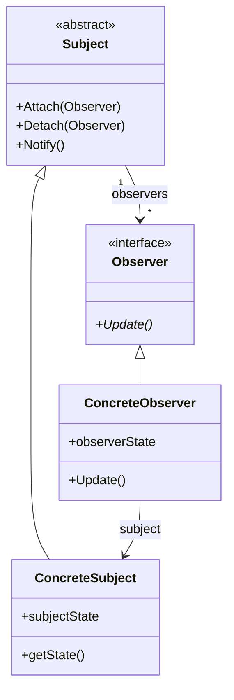
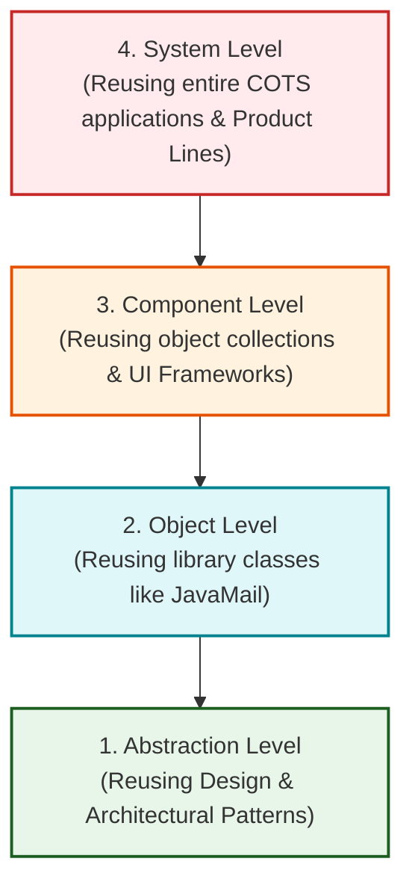
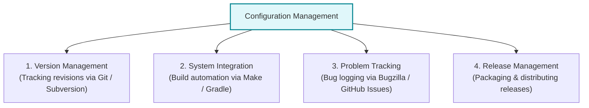
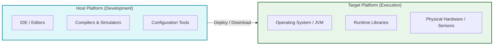

# Design Patterns, Implementation Issues, and Software Reuse

_(Based on Ian Sommerville, "Software Engineering" - Chapter 7, Sections 7.2, 7.3)_

**Design patterns** represent reusable descriptions of accumulated software engineering wisdom and proven solutions to common object-oriented design problems.

---

## 1. Fundamentals of Design Patterns

### 1.1 Origin & Purpose

- **Origin:** Adapted from Christopher Alexander's building architecture patterns and formalized for software by the **"Gang of Four" (GoF: Gamma, Helm, Johnson, Vlissides - 1995)**.
- **Purpose:** Provides a shared vocabulary for developers and enables high-level concept reuse without forcing concrete implementation choices.

---

### 1.2 The Four Essential Elements of a Design Pattern (GoF)

1.  **Pattern Name:** A meaningful, standardized reference to the pattern (e.g., _Observer_, _Facade_).
2.  **Problem Description:** Explains when the pattern applies, including motivation and environmental prerequisites.
3.  **Solution Description:** An abstract template defining design components, their roles, and relationships (usually modeled with UML class diagrams).
4.  **Statement of Consequences:** The results, benefits, trade-offs, and performance impacts of applying the pattern.

---

## 2. Deep-Dive: The Observer Design Pattern

### 2.1 Intent and Motivation

- **Intent:** Decouples an object maintaining state information from the various displays rendering that state.
- **Mechanism:** When the target object's state changes, all registered observer displays are automatically notified and refreshed.

---

### 2.2 Standard UML Class Model of the Observer Pattern

#### Class Roles & Responsibilities:

- **`Subject` (Abstract):** Maintains a list of registered observers and provides `Attach()` and `Detach()` methods.
- **`Notify()`:** Loops through all registered observers (`for all o in observers`) and calls `o.Update()`.
- **`ConcreteSubject`:** Holds the actual application state (`subjectState`) and provides `getState()`.
- **`Observer` (Interface):** Defines the `Update()` interface for receiving notifications.
- **`ConcreteObserver`:** Maintains a copy of the subject state (`observerState`) and updates its display whenever `Update()` is invoked.

#### Consequences & Trade-offs:

- _Advantage:_ Minimal coupling between Subject and Observers.
- _Disadvantage:_ Can cause cascading update storms or unneeded display refreshes if changes occur rapidly.

---

### 2.3 Key Examples of GoF Design Patterns

| Pattern Name  | Category   | Primary Purpose                                                                                                |
| :------------ | :--------- | :------------------------------------------------------------------------------------------------------------- |
| **Observer**  | Behavioral | Notifies multiple dependent objects automatically when one object changes state.                               |
| **Facade**    | Structural | Provides a simplified, unified high-level interface to a complex subsystem of classes.                         |
| **Iterator**  | Behavioral | Provides a standard sequential way to access elements of a collection without exposing its internal structure. |
| **Decorator** | Structural | Dynamically attaches additional responsibilities and capabilities to an object at runtime.                     |

---

## 3. Implementation Issues: Software Reuse

Modern software is built primarily by reusing existing components and frameworks rather than writing code from scratch.

### 3.1 The 4 Abstraction Levels of Software Reuse

1.  **Abstraction Level:** Reusing conceptual design knowledge (Design & Architectural Patterns).
2.  **Object Level:** Directly reusing classes and methods from language libraries (e.g., `java.util`, `JavaMail`).
3.  **Component Level:** Reusing integrated collections of classes and frameworks (e.g., Spring Framework, React UI components).
4.  **System Level:** Reusing entire off-the-shelf Commercial Off-The-Shelf (COTS) software applications or enterprise product lines.

---

### 3.2 Four Core Costs of Software Reuse

1.  **Search & Assessment Cost:** Time spent evaluating reusable assets.
2.  **License Purchase Cost:** Expense of buying commercial software assets.
3.  **Adaptation & Configuration Cost:** Tailoring reusable code to match local requirements.
4.  **Integration Cost:** Resolving conflicting assumptions between external components.

---

## 4. Implementation Issues: Configuration Management (CM)

**Configuration Management (CM)** is the process of managing changes to software components to ensure coordinated, error-free team development.

### 4.1 Four Fundamental CM Activities

1.  **Version Management:** Tracks component revisions and prevents developers from overwriting each other's code (e.g., Git, Subversion).
2.  **System Integration:** Automatically compiles and links specific component versions to build executable system releases (e.g., GNU Make, Gradle).
3.  **Problem Tracking:** Logs user bug reports and tracks resolution progress (e.g., Bugzilla, GitHub Issues).
4.  **Release Management:** Plans, packages, and distributes official software releases to customers.

---

## 5. Host-Target Development and Deployment

Production software is typically written on a **Host (Development Platform)** and executed on a **Target (Execution Platform)**.

### 5.1 Host vs. Target Architecture

---

### 5.2 Three Key Target Deployment Rules

1.  **Hardware/Software Compatibility:** Components requiring specific GPU/OS architectures must deploy on matching target nodes.
2.  **Availability Redundancy:** High-availability systems deploy duplicate active components across multiple target servers for fault tolerance.
3.  **IPC Latency Co-location:** Components with heavy Inter-Process Communication (IPC) should be co-located on the same physical server to eliminate network delay.

---
