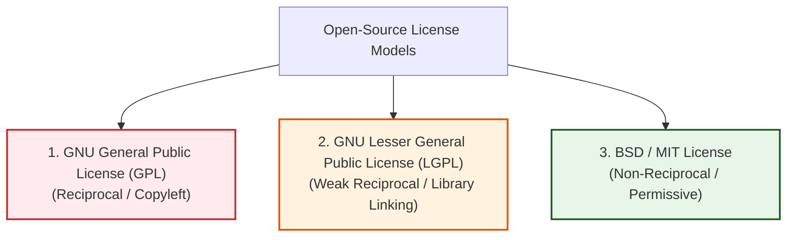

# Open-Source Development and Software Licensing

_(Based on Ian Sommerville, "Software Engineering" - Chapter 7, Section 7.4)_

**Open-source development** is an approach to software engineering where the source code of a software system is published openly, inviting volunteer communities to participate in testing, debugging, and extending the software.

---

## 1. Fundamentals of Open-Source Development

### 1.1 Development Model and Core Groups

- **Origin:** Rooted in the **Free Software Foundation (FSF)**, which advocates that software source code should never be proprietary.
- **Community Model:** Uses the Internet to recruit developers worldwide. While anyone can submit bug fixes or feature requests, successful open-source projects rely on a **small core group of maintainers** who inspect and approve all code commits.
- **Major Open-Source Systems:**
  - _Operating Systems:_ Linux, Android OS.
  - _Web & Database Servers:_ Apache HTTP Server, MySQL.
  - _Development Platforms:_ Java, Eclipse IDE, Python.

---

### 1.2 Open-Source Business Models

Companies adopting open-source software generate revenue without selling code licenses by:

1.  **Selling Add-On Support & Consulting:** Offering professional installation, training, and maintenance contracts.
2.  **Hosted Cloud Services (SaaS):** Running and managing open-source systems on cloud infrastructure for enterprise clients.
3.  **Dual Licensing:** Offering a free open-source version alongside a paid commercial version with premium features.

---

## 2. Open-Source Software Licensing

> [!IMPORTANT]
> **Key Legal Concept:**
> Open source does **NOT** mean public domain or copyright-free. Source code remains legally owned by its creators, who enforce mandatory usage terms via **Open-Source Software Licenses**.

---

### 2.1 The Three Major Open-Source License Models

| License Type                                 | Category                        | Core Terms & Restrictions                                                                                                                                        | Commercial Impact                                                                                      |
| :------------------------------------------- | :------------------------------ | :--------------------------------------------------------------------------------------------------------------------------------------------------------------- | :----------------------------------------------------------------------------------------------------- |
| **GNU General Public License (GPL)**         | **Reciprocal (Copyleft)**       | If your software includes or derives from GPL code, **your entire application must be open-sourced under GPL**.                                                  | **High Risk for Proprietary Products.** Cannot sell closed-source binary products containing GPL code. |
| **GNU Lesser General Public License (LGPL)** | **Weak Reciprocal**             | You can link proprietary applications to LGPL components without open-sourcing your code. **Only modifications to the LGPL component itself must be published.** | **Medium Risk.** Safe for linking standard dynamic libraries.                                          |
| **BSD / MIT License**                        | **Non-Reciprocal (Permissive)** | Allows incorporating code into proprietary closed-source products without releasing your source code. Requires only crediting original authors.                  | **Low Risk.** Highly popular for commercial enterprise product development.                            |

---

## 3. Six Organizational Open-Source Management Rules

According to Bayersdorfer, software development organizations using open-source software must establish 6 operational guidelines:

1.  **Component & License Tracking:** Maintain an exact repository log of all downloaded open-source components and valid copies of their active licenses.
2.  **Pre-Use License Evaluation:** Audit open-source component licenses prior to integration to ensure compliance with commercial product goals.
3.  **Evolution Pathway Roadmapping:** Monitor open-source project development roadmaps to anticipate breaking changes.
4.  **Developer License Education:** Train software engineers on license compliance risks (e.g., avoiding accidental GPL contamination).
5.  **Automated License Auditing:** Use automated code-scanning tools to detect unauthorized open-source snippet pasting in production repositories.
6.  **Active Community Participation:** Contribute fixes and financial support back to the open-source projects the organization relies upon.

---
