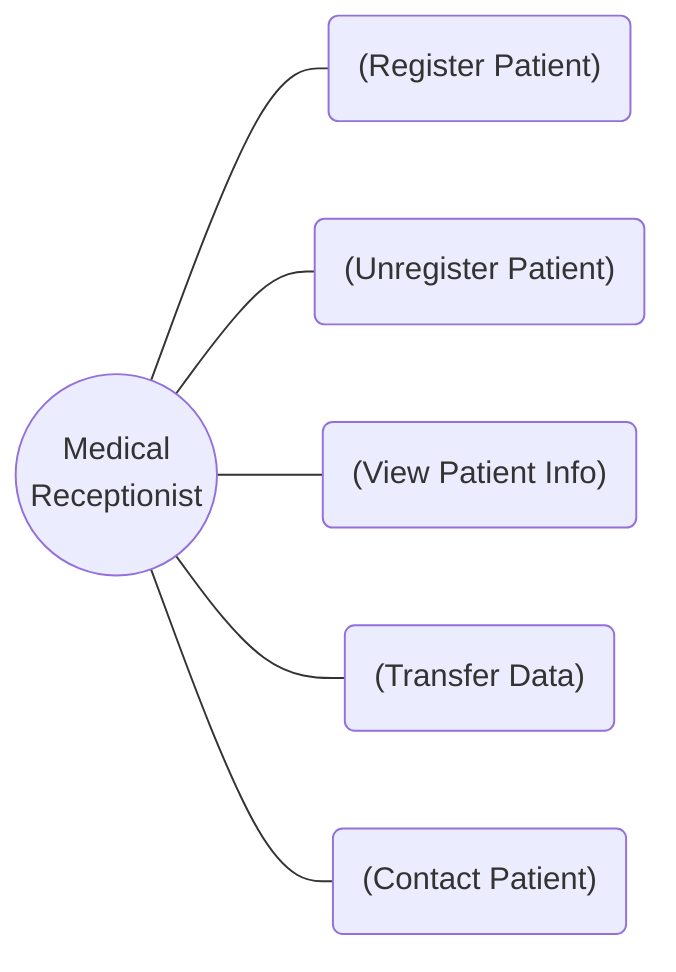
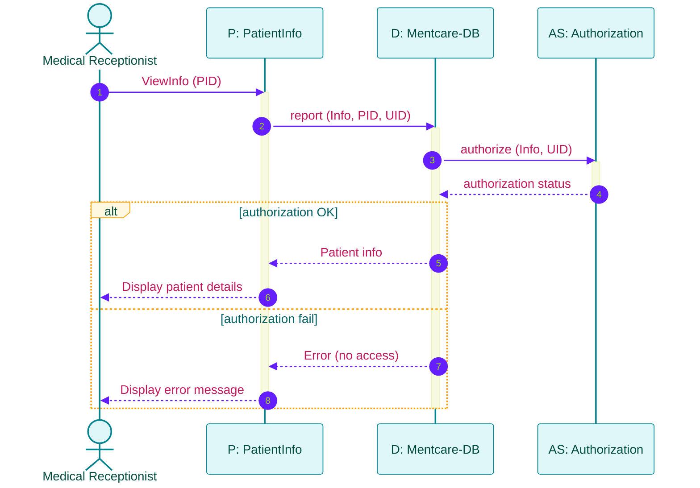
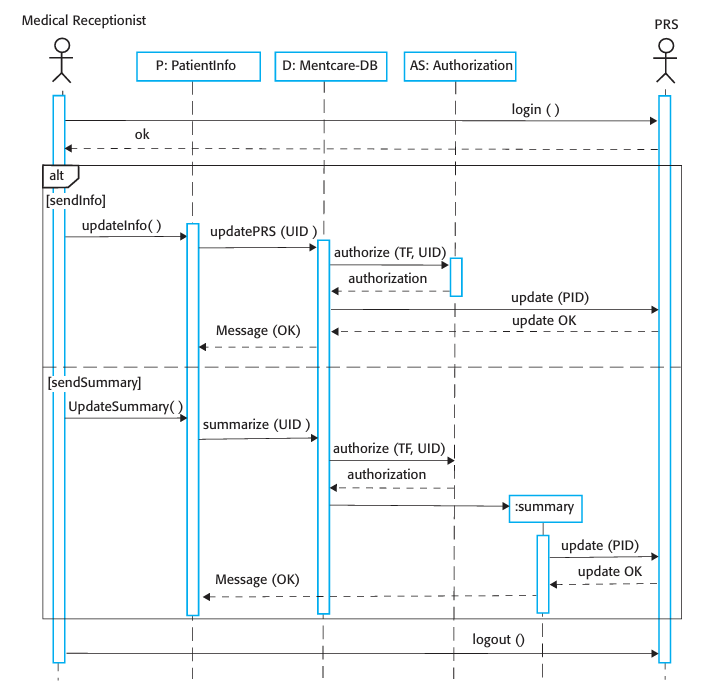
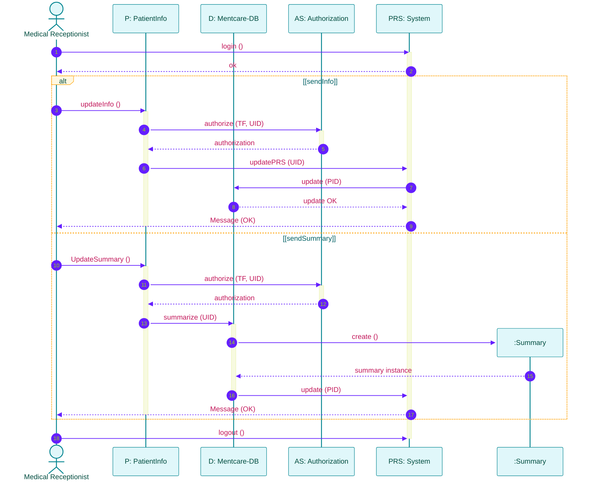
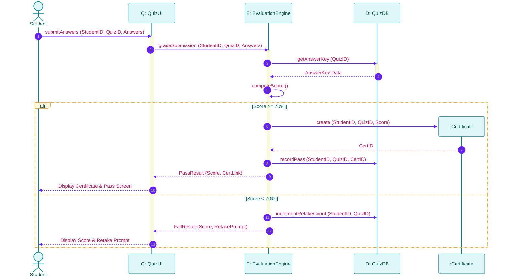

# Interaction Models and Sequence Diagrams
*(Based on Ian Sommerville, "Software Engineering" - Chapter 5)*

**Interaction modeling** focuses on how system components interact with each other, with external systems, and with human users.

---

## 1. Fundamentals of Interaction Modeling

Modeling interaction serves three distinct software engineering purposes:
1.  **User Interaction Modeling:** Helps identify user requirements and user interface flows.
2.  **System-to-System Interaction Modeling:** Highlights communication protocols and data exchange issues between external software systems.
3.  **Component Interaction Modeling:** Helps evaluate if a proposed software architecture will deliver required performance and dependability.

### Two Complementary Approaches:
*   **Use Case Modeling:** High-level overview of interactions between a system and external agents (users/systems).
*   **Sequence Diagrams:** Detailed, temporal sequence of messages passed between actors and system objects over time.

---

## 2. Use Case Modeling

### 2.1 Use Case Elements
*   **Actors:** External entities that interact with the system. Represented as stick figures (used for both **human users** and **external automated systems**).
*   **Use Case:** A discrete unit of system functionality. Represented as an ellipse.
*   **Association Line:** Connects an actor to a use case.

### 2.2 Tabular Specification of Use Cases
A use case diagram provides an overview, but full details must be documented in a structured table.

#### Example: "Transfer Data" Use Case Specification (Mentcare)

| Field | Description |
| :--- | :--- |
| **Use Case Name** | Transfer Data |
| **Actors** | Medical Receptionist, Patient Records System (PRS) |
| **Description** | The receptionist transfers patient data from Mentcare to a central health authority PRS database (either updated contact info or treatment summary). |
| **Data** | Patient personal info, treatment summary record. |
| **Stimulus** | User command issued by the Medical Receptionist. |
| **Response** | Confirmation message displayed that PRS has been updated successfully. |
| **Comments** | The receptionist must hold security authorization to read patient records and write to the PRS. |

### 2.3 Composite Use Case Diagrams
When a single actor interacts with multiple system functions, related use cases are grouped into a **Composite Use Case Diagram**:

---

## 3. Sequence Diagrams
Sequence diagrams capture the dynamic, time-ordered sequence of interactions between system objects and actors.

### 3.1 Key Sequence Diagram Notations
*   **Objects / Actors (Top Box):** Entities involved in the interaction (e.g., `P: PatientInfo`, `AS: Authorization`).
*   **Lifeline (Vertical Dashed Line):** Represents the existence of an object over time.
*   **Activation Bar (Vertical Rectangle):** Indicates the period during which an object is executing an operation.
*   **Solid Arrow ($\rightarrow$):** Synchronous method call or message.
*   **Dashed Arrow ($\dashleftarrow$):** Return value/reply message.
*   **`alt` Box (Combined Fragment):** Represents alternative conditional branches (guarded by `[condition]`).
*   **Object Creation (`create`):** Indicates dynamic instantiation of a new object during execution (e.g., `:Summary`).

---

### 3.2 Sequence Diagram 1: View Patient Information

---

### 3.3 Sequence Diagram 2: Transfer Data (Textbook Diagram)
Below is the official textbook sequence diagram for transferring data to the national Patient Record System (PRS):

#### Equivalent Sequence Diagram Flow:

---

## 4. Solved Practical Exam Problem

### Problem Statement
> **Exam Question (10 Marks):**
> *An **Online Quiz & Certification System (OQCS)** allows a Student to submit quiz answers. The system operates as follows:*
> 1. *The Student submits their quiz answers via the UI object (`Q: QuizUI`).*
> 2. *`Q: QuizUI` requests the `E: EvaluationEngine` to grade the submission.*
> 3. *`E: EvaluationEngine` fetches correct answer keys from `D: QuizDB` and calculates the percentage score.*
> 4. *If the score is $\ge 70\%$, `E: EvaluationEngine` dynamically creates a `:Certificate` object, records the pass result in `D: QuizDB`, and returns a success message with a PDF download link.*
> 5. *If the score is $< 70\%$, `E: EvaluationEngine` updates the retake counter in `D: QuizDB` and returns a failure message.*
>
> **Tasks:**
> 1. Write the **Use Case Tabular Specification** for "Submit Quiz".
> 2. Draw the complete **UML Sequence Diagram** using `alt` branching and dynamic object creation (`:Certificate`).

---

### Solution

#### Task 1: Tabular Specification for "Submit Quiz" Use Case

| Field | Description |
| :--- | :--- |
| **Use Case Name** | Submit Quiz Answers |
| **Actors** | Student (Primary User), Evaluation Engine |
| **Description** | Student submits completed quiz answers to be graded automatically by the evaluation engine. |
| **Data** | Student ID, Quiz ID, Answer array, Score, Certificate ID. |
| **Stimulus** | Student clicks the "Submit Quiz" button on the UI. |
| **Response** | Score display with a Certificate download link (if passed) or Retake prompt (if failed). |
| **Comments** | Passing threshold is strictly set to 70%. |

#### Task 2: Sequence Diagram with `alt` Branching & Dynamic Object Creation

#### Diagram Explanation:
1.  **Synchronous Message (`1`):** Student triggers `submitAnswers(...)` on `Q: QuizUI`.
2.  **Internal Computation (`5`):** `E: EvaluationEngine` self-calls `computeScore()`.
3.  **Dynamic Creation (`alt` Branch 1):** When `[Score >= 70%]`, `E: EvaluationEngine` executes `create` to instantiate a new `:Certificate` object.
4.  **Alternative Branch (`alt` Branch 2):** When `[Score < 70%]`, execution switches to incrementing retake counts without creating a certificate object.
