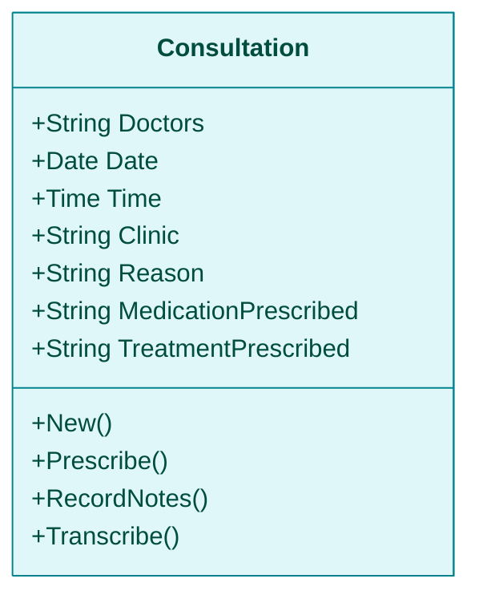
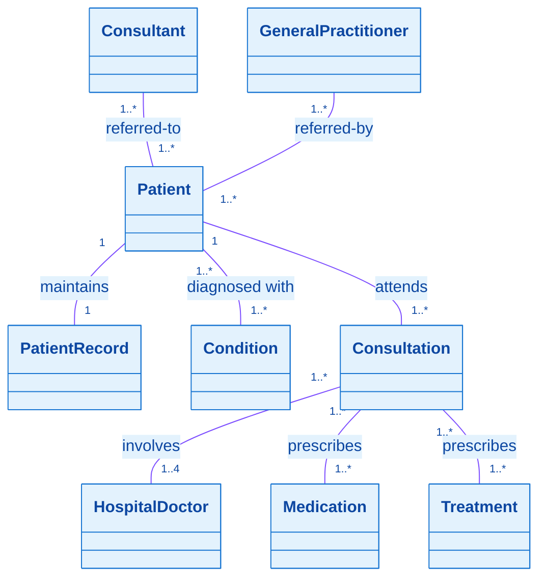
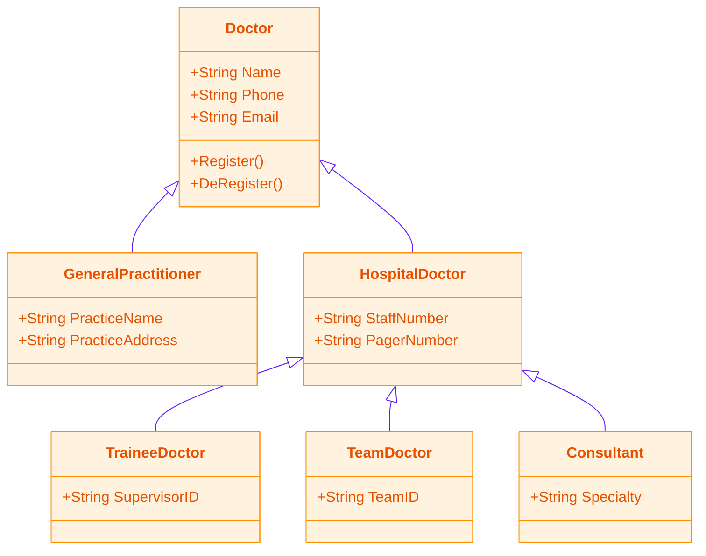
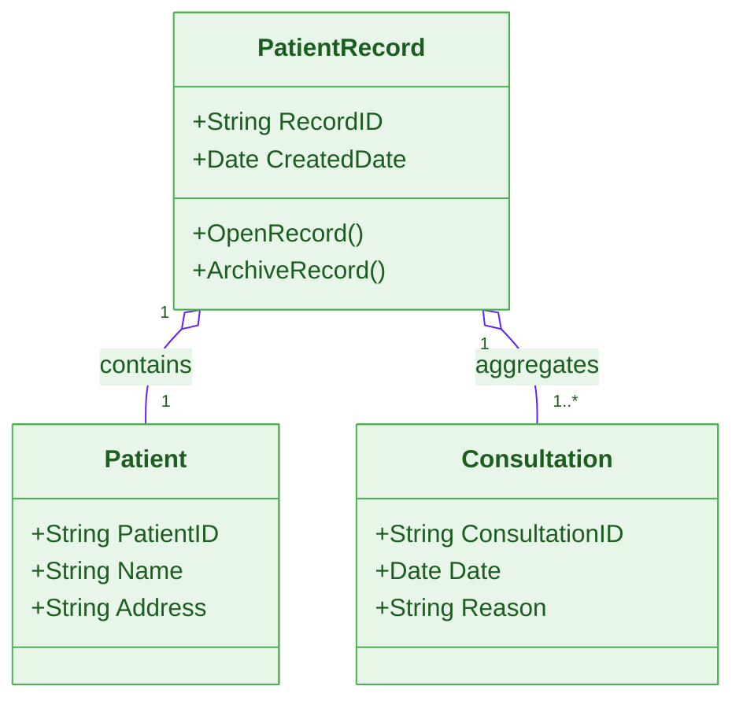
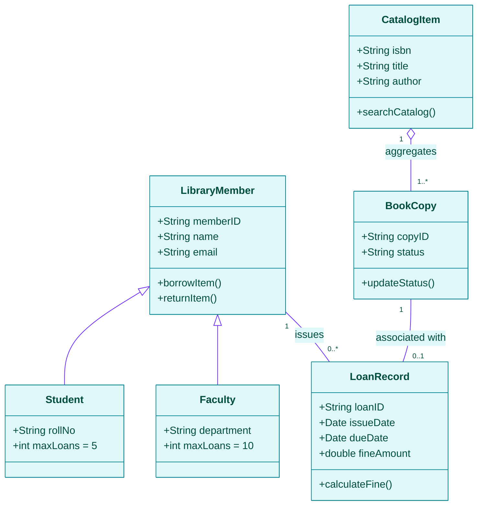

# Structural Models: Class Diagrams, Generalization, and Aggregation
*(Based on Ian Sommerville, "Software Engineering" - Chapter 5)*

**Structural models** display the static organization of a system in terms of the components that make up the system and their relationships.

---

## 1. Fundamentals of Structural Models

*   **Static Models:** Show the organization of the system design (class structures, packages, deployment nodes).
*   **Dynamic Models:** Show the organization of the system during runtime execution (interacting threads, object instances).
*   **Primary Tool:** **UML Class Diagrams** are used to model static object-oriented structures, showing object classes, their internal details, and relationships.

---

## 2. UML Class Diagrams and Associations

### 2.1 The Three-Compartment Class Box
In UML, an object class is drawn as a rectangle split into three sections:

1.  **Top Compartment:** Class Name (e.g., `Consultation`).
2.  **Middle Compartment:** Class Attributes (variables/characteristics).
3.  **Bottom Compartment:** Class Operations / Methods (functions associated with the class).

---

### 2.2 Associations and Multiplicity
An **association** is a link between classes indicating a relationship. Annotations at line ends show **multiplicity**:

| Multiplicity Notation | Meaning | Real-World Example |
| :--- | :--- | :--- |
| **`1`** | Exactly one object instance | Each `Patient` has exactly `1` `Patient Record`. |
| **`1..*`** | One or more objects (at least 1) | A `Doctor` prescribes `1..*` `Treatment` records. |
| **`1..4`** | Range from 1 to 4 objects | A `Consultation` involves `1..4` `Doctors`. |
| **`*` or `0..*`** | Zero or more objects (any number) | A `Patient` can have `0..*` `Consultations`. |

#### Mentcare System Class Association Overview:

---

## 3. Generalization (Inheritance)

**Generalization** is an abstraction technique used to manage complexity by placing common attributes and operations in a high-level **superclass**, which lower-level **subclasses** inherit.

### 3.1 Key Generalization Rules
*   **UML Notation:** Solid arrow with a **hollow triangular arrowhead ($\triangle$) pointing UP toward the superclass**.
*   **Inheritance:** Subclasses inherit all attributes and methods of the superclass and add their own specialized fields.

### 3.2 Mentcare Doctor Inheritance Hierarchy

---

## 4. Aggregation (Whole-Part Relationship)

**Aggregation** models a composition where one object (the **Whole**) is composed of or contains other objects (the **Parts**).

### 4.1 Key Aggregation Rules
*   **UML Notation:** A **hollow diamond ($\diamond$)** placed at the line end attached to the **Whole / Composite class**.
*   **Exam Distinction:** If the composite class is destroyed, component parts may still exist independently in memory.

#### Mentcare Patient Record Aggregation Example:

---

## 5. Solved Practical Exam Problem

### Problem Statement
> **Exam Question (10 Marks):**
> *Design a complete UML Class Diagram for a **University Library Management System**. The system requirements are:*
> 1. *A base class `LibraryMember` holds `memberID`, `name`, `email` and methods `borrowItem()`, `returnItem()`.*
> 2. *`LibraryMember` has two subclasses: `Student` (adds `rollNo`, `maxLoans=5`) and `Faculty` (adds `department`, `maxLoans=10`).*
> 3. *A `LibraryMember` initiates `0..*` `LoanRecord` objects (`1` member $\rightarrow$ `0..*` loans).*
> 4. *Each `LoanRecord` holds `loanID`, `issueDate`, `dueDate`, `fineAmount` and method `calculateFine()`.*
> 5. *A `CatalogItem` (the Whole) aggregates `1..*` physical `BookCopy` objects (the Parts).*
>
> **Tasks:**
> 1. Draw the complete **UML Class Diagram** showing 3-compartment classes, generalization arrows, aggregation diamonds, and multiplicities.
> 2. Explain the relationship between `LibraryMember`, `Student`, and `Faculty`.

---

### Solution

#### Task 1: Complete UML Class Diagram

#### Task 2: Structural Relationship Explanation
1.  **Generalization (`LibraryMember <|-- Student` & `Faculty`):**
    *   `LibraryMember` is the **Superclass** containing common member data (`memberID`, `name`, `email`, `borrowItem()`).
    *   `Student` and `Faculty` are **Subclasses** inheriting all member attributes while defining role-specific loan limits (`maxLoans=5` vs `maxLoans=10`).
2.  **Aggregation (`CatalogItem 1 o-- 1..* BookCopy`):**
    *   `CatalogItem` represents the general book title entry (the **Whole**), which aggregates multiple physical copies (`BookCopy`, the **Parts**) using the hollow diamond (`o--`).
3.  **Multiplicities:**
    *   `LibraryMember "1" -- "0..*" LoanRecord`: One member can hold zero or multiple active loan records.
    *   `CatalogItem "1" o-- "1..*" BookCopy`: One catalog entry must aggregate at least 1 physical copy.
