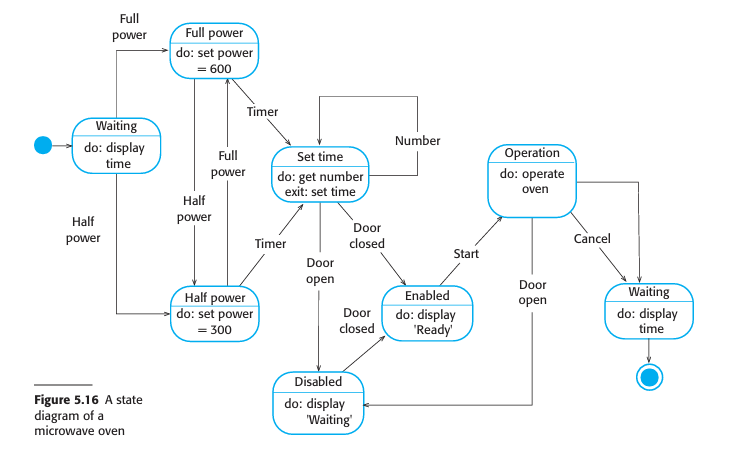
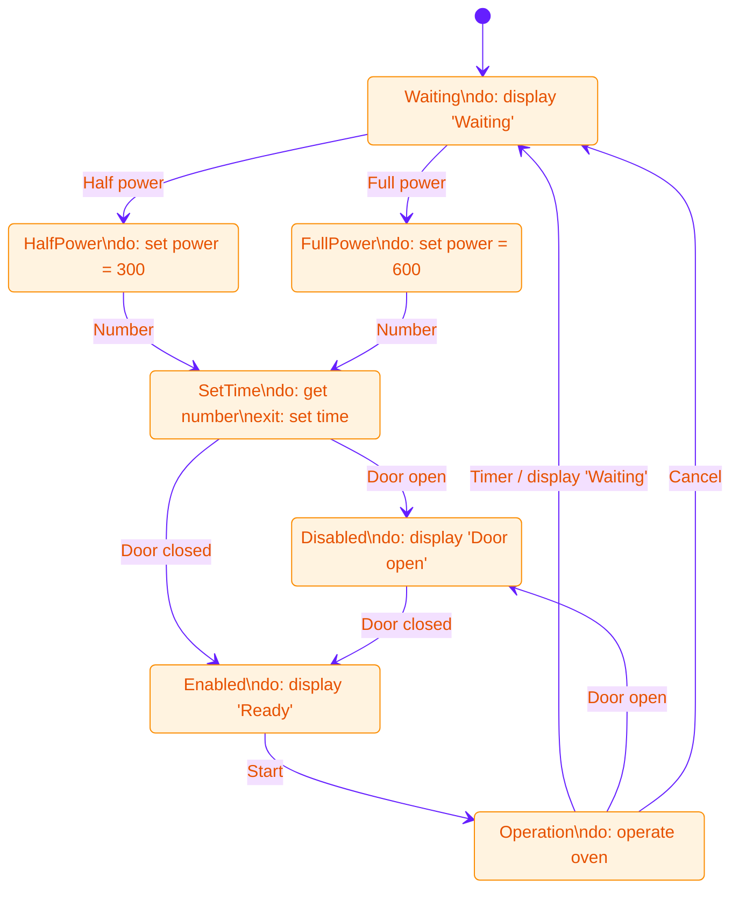
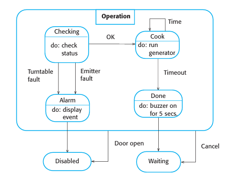
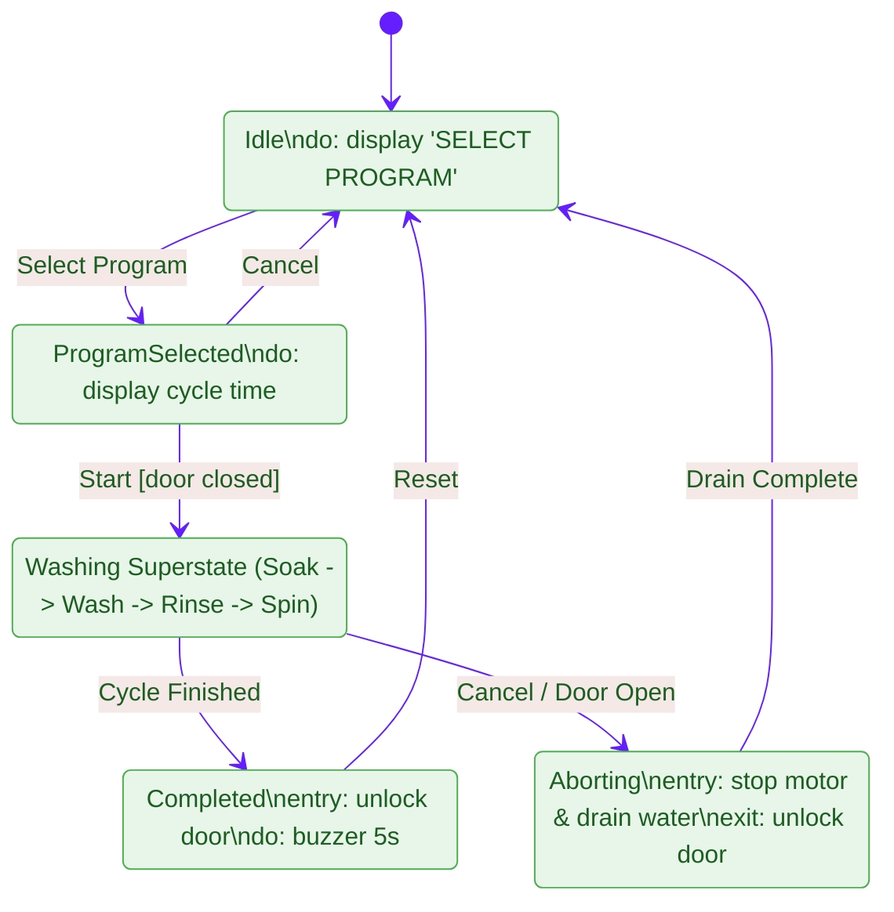

# Behavioral Models: Data-Driven, Event-Driven, and Model-Driven Architecture
*(Based on Ian Sommerville, "Software Engineering" - Chapter 5)*

**Behavioral models** describe the dynamic execution behavior of a software system as it responds to stimuli from its environment.

---

## 1. Fundamentals of Behavioral Modeling

System stimuli fall into two primary categories:

| Stimulus Type | System Characteristics | Primary Domain | UML Diagram Used |
| :--- | :--- | :--- | :--- |
| **Data-Driven** | Processing is triggered by the arrival of input data. The system executes a sequence of data transformations. | Business systems, billing, batch processing. | Activity Diagrams (with Data Objects), Left-to-Right Sequence Diagrams |
| **Event-Driven** | Processing is triggered by external or internal events. The system changes state in response to signals. | Real-time embedded systems, IoT devices, control systems. | State Machine Diagrams (Statecharts) |

---

## 2. Data-Driven Modeling
Data-driven models show the sequence of actions involved in processing input data and generating output.

### 2.1 UML Activity Diagrams with Data Objects
Historically represented using Data Flow Diagrams (DFDs), modern UML represents data flows by combining **Activities** (rounded rectangles) with **Data Objects** (rectangles):

*   **Activities (Rounded Boxes):** Processing steps (`Get Sensor Value`, `Compute Sugar Level`).
*   **Data Objects (Rectangles):** Transient data artifacts passed between steps (`Sensor Data`, `Insulin Requirement`).

### 2.2 Sequence Diagram Data-Flow Representation
Alternatively, sequence diagrams drawn so that messages flow primarily left-to-right highlight object-driven data processing (e.g., an Order Processing workflow updating an `«datastore» Orders` object).

---

## 3. Event-Driven Modeling (State Machine Diagrams)

Event-driven modeling assumes a system exists in a finite number of **states** and that stimuli cause **transitions** between states.

### 3.1 Microwave Oven State Diagram (Textbook Diagram)
Below is the official textbook state diagram for the microwave oven control system:

#### Equivalent State Diagram Structure:

---

### 3.2 Superstates and Substates
In large state models, the number of states increases rapidly (state explosion). To manage complexity, UML uses **Superstates**:
*   A **Superstate** encapsulates a cluster of separate sub-states into a single high-level state box.
*   On a high-level diagram, it appears as a single state (e.g., `Operation`), but it is expanded into a detailed separate diagram.

#### Expansion of the `Operation` Superstate (Textbook Diagram):
Below is the textbook diagram detailing the sub-states inside the `Operation` superstate:

#### Substate Workflow Breakdown:
1.  **Checking:** Performs initial status check (`do: check status`). If hardware errors occur (`Turntable fault` or `Emitter fault`), it transitions to `Alarm` (`do: display event`) and then `Disabled`.
2.  **Cook:** If status is `OK`, transitions to `Cook` (`do: run generator`).
3.  **Done:** Upon `Timeout`, transitions to `Done` (`do: buzzer on for 5 secs`).
4.  **Completion / Abort:** Moves back to `Waiting` or `Disabled` if the door is opened.

---

### 3.3 Tabular Description of Microwave States and Stimuli

#### Microwave States Table:
| State | Description |
| :--- | :--- |
| **Waiting** | The oven is waiting for user input. Display shows current time. |
| **Half power** | Power is set to 300 watts. Display shows "Half power." |
| **Full power** | Power is set to 600 watts. Display shows "Full power." |
| **Set time** | Cooking time is set to user input value. Display shows cooking time. |
| **Disabled** | Operation disabled for safety (door open). Interior light ON. Display shows "Not ready." |
| **Enabled** | Operation enabled. Interior light OFF. Display shows "Ready to cook." |
| **Operation** | Oven actively cooking. Interior light ON. Display shows timer countdown. Buzzer sounds for 5 seconds on completion. |

#### Microwave Stimuli Table:
| Stimulus | Trigger Description |
| :--- | :--- |
| **Half power** | User pressed the half-power button. |
| **Full power** | User pressed the full-power button. |
| **Timer** | User pressed a timer button. |
| **Number** | User pressed a numeric key. |
| **Door open** | Oven door switch opened. |
| **Door closed** | Oven door switch closed. |
| **Start** | User pressed the Start button. |
| **Cancel** | User pressed the Cancel button. |

---

## 4. Model-Driven Architecture (MDA) and Model-Driven Engineering (MDE)

**Model-Driven Engineering (MDE)** is an approach where software models (rather than source code) are the primary outputs of the software process, and executable code is automatically generated from these models.

*   **MDE vs. MDA:**
    *   **Model-Driven Architecture (MDA):** Proposed by the Object Management Group (OMG), MDA focuses specifically on the **design and implementation** stages of development.
    *   **Model-Driven Engineering (MDE):** A broader concept covering all lifecycle phases, including model-based requirements engineering, processes, and model-based testing.

---

## 5. Solved Practical Exam Problem

### Problem Statement
> **Exam Question (10 Marks):**
> *Design a complete UML State Machine Diagram for an **Automated Washing Machine Control System**. The system requirements state:*
> 1. *The machine starts in `Idle` (`do: display "SELECT PROGRAM"`).*
> 2. *Selecting a cycle moves it to `ProgramSelected` (`do: display cycle time`).*
> 3. *Pressing `Start` [door closed] moves it to the `Washing` superstate.*
> 4. *The `Washing` superstate contains sub-states: `Soaking` $\rightarrow$ `WashingCycle` $\rightarrow$ `Rinsing` $\rightarrow$ `Spinning`.*
> 5. *Upon completion, it transitions to `Completed` (`entry: unlock door`, `do: buzzer 5s`).*
> 6. *Opening the door or pressing Cancel during active washing aborts to `Aborting` (`entry: stop motor & drain`).*
>
> **Tasks:**
> 1. Explain the concept of **Superstates** and why they are necessary in event-driven modeling.
> 2. Draw the complete **UML State Diagram** incorporating superstate concepts and transition conditions.

---

### Solution

#### Task 1: Concept of Superstates
A **Superstate** groups related substates into a higher-level abstraction. It is necessary in state-based modeling because:
1.  **Prevents State Explosion:** Avoids drawing dozens of repeating transition arrows (e.g., drawing `Cancel` transitions from 5 different sub-states to `Idle` can be replaced by a single transition from the `Washing` superstate).
2.  **Improves Readability:** Allows system designers to present high-level architecture before zooming into substate implementation details.

#### Task 2: Washing Machine State Diagram

