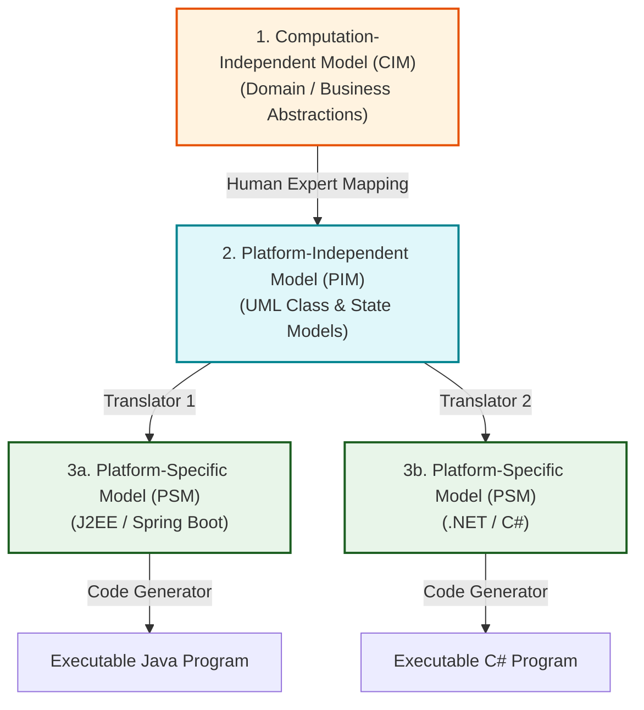
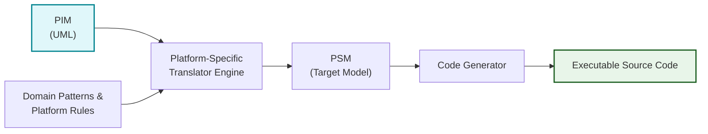
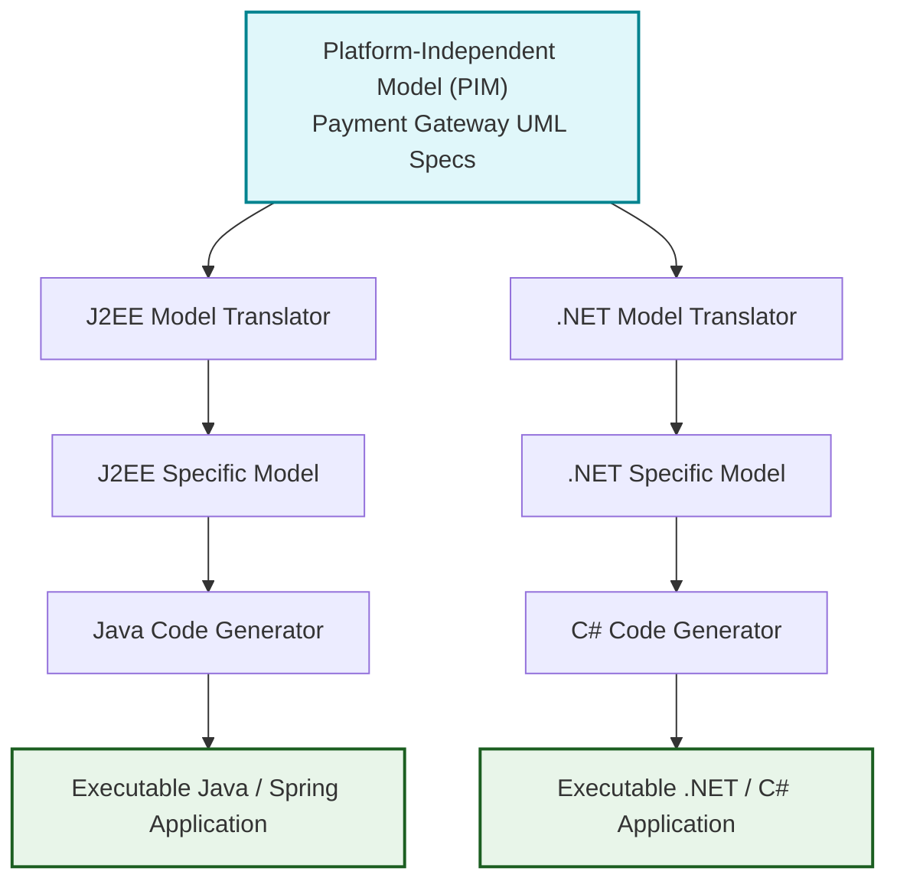

# Model-Driven Architecture (MDA) and Model-Driven Engineering (MDE)
*(Based on Ian Sommerville, "Software Engineering" - Chapter 5)*

**Model-Driven Engineering (MDE)** is an approach to software development where graphical models, rather than source code programs, are the primary outputs of the development process. Executable code is automatically generated from these models.

---

## 1. MDE vs. MDA

| Aspect | Model-Driven Engineering (MDE) | Model-Driven Architecture (MDA) |
| :--- | :--- | :--- |
| **Origin & Focus** | Broader software engineering paradigm. | Proposed by the Object Management Group (OMG). |
| **Lifecycle Scope** | Applies to **all** phases (Requirements, Design, Testing, Maintenance). | Focuses specifically on **Design and Implementation**. |
| **Core Goal** | Raises software abstraction so engineers do not deal with language syntax or execution platforms. | Standardizes platform-independent model transformations to code. |

---

## 2. The Three MDA Model Abstraction Levels

MDA recommends creating three distinct levels of abstract system models:

### 2.1 Computation-Independent Model (CIM)
*   **Definition:** Also called **Domain Models**, CIMs represent high-level business concepts and domain abstractions without any reference to software systems or technology.
*   *Examples:* Security CIM (identifying assets and user roles), Hospital Patient Record CIM (patients, consultations).

### 2.2 Platform-Independent Model (PIM)
*   **Definition:** Models the operational behavior and static structure of the system without reference to its execution platform or middleware.
*   *Format:* Expressed using standard UML class diagrams, activity models, and statecharts.

### 2.3 Platform-Specific Models (PSM)
*   **Definition:** Transformations of the PIM tailored for specific target execution platforms (e.g., J2EE, .NET, Android).
*   *Layers:* There can be multiple layers of PSM (e.g., middleware-specific PSM followed by database-specific PSM).

---

## 3. MDA Transformation Pipeline and Tooling

### 3.1 Model Transformation Process

1.  **CIM to PIM Translation:** Requires **human intervention** (domain experts) because linking abstract business domain concepts (e.g., security roles vs. hospital staff) cannot be automated fully by AI or rules engines.
2.  **PIM to PSM Translation:** Automated by commercial and open-source translation engines using platform-specific patterns and libraries.
3.  **PSM to Code Generation:** Automated compilation of PSM into source files (Java, C#, C++) using tools like **Executable UML (xUML)**.

---

## 4. Why MDA Has Faced Slow Mainstream Adoption

Although MDA promises automatic code generation and platform independence, mainstream adoption has been slow due to 4 major obstacles:

1.  **Abstraction Misalignment:** Abstractions ideal for high-level stakeholder discussions are rarely the right abstractions for implementation (which often rely on commercial off-the-shelf component integration).
2.  **Coding is Not the Primary Bottleneck:** In complex enterprise software, writing source code is relatively easy compared to **Requirements Engineering, Security/Dependability Analysis, Legacy System Integration, and Testing**. MDA only speeds up code generation.
3.  **High Tooling & Maintenance Costs:** Off-the-shelf tools rarely support custom in-house libraries. Building and maintaining custom MDA model translators requires high investment, which is unfeasible for standard platforms (Windows/Linux).
4.  **Conflict with Agile Methodologies:** Extensive up-front modeling directly contradicts the Agile Manifesto (which favors working code over comprehensive documentation). *Exception:* Companies like Motorola have successfully combined Agile development with automated model code generation.

> [!NOTE]
> **MDA Success Domain:** MDA has been most successful in **systems products** (e.g., automotive control, aerospace, air traffic control) where software has a multi-decade lifetime, hardware platforms change frequently, and domain rules are highly formalized.

---

## 5. Solved Practical Exam Problem

### Problem Statement
> **Exam Question (10 Marks):**
> *A financial enterprise is engineering a **Cross-Border Payment Gateway System** that must be deployed on both **J2EE (Java)** and **Microsoft .NET (C#)** platforms.*
> 
> **Tasks:**
> 1. Define the 3 levels of MDA models (CIM, PIM, PSM) for this Payment Gateway.
> 2. Draw the **MDA Model Transformation Diagram** showing how one PIM yields code for both platforms.
> 3. State 3 key reasons why enterprise software companies often hesitate to adopt MDA.

---

### Solution

#### Task 1: MDA Model Levels for Payment Gateway
1.  **CIM (Computation-Independent Model):** High-level financial domain model defining currency exchange rules, compliance regulation abstractions, and fraud risk thresholds.
2.  **PIM (Platform-Independent Model):** UML Class and State diagrams defining `Account`, `Transaction`, `PaymentProcessor` objects and validation statecharts without specifying database or language frameworks.
3.  **PSM (Platform-Specific Model):**
    *   *J2EE PSM:* Maps `PaymentProcessor` to Spring Boot `@Service` beans and JPA entities.
    *   *.NET PSM:* Maps `PaymentProcessor` to ASP.NET Core Controllers and Entity Framework models.

#### Task 2: MDA Model Transformation Diagram

#### Task 3: 3 Reasons for Slow Enterprise Adoption
1.  **Custom Tooling Costs:** Off-the-shelf MDA tools cannot handle custom enterprise banking APIs, requiring expensive in-house translator development.
2.  **Implementation is Not the Core Problem:** Major risks lie in security auditing, banking compliance, and legacy mainframe integration—areas MDA does not solve.
3.  **Agile Preference:** Modern teams prefer iterative code refactoring over heavy up-front UML model translation pipelines.
