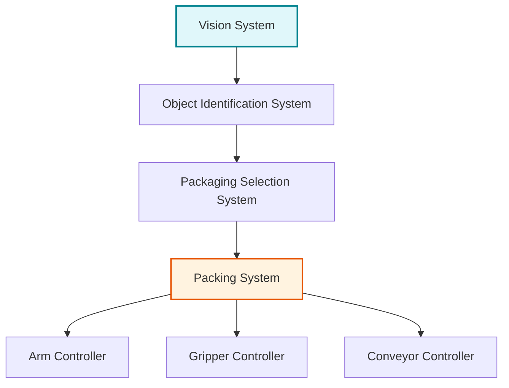
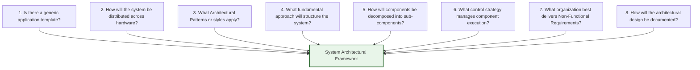
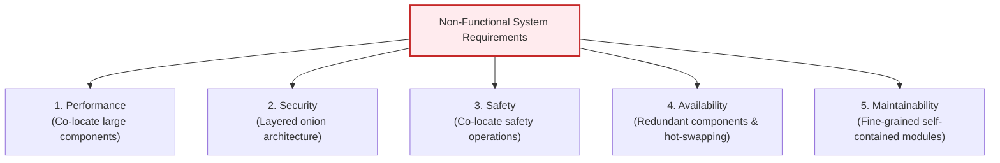
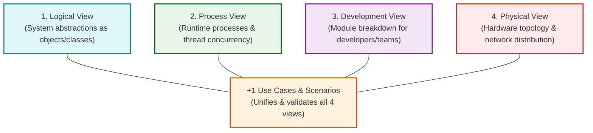

# Architectural Design and Architectural Design Decisions
*(Based on Ian Sommerville, "Software Engineering" - Chapter 6)*

**Architectural design** is the process of understanding how a software system should be organized and designing its high-level structural framework. It serves as the critical link between requirements engineering and detailed software design.

---

## 1. Fundamentals of Software Architecture

### 1.1 Architectural Refactoring vs. Component Refactoring

> [!IMPORTANT]
> **Exam Concept:** Why is architectural design done early?
> *   **Component Refactoring:** Relatively easy and inexpensive to modify individual classes or functions during development.
> *   **Architectural Refactoring:** Extremely expensive and difficult because changing the system architecture requires modifying and re-testing almost every component in the system.

### 1.2 Two Levels of Architectural Abstraction
1.  **Architecture in the Small:** Concerned with the architecture of individual programs and how a single program is decomposed into components.
2.  **Architecture in the Large:** Concerned with complex enterprise systems that include multiple programs, databases, and distributed services across different computers and organizations.

### 1.3 Three Key Advantages of Explicit Architecture Design (Bass et al.)
1.  **Stakeholder Communication:** Provides a high-level, abstract model that non-technical business stakeholders, managers, and engineers can discuss without getting bogged down in low-level code details.
2.  **System Analysis:** Allows early evaluation of whether the proposed system can satisfy critical quality attributes like performance, reliability, and security.
3.  **Large-Scale Reuse:** Architectural models can be reused across an entire family of related applications (**Software Product-Line Architectures**).

---

## 2. Abstract Architectural Models (Block Diagrams)

Informal block diagrams represent architectural components as boxes and data/control flow as arrows.

### Packing Robot Control System Architecture Example:

*   **Higher-Level Components:** Vision system, Object identification, Packaging selection.
*   **Lower-Level Controllers:** Arm controller, Gripper controller, Conveyor controller.

---

## 3. The 8 Fundamental Architectural Design Decisions

Architectural design is a creative decision-making process. System architects must answer 8 fundamental questions:

---

## 4. How Non-Functional Requirements (NFRs) Drive Architecture

> [!CAUTION]
> **Exam Question Focus:** *"Individual components implement functional requirements, but system architecture dictates non-functional quality attributes."*

The choice of architectural style depends heavily on the primary Non-Functional Requirements (NFRs) of the system:

### 4.1 Architectural Design Rules for Each Quality Attribute

1.  **Performance:**
    *   *Design Rule:* Localize critical operations within a **small number of large, co-located components** deployed on the same machine to eliminate network communication latency.
2.  **Security:**
    *   *Design Rule:* Use a **layered (onion) architecture** where the most critical assets are protected inside the innermost layers, and high-level validation checks are performed at outer layers.
3.  **Safety:**
    *   *Design Rule:* Co-locate safety-critical operations in a single small component (or isolated sub-system). This simplifies safety validation and enables dedicated emergency shutdown sub-systems.
4.  **Availability:**
    *   *Design Rule:* Include **redundant components** and fault-tolerant mechanisms so components can be updated or replaced without shutting down the system (hot-swapping).
5.  **Maintainability:**
    *   *Design Rule:* Use **fine-grained, self-contained, decoupled components**. Separate data producers from data consumers and avoid shared central data structures.

---

### 4.2 Architectural NFR Trade-off Conflicts

| Conflict Pair | Trade-off Friction | Resolution Strategy |
| :--- | :--- | :--- |
| **Performance vs. Maintainability** | Performance requires *large, co-located components* (less communication), whereas Maintainability requires *small, fine-grained components* (easy to change). | Use fine-grained modules during design, but bundle critical hot-paths into unified execution units at deployment. |
| **Security vs. Performance** | Layered security adds encryption and validation overhead at every boundary, slowing down transactions. | Apply heavy security checks at outer entry boundaries and cache validation tokens for inner operations. |

---

---

## 5. Architectural Views and Descriptions

Because a single graphical diagram cannot show all aspects of a system, software architects use **multiple architectural views** to present different system perspectives.

### 5.1 Kruchten's 4+1 View Model of Software Architecture

1.  **Logical View:** Shows key system abstractions as object classes. Relates business requirements directly to system entities.
2.  **Process View:** Shows runtime composition as interacting threads and processes. Used to evaluate **performance, concurrency, and availability**.
3.  **Development View:** Shows how software is decomposed into packages, modules, and components assigned to individual developers or teams.
4.  **Physical View:** Shows system hardware topology and how software components are distributed across physical servers and processors.
5.  **+1 Scenarios / Use Cases:** Binds the four views together using key user scenarios to demonstrate that the architecture functions as intended.

---

### 5.2 Conceptual Views (Hofmeister et al.)
In addition to Kruchten's views, Hofmeister proposed the **Conceptual View**—an abstract, high-level structural model (such as the Packing Robot diagram in Section 2) used to decompose requirements, explore component reuse, and establish product-line architectures.

---

### 5.3 Architectural Notations: UML vs. ADLs vs. Agile Documentation

| Notation / Approach | Characteristics | Practical Usage |
| :--- | :--- | :--- |
| **Informal Block Diagrams** | Simple boxes (components) and arrows (data/control flow). | Highly intuitive; preferred for whiteboard discussions and stakeholder communication. |
| **UML Diagrams** | Standardized OO modeling (Class, Component, Deployment diagrams). | Used primarily for detailed documentation and Model-Driven Engineering. |
| **Architectural Description Languages (ADLs)** | Specialized formal languages defining components, connectors, and constraints. | Rarely used in mainstream practice because domain experts find ADL syntax difficult to understand. |
| **Agile Documentation Stance** | Focuses on minimal, essential architectural sketches. | Rejects exhaustive up-front 4+1 documentation as wasteful, advocating only for views essential to team communication. |

---

## 6. Solved Practical Exam Problem

### Problem Statement
> **Exam Question (10 Marks):**
> *An enterprise is designing an **Autonomous Banking & Fraud Detection Platform**. The system requires ultra-fast transaction processing (Performance), strict encryption (Security), zero downtime (Availability), and frequent feature updates (Maintainability).*
> 
> **Tasks:**
> 1. Explain **Kruchten's 4+1 View Model** and detail how each view is used.
> 2. Explain how the architect must structure the system to satisfy **Performance, Security, Availability, and Maintainability**.
> 3. State the core architectural conflict between Performance and Maintainability and explain how the compromise is reached.

---

### Solution

#### Task 1: Kruchten's 4+1 Architectural Views
1.  **Logical View:** Maps banking entities (`Account`, `Transaction`, `Customer`) to object classes.
2.  **Process View:** Evaluates thread concurrency and latency in the real-time fraud checking pipeline.
3.  **Development View:** Organizes code into decoupled microservice packages assigned to separate engineering teams.
4.  **Physical View:** Maps containerized services to cloud server nodes, load balancers, and database clusters.
5.  **+1 Scenarios:** Uses a scenario like *"Process $10,000 ATM Withdrawal"* to validate that all 4 views work together seamlessly.

#### Task 2: Architectural Structures for NFRs
*   **Security:** Implement a **Layered Architecture**. The core vault and database sit in the innermost layer, surrounded by authentication, authorization, and API gateway layers.
*   **Performance:** Co-locate the Fraud Detection Engine and Account Ledger on high-speed in-memory servers to eliminate network IPC overhead.
*   **Availability:** Deploy **redundant active-active server clusters** with automated load balancing so individual nodes can be updated with zero downtime.
*   **Maintainability:** Use decoupled microservices for reporting, notifications, and analytics, separating data producers from consumers.

#### Task 3: Performance vs. Maintainability Conflict & Compromise
*   **The Conflict:** Performance demands large, monolithic components to avoid communication delays. Maintainability demands small, fine-grained components for easy updates.
*   **The Compromise:** Use a **Hybrid Architectural Pattern**. The high-frequency core payment pathway uses co-located, larger components (optimizing Performance), while secondary services (reporting, customer support) use fine-grained microservices (optimizing Maintainability).

