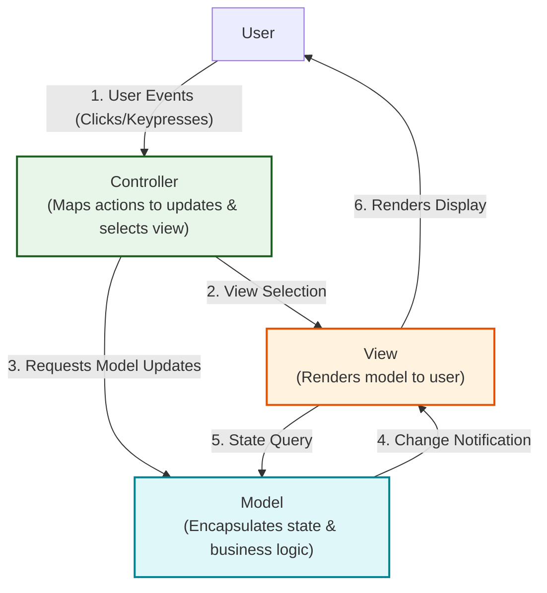
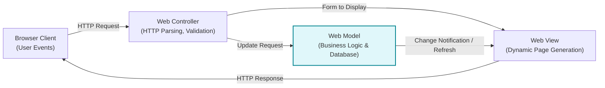
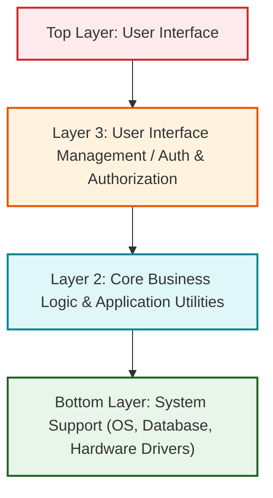
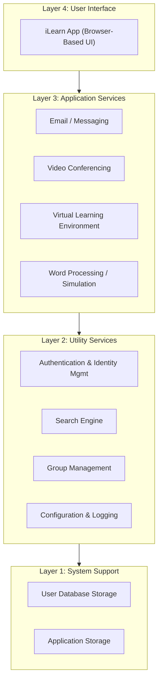
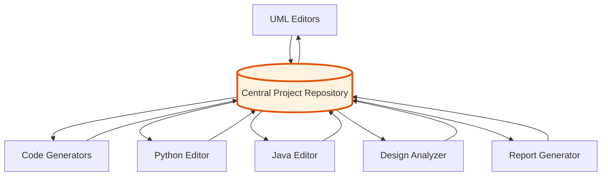
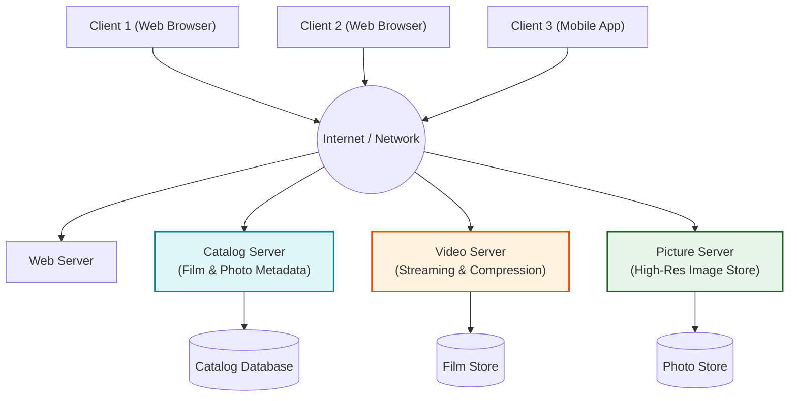
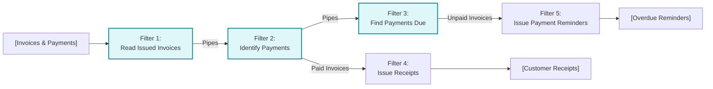
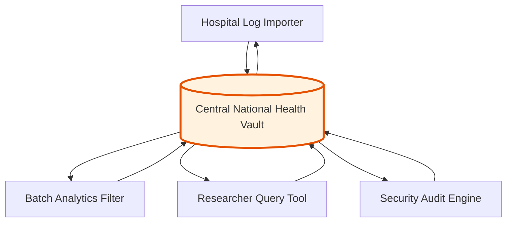

# Architectural Patterns
*(Based on Ian Sommerville, "Software Engineering" - Chapter 6, Section 6.3)*

An **Architectural Pattern** is a reusable, high-level structural blueprint for organizing software components, based on tried-and-tested software engineering practices.

---

## 1. Quick Exam Definitions & Comparison Matrix

### 1.1 Easy-to-Memorize Definitions
*   **Architectural Pattern:** A reusable template describing a proven system organization, including its context, strengths, and weaknesses.
*   **Model-View-Controller (MVC):** Separates data (**Model**), user interface (**View**), and interaction logic (**Controller**) into 3 decoupled components.
*   **Layered Architecture:** Organizes software into stacked functional layers, where each layer only uses services from the layer directly beneath it.
*   **Repository Architecture:** All system components share data through a single central database (**Repository**) without calling each other directly.
*   **Client-Server Architecture:** Organizes software as network-based **Servers** delivering specialized services to distributed **Client** applications.
*   **Pipe and Filter Architecture:** Data flows sequentially through discrete processing components (**Filters**) connected by data channels (**Pipes**).

---

### 1.2 Master Pattern Comparison Matrix

| Pattern Name | Core Mechanism | Key Advantages | Disadvantages / Risks | Best Suited For |
| :--- | :--- | :--- | :--- | :--- |
| **Model-View-Controller (MVC)** | Separates **Model** (Data), **View** (UI), and **Controller** (Events). | Data and representation change independently; supports multiple views. | Adds code complexity for simple applications. | Web applications, interactive GUI applications. |
| **Layered Architecture** | Organizes system into hierarchical functional layers. | Supports incremental development, multi-platform portability, and security isolation. | Multi-layer interpretation overhead reduces performance; clean layer boundaries can be hard to enforce. | Enterprise software, operating systems, multi-level security systems. |
| **Repository** | Central passive store shared by independent tools. | Components are independent; centralized data management and backup. | Single point of failure; schema changes affect all tools; distribution is difficult. | Software Development IDEs, CAD systems, Command & Control systems. |
| **Client-Server** | Network services delivered by servers to concurrent clients. | Distributed processing across network nodes; servers upgraded transparently. | Single point of failure for specific servers; network latency; DoS risk. | Web applications, video/media streaming libraries, multi-user shared databases. |
| **Pipe and Filter** | Sequential data transformations (**filters**) connected by streams (**pipes**). | Easy to understand; supports transformation reuse; matches business data workflows. | Data formats must be agreed upon; parsing/unparsing overhead; unsuited for interactive GUIs. | Batch processing, invoice/billing systems, signal/image processing pipelines. |

---

## 2. Model-View-Controller (MVC) Pattern

### 2.1 Pattern Structure and Interactions

### 2.2 MVC in Web Application Architecture

---

## 3. Layered Architecture Pattern

### 3.1 Generic 4-Layer Hierarchy

### 3.2 Real-World Textbook Example: iLearn Digital Learning System

---

## 4. Repository Architecture Pattern

In a **Repository Architecture**, components interact exclusively through a centralized data store rather than calling each other directly.

### 4.1 Real-World Textbook Example: Model-Driven IDE Architecture

> [!NOTE]
> **Passive Repository vs. Blackboard Model:**
> *   **Passive Repository:** Components control execution and explicitly query/update the central database.
> *   **Blackboard Model (AI Systems):** The central data store is active. When new unstructured data arrives, it triggers matching specialist knowledge sources (components).

---

## 5. Client-Server Architecture Pattern

In a **Client-Server Architecture**, system functionality is organized into a set of network services delivered by independent servers to concurrent client applications.

### 5.1 Real-World Textbook Example: Film and Photo Library System

---

## 6. Pipe and Filter Architecture Pattern

The **Pipe and Filter Pattern** models system execution as a chain of discrete data transformation components (**filters**) connected by data streams (**pipes**).

### 6.1 Real-World Textbook Example: Invoice Processing System

> [!WARNING]
> **Interactive GUI Limitation:** Pipe and filter systems are ideal for batch and stream processing, but are poorly suited for interactive GUI applications due to complex event-driven mouse/keyboard input streams.

---

## 7. Solved Practical Exam Problem

### Problem Statement
> **Exam Question (10 Marks):**
> *An engineering team is building a **National Healthcare Analytics Platform**. The platform must:*
> 1. *Allow medical practitioners to query patient records over the Internet using web browsers.*
> 2. *Enable data science teams to run weekly batch ETL jobs that transform raw hospital logs into anonymized research summaries.*
> 3. *Store all national health data in a central, highly secure, version-controlled vault accessible by research tools.*
>
> **Tasks:**
> 1. Recommend the most appropriate architectural pattern for each of the 3 system requirements above.
> 2. Draw a structural diagram for the **Repository Architecture** requirement.
> 3. Compare **Layered Architecture** and **Client-Server Architecture** in terms of advantages, disadvantages, and ideal use cases.

---

### Solution

#### Task 1: Architectural Pattern Recommendations
1.  **Web Browser Querying:** **Client-Server / MVC Architecture**. Allows distributed web clients to query centralized catalog and patient servers via HTTP without local database overhead.
2.  **Weekly Batch ETL Transformation:** **Pipe and Filter Architecture**. Ideal for batch sequential transformation workflows (Extracting logs $\rightarrow$ Anonymizing patient IDs $\rightarrow$ Computing summaries $\rightarrow$ Generating reports).
3.  **Centralized Secure Data Vault:** **Repository Architecture**. Ensures all research tools access an integrated, version-controlled central data model with unified backup and access controls.

#### Task 2: Repository Architecture Diagram for Healthcare Data Vault

#### Task 3: Layered vs. Client-Server Architectural Comparison

| Comparison Dimension | Layered Architecture | Client-Server Architecture |
| :--- | :--- | :--- |
| **Primary Focus** | Conceptual organization and separation of concerns within an application. | Distribution of runtime components across networked hardware machines. |
| **Communication** | Direct method calls between adjacent vertical layers. | Remote Procedure Calls (RPC) / HTTP request-reply protocols over networks. |
| **Key Advantage** | High maintainability and easy layer replacement (e.g., swapping database layers). | High scalability and distribution; servers can be added or upgraded transparently. |
| **Key Disadvantage** | Multilevel interpretation overhead can reduce runtime performance. | Network latency and vulnerability to Single Point of Failure (DoS attacks). |
| **Ideal Use Case** | Complex enterprise applications requiring multi-level security and OS portability. | Multi-user web applications, cloud services, and video streaming platforms. |
