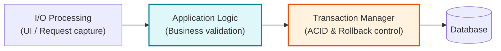
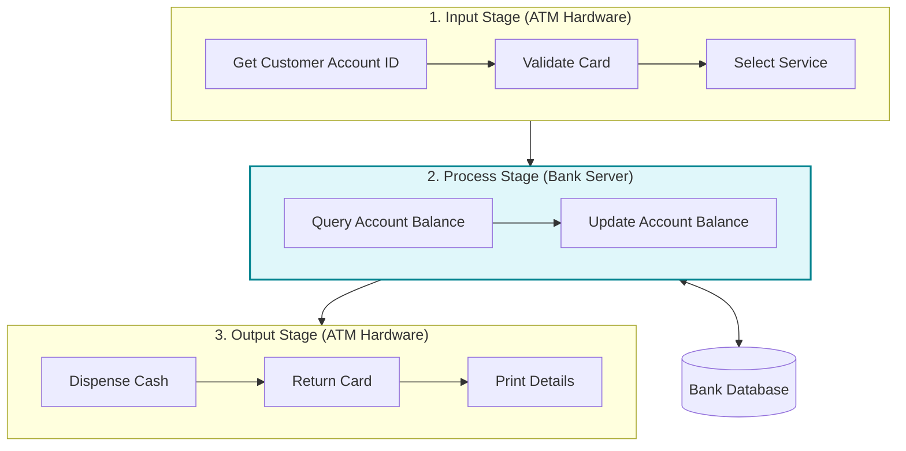
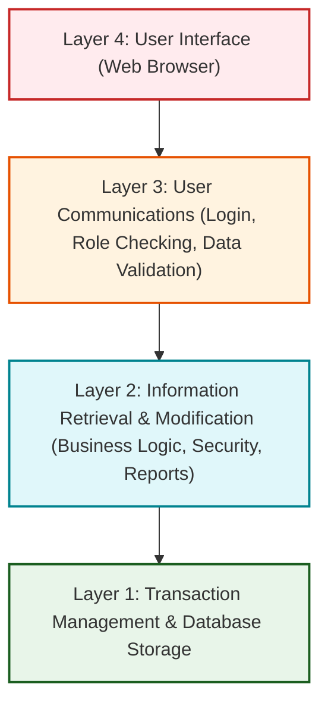
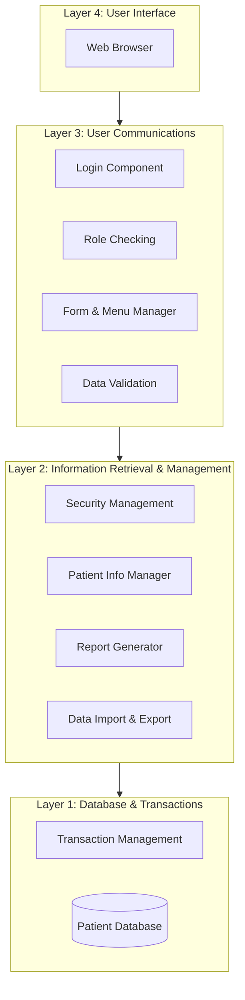
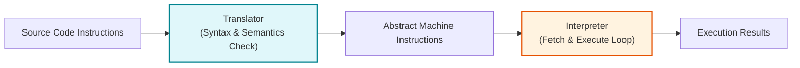
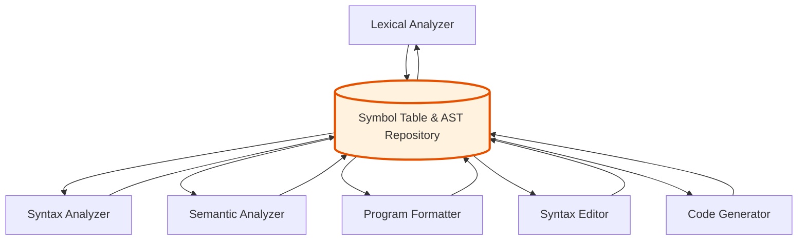
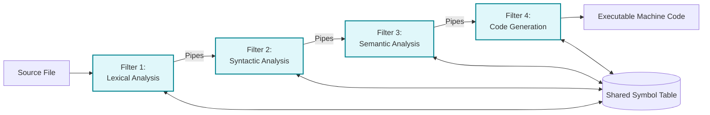

# Application Architectures
*(Based on Ian Sommerville, "Software Engineering" - Chapter 6, Section 6.4)*

**Application Architectures** describe the generic structure and organization of a particular class of business or domain software systems (such as ERP systems, banking transaction processors, or compilers).

---

## 1. Fundamentals of Application Architectures

### 1.1 Five Uses of Application Architecture Models
Software architects use generic application architectures in 5 major ways:
1.  **As a Starting Point for Design:** Specializing a generic domain template for a specific application being built.
2.  **As a Design Checklist:** Verifying that a proposed custom architecture is consistent with industry-standard practices.
3.  **As a Work Organization Tool:** Dividing system components into stable structural modules that separate engineering teams can build in parallel.
4.  **As a Reuse Assessment Tool:** Evaluating whether off-the-shelf commercial components match required system structures.
5.  **As a Shared Vocabulary:** Providing standardized terminology for discussing application designs with stakeholders.

---

## 2. Transaction Processing Systems (TPS)

**Transaction Processing Systems (TPS)** are database-centered applications that process asynchronous user requests to query or modify information in a central database.

### 2.1 Concept of a Database Transaction
*   A **transaction** is a sequence of operations treated as a single **atomic unit** (All-or-Nothing execution).
*   If any single step fails, the entire transaction is rolled back so database integrity is never compromised.

### 2.2 Conceptual TPS Structure

---

### 2.3 Real-World Textbook Example: ATM Software Architecture

An ATM processing pipeline separates operations into Input, Process, and Output stages:

---

## 3. Information Systems Architectures

**Information Systems** are layered web-based applications providing controlled access to shared data stores (e.g., healthcare records, library catalogs, e-commerce stores).

### 3.1 Generic 4-Layer Information System Model

---

### 3.2 Real-World Textbook Example: Mentcare Information System Architecture

---

## 4. Language Processing Systems

**Language Processing Systems** translate instructions expressed in a formal language (such as Java, Python, or SQL) into an internal representation or executable machine code.

### 4.1 Generic Language Processing Pipeline

---

### 4.2 The 6 Core Compiler Components
1.  **Lexical Analyzer:** Converts source code character streams into internal tokens.
2.  **Symbol Table:** Central repository storing identifier names, types, and scopes.
3.  **Syntax Analyzer:** Checks syntax against language grammar and builds an **Abstract Syntax Tree (AST)**.
4.  **Abstract Syntax Tree (AST):** Internal tree representation of program structure.
5.  **Semantic Analyzer:** Type-checks the AST against the symbol table for logical consistency.
6.  **Code Generator:** Walks the AST to generate target machine code.

---

### 4.3 Repository-Based vs. Pipe & Filter Compiler Architectures

#### 1. Repository-Based Compiler Architecture (For Interactive IDEs)

*   *Advantage:* Ideal for interactive IDEs (e.g., VS Code, Eclipse) where typing in the editor instantly updates syntax highlighting, error checking, and code completion.

#### 2. Pipe and Filter Compiler Architecture (For Batch Compilers)

*   *Advantage:* Ideal for batch command-line compilation (e.g., `gcc` or `javac`) where source files are compiled sequentially without user interaction.

---

## 5. Solved Practical Exam Problem

### Problem Statement
> **Exam Question (10 Marks):**
> *An engineering team is developing a **Smart Contract Compiler & IDE Environment** for blockchain applications.*
>
> **Tasks:**
> 1. List the 5 ways software engineers use Application Architectures.
> 2. Explain the 6 core components of a compiler pipeline.
> 3. Compare **Repository-Based Compiler Architecture** and **Pipe & Filter Compiler Architecture**, explaining why an interactive IDE requires the Repository model.

---

### Solution

#### Task 1: 5 Uses of Application Architectures
1.  **Design Starting Point:** Provides a pre-tested structural template to build upon.
2.  **Design Checklist:** Ensures consistency with standard domain architectural patterns.
3.  **Work Organization:** Enables parallel component development across engineering teams.
4.  **Reuse Assessment:** Identifies opportunities for incorporating existing commercial off-the-shelf tools.
5.  **Shared Vocabulary:** Standardizes terminology across technical and non-technical stakeholders.

#### Task 2: 6 Core Compiler Pipeline Components
1.  **Lexical Analyzer:** Converts raw source code text into clean lexical tokens.
2.  **Symbol Table:** Shared dictionary storing variable names, data types, and scope.
3.  **Syntax Analyzer:** Verifies program grammar and constructs an Abstract Syntax Tree (AST).
4.  **Abstract Syntax Tree (AST):** Hierarchical tree representation of program logic.
5.  **Semantic Analyzer:** Verifies type safety and semantic rules using AST and symbol table.
6.  **Code Generator:** Translates verified AST into target bytecode or machine instructions.

#### Task 3: Repository vs. Pipe & Filter Compiler Architecture Comparison

| Dimension | Repository Compiler Architecture | Pipe & Filter Compiler Architecture |
| :--- | :--- | :--- |
| **Data Sharing** | Tools share data through a central Symbol Table & AST repository. | Data flows sequentially from filter to filter via text/binary streams. |
| **Interactivity** | **High.** Editor, linters, and formatters react instantly to code changes. | **Low.** Designed for non-interactive batch compilation from command line. |
| **Tool Integration** | Easy to attach new tools (e.g., refactoring engine) to the central repository. | Difficult to attach interactive tools because changes must flow through the full pipe chain. |
| **Why IDEs Need Repository:** | In an IDE, when a developer types a character, the **Syntax Editor** must instantly update error squiggles and auto-completion hints. A Pipe & Filter architecture would require re-running the entire sequential batch compilation pipeline for every keystroke, which is too slow and inefficient. |
