# Object-Oriented Design Using the UML
*(Based on Ian Sommerville, "Software Engineering" - Chapter 7, Section 7.1)*

**Software design and implementation** is the stage in the software engineering process at which an executable software system is developed. Software design is the creative activity of identifying components and their relationships based on requirements; implementation realizes that design as executable programs.

---

## 1. Fundamentals of Object-Oriented Design

### 1.1 "Build vs. Buy" Implementation Decisions
An early critical implementation decision is whether to **build** custom software from scratch or **buy** off-the-shelf configurable application packages (e.g., commercial medical records or ERP packages).
*   *Advantage of Buying:* Faster deployment, lower cost, and proven reliability.
*   *Design Impact:* Focuses on configuring system parameters rather than designing object classes and sequence interactions.

---

### 1.2 The 5 Stages of the Object-Oriented Design Process

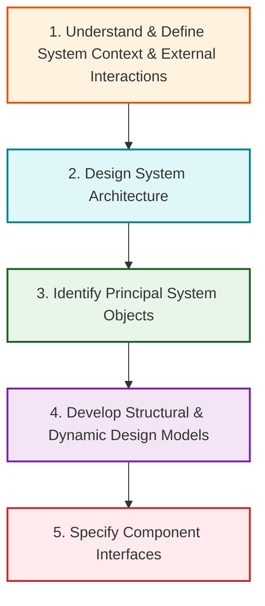

---

## 2. Stage 1: System Context and External Interactions

Developing an understanding of the relationship between the target software system and its environment is essential for establishing system boundaries and communication interfaces.

### 2.1 System Context Model (Structural Perspective)
Demonstrates external systems that interact with the system being designed.

#### Wilderness Weather Station Context Model:

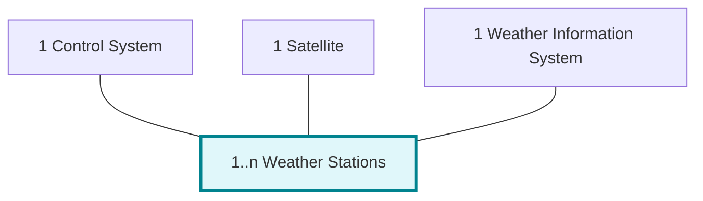

---

### 2.2 Interaction Model (Dynamic Perspective)
Uses UML Use Cases to specify how external actors (users or other systems) interact with the system.

#### Weather Station Use Case Model:

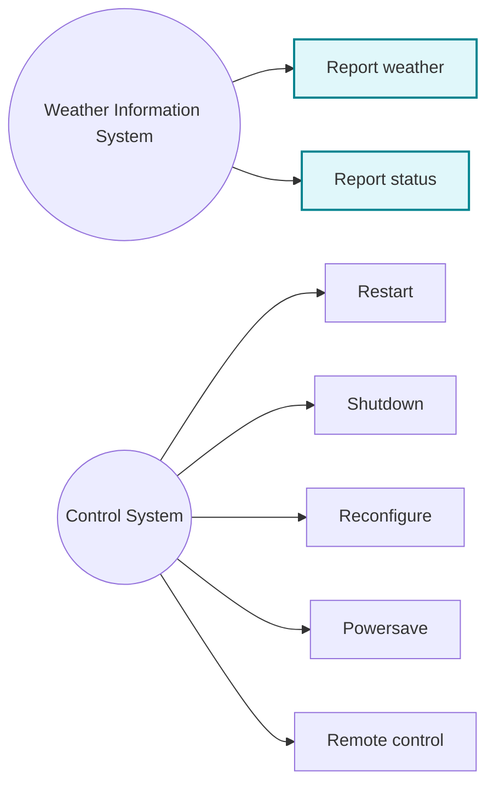

---

### 2.3 Structured Use Case Description Template

| Field Name | Description Content |
| :--- | :--- |
| **System** | Weather Station |
| **Use Case** | **Report weather** |
| **Actors** | Weather Information System, Weather Station |
| **Data** | Summary of weather data collected from instruments over the collection period: max, min, avg ground & air temperatures; max, min, avg air pressures; max, min, avg wind speeds; total rainfall; wind direction sampled at 5-minute intervals. |
| **Stimulus** | Weather Information System establishes a satellite communication link and requests data transmission. |
| **Response** | Summarized weather data is sent to the Weather Information System. |
| **Comments** | Weather stations report once per hour by default, but frequency can be modified remotely. |

---

## 3. Stage 2: Architectural Design

Once external interactions are defined, major software subsystems and their communications are structured using architectural patterns.

### 3.1 Weather Station Subsystem Architecture ("Listener Bus" Model)

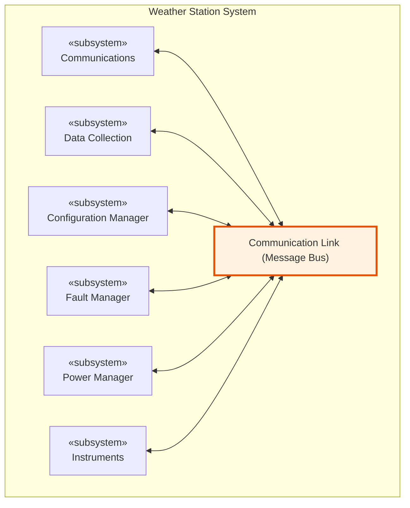

> [!NOTE]
> **Key Benefit of the Listener Architecture:**
> Subsystems communicate by broadcasting messages over a shared infrastructure. Senders do not need to know the specific addresses of receivers, allowing subsystems to be reconfigured or swapped independently.

---

### 3.2 Data Collection Subsystem (Producer-Consumer Pattern)

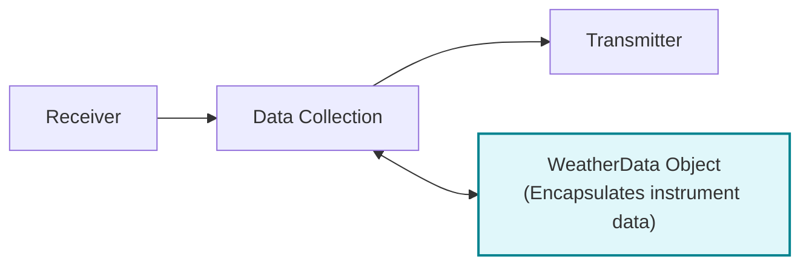

---

## 4. Stage 3: Object Class Identification

### 4.1 Three Classical Approaches for Object Identification

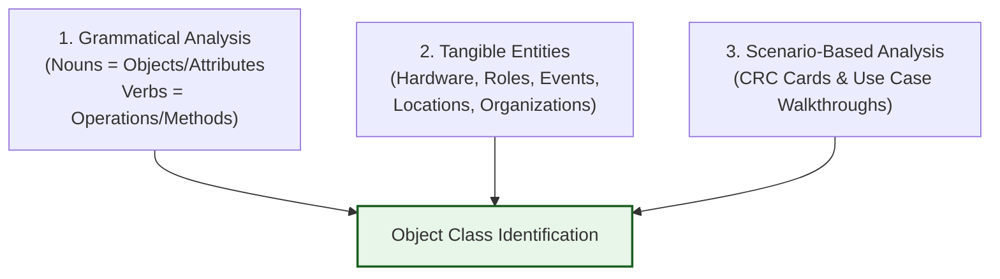

1.  **Grammatical Analysis (Abbott 1983):** Analyzes natural language system specifications. Nouns represent potential objects or attributes; verbs represent operations or methods.
2.  **Tangible Application Entities (Wirfs-Brock 1990):** Identifies real-world hardware devices, user roles, physical locations, and business events.
3.  **Scenario-Based Analysis (Beck & Cunningham 1989):** Walkthroughs of user scenarios identify required object responsibilities and collaborations (Class-Responsibility-Collaboration / CRC cards).

---

### 4.2 Weather Station Object Classes

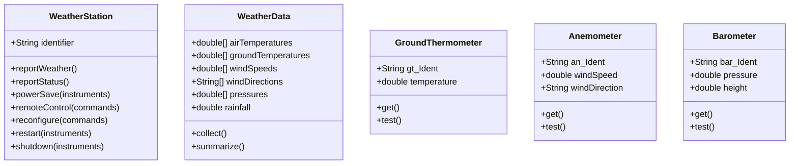

*   `WeatherStation`: Provides the primary environmental interface executing use case commands.
*   `WeatherData`: Encapsulates collected raw data arrays and computes summarized reports.
*   `GroundThermometer`, `Anemometer`, `Barometer`: Domain objects mapping directly to physical hardware instruments.

---

## 5. Stage 4: Design Models (Structural and Dynamic)

Design models bridge high-level requirements and actual code implementation.

| Model Category | UML Diagram Type | Purpose |
| :--- | :--- | :--- |
| **Structural Models** | Subsystem (Package) Diagrams, Class Diagrams | Shows static component decomposition, generalization (inheritance), and composition. |
| **Dynamic Models** | Sequence Diagrams, State Machine Diagrams | Shows expected runtime message calls, activations, and object state transitions. |

---

### 5.1 Dynamic Sequence Model (Data Collection Workflow)

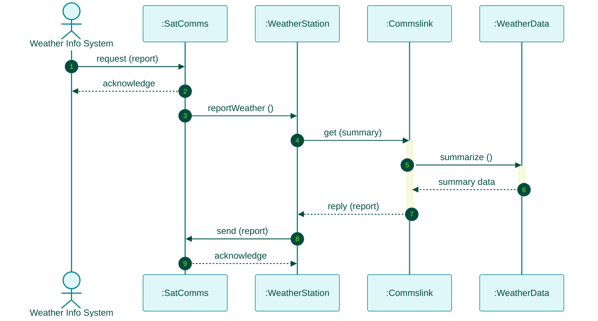

---

### 5.2 Dynamic State Machine Model (Weather Station Operational States)

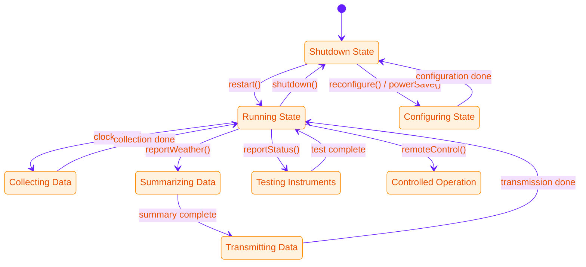

---

## 6. Stage 5: Interface Specification

Interface design specifies the signatures and operational semantics of services without exposing internal data representations.

> [!IMPORTANT]
> **Interface Design Rule:**
> Do **NOT** include attributes in interface specifications. Hiding data representation allows internal storage structures (e.g., changing an array to a linked list) to be modified without breaking client components.

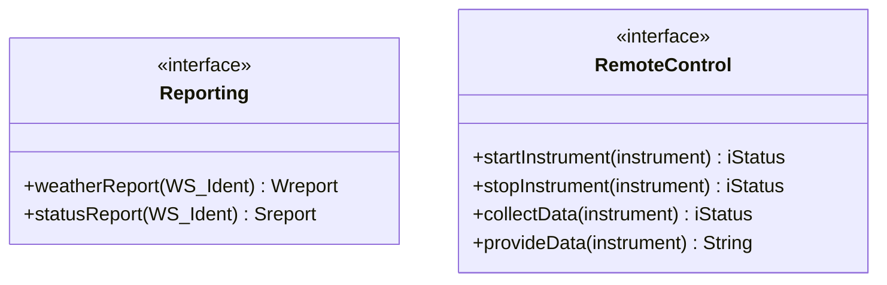

*   `Reporting` Interface: Exposes public methods for fetching weather summaries and diagnostic status reports.
*   `RemoteControl` Interface: Exposes fine-grained hardware management commands.

---

## 7. Solved Practical Exam Problem

### Problem Statement
> **Exam Question (10 Marks):**
> *An engineering firm is designing an **Autonomous Environmental Drone Fleet** for wildfire monitoring.*
>
> **Tasks:**
> 1. List the 5 stages of the Object-Oriented Design process.
> 2. Detail the 3 classical approaches for identifying object classes from system requirements.
> 3. Draw a complete UML Sequence Diagram showing interaction between `ControlCenter`, `DroneInterface`, `FlightController`, and `SensorPayload` objects during a "Fetch Telemetry" request.

---

### Solution

#### Task 1: 5 Stages of the Object-Oriented Design Process
1.  **System Context & External Interactions:** Establish system boundaries and external actor interfaces.
2.  **Architectural Design:** Structure high-level subsystems using architectural patterns.
3.  **Object Class Identification:** Discover domain entities, attributes, and operations.
4.  **Design Models Development:** Construct structural (class/package) and dynamic (sequence/state) models.
5.  **Interface Specification:** Formally define public method signatures with `«interface»` abstractions.

#### Task 2: 3 Classical Approaches for Object Identification
1.  **Grammatical Analysis:** Analyze natural language requirements (Nouns $\rightarrow$ Objects/Attributes, Verbs $\rightarrow$ Operations).
2.  **Tangible Entity Analysis:** Identify physical hardware components (drones, thermal cameras, GPS receivers), user roles, and domain events.
3.  **Scenario-Based Analysis:** Use CRC cards and use case walkthroughs to identify object responsibilities and collaborations.

#### Task 3: UML Sequence Diagram for Drone Telemetry Fetch

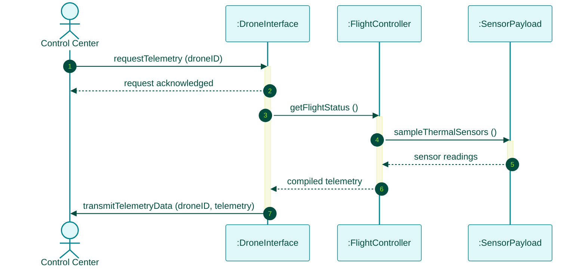
