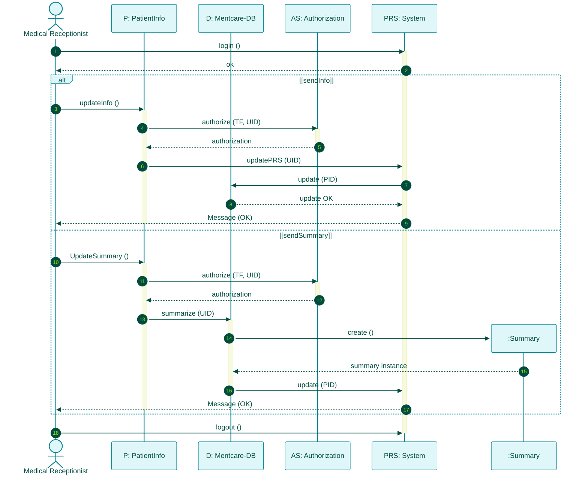
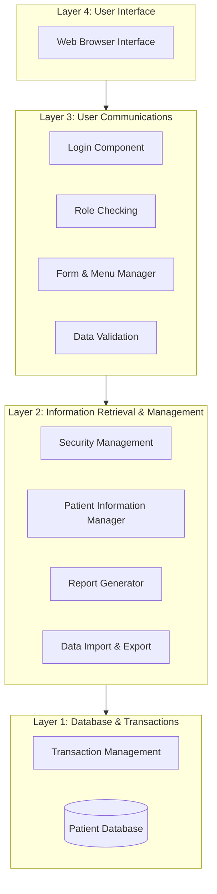
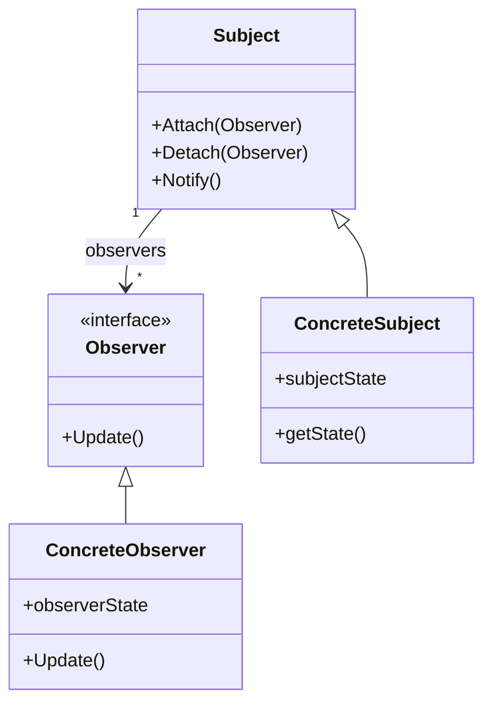

# Unit 2: Exam Questions & Answers Guide
*(System Modeling, Architectural Design, Architectural Patterns & Application Architectures)*

This guide provides concise, high-scoring answers to typical 2-mark, 5-mark, and 10-mark university examination questions for Unit 2.

---

## Part A: 2-Mark Short Questions & Answers

### Q1. What is System Modeling?
**Answer:** System modeling is the process of developing abstract graphical models of a software system (primarily using UML diagram types) to present different perspectives or views of the system during requirements engineering, design, and documentation.

### Q2. Distinguish between System Abstraction and System Representation.
**Answer:**
*   **Abstraction:** Deliberately simplifies a system by omitting minor details to highlight salient characteristics (e.g., a system architecture diagram).
*   **Representation:** Preserves *all* original information without omitting detail (e.g., translating code from Java to C#).

### Q3. List the 4 system modeling perspectives and their associated UML diagrams.
**Answer:**
1.  **External Perspective:** Context Diagrams, Activity Diagrams.
2.  **Interaction Perspective:** Use Case Diagrams, Sequence Diagrams.
3.  **Structural Perspective:** Class Diagrams, Component Diagrams.
4.  **Behavioral Perspective:** State Machine Diagrams, Activity Diagrams.

### Q4. Differentiate between Generalization and Aggregation in UML Class Diagrams.
**Answer:**
*   **Generalization ($\triangle$):** An inheritance ("is-a") relationship where a subclass inherits attributes/methods from a general superclass.
*   **Aggregation ($\diamond$):** A whole-part ("has-a") relationship where a composite object contains component objects.

### Q5. What is a Superstate in UML State Machine Diagrams?
**Answer:** A Superstate is a high-level state box that encapsulates a cluster of separate sub-states to prevent state explosion and hide implementation complexity on high-level diagrams.

### Q6. Define the three levels of models in Model-Driven Architecture (MDA).
**Answer:**
1.  **CIM (Computation-Independent Model):** High-level business domain model.
2.  **PIM (Platform-Independent Model):** System operation model independent of execution platform.
3.  **PSM (Platform-Specific Model):** Model transformed for a specific target platform (e.g., J2EE, .NET).

### Q7. Define an Architectural Pattern.
**Answer:** An Architectural Pattern is a stylized, abstract description of tried-and-tested software organizational practice that has been successfully used across different systems and environments.

### Q8. What is a Database Transaction?
**Answer:** A database transaction is a sequence of operations treated as a single **atomic unit** (All-or-Nothing execution). If any operation fails, the transaction is rolled back to preserve database consistency.

---

## Part B: 5-Mark Medium Questions & Answers

### Q9. Explain the 7 mandatory symbols used in drawing UML Activity Diagrams.
**Answer:**
1.  **Initial Node ($\bullet$):** Solid black dot marking process start.
2.  **Activity Box:** Rounded rectangle representing a process step.
3.  **Control Flow Arrow ($\rightarrow$):** Direction of execution flow.
4.  **Decision Diamond ($\diamond$):** Branching logic annotated with `[Guard Conditions]`.
5.  **Fork Bar (1 in, $N$ out):** Splits control flow into parallel/concurrent activities.
6.  **Join Bar ($N$ in, 1 out):** Synchronization point waiting for all parallel activities to finish.
7.  **Final Node ($\odot$):** Bullseye dot marking process completion.

### Q10. Describe how Non-Functional Requirements (NFRs) dictate architectural design choices.
**Answer:**
1.  **Performance:** Co-locate critical operations in a small number of **large components** to eliminate network communication latency.
2.  **Security:** Implement a **Layered (Onion) Structure** protecting core assets in innermost layers.
3.  **Safety:** Co-locate safety-critical operations in a single small component for easy validation and emergency shutdown.
4.  **Availability:** Use **redundant components** for zero-downtime hot-swapping.
5.  **Maintainability:** Use **fine-grained, decoupled components** separating data producers from consumers.

### Q11. Explain Kruchten's 4+1 View Model of Software Architecture.
**Answer:**
1.  **Logical View:** Shows key system abstractions as object classes representing requirements entities.
2.  **Process View:** Shows interacting runtime processes/threads used to evaluate performance and availability.
3.  **Development View:** Shows software breakdown into modules/packages for developers and programming teams.
4.  **Physical View:** Shows hardware topology and deployment of software components across physical nodes.
5.  **+1 Use Cases / Scenarios:** Binds and validates all 4 views using unified user scenarios.

### Q12. Explain the 6 core components of a programming language Compiler Pipeline.
**Answer:**
1.  **Lexical Analyzer:** Converts raw source code characters into lexical tokens.
2.  **Symbol Table:** Central repository storing variable/class names, data types, and scopes.
3.  **Syntax Analyzer:** Checks program grammar and builds an Abstract Syntax Tree (AST).
4.  **Abstract Syntax Tree (AST):** Internal tree representation of program logic.
5.  **Semantic Analyzer:** Type-checks the AST against the symbol table for logical consistency.
6.  **Code Generator:** Walks the AST to generate target machine code.

---

## Part C: 10-Mark Comprehensive Questions & Answers

### Q13. Draw and explain the UML Sequence Diagram for the Mentcare "Transfer Data" use case, detailing `alt` conditional frames and dynamic object creation.
**Answer:**

#### Detailed Workflow Breakdown:
1.  **Authentication (`1-2`):** Receptionist logs into the national PRS system.
2.  **`alt` Fragment ([sendInfo] vs [sendSummary]):**
    *   *Branch 1 (`sendInfo`):* Authorizes user and directly transfers updated patient contact info to PRS.
    *   *Branch 2 (`sendSummary`):* Authorizes user, invokes `summarize(UID)`, dynamically instantiates a new `:Summary` object (`create`), and pushes summary data to PRS.
3.  **Termination (`16`):** Receptionist receives confirmation message and logs out.

---

### Q14. Compare all 5 core Architectural Patterns (MVC, Layered, Repository, Client-Server, Pipe & Filter) in terms of structure, advantages, disadvantages, and ideal applications.
**Answer:**

| Pattern Name | Core Structure | Advantages | Disadvantages | Ideal Application |
| :--- | :--- | :--- | :--- | :--- |
| **Model-View-Controller (MVC)** | Decouples **Model** (Data), **View** (UI), and **Controller** (Events). | Data and representation change independently; multiple views supported. | Code complexity for simple apps. | Web apps, GUI interfaces. |
| **Layered Architecture** | Stacked vertical functional layers (UI $\rightarrow$ Logic $\rightarrow$ System). | Supports incremental development and multi-platform portability. | Multi-layer interpretation overhead. | Enterprise software, OS design, security systems. |
| **Repository** | Central passive data store accessed by independent tools. | Independent tools; unified central backup. | Single point of failure; hard schema locking. | IDEs, CAD tools, Command & Control. |
| **Client-Server** | Network services delivered by servers to concurrent clients. | Distributed processing; transparent server upgrades. | Network latency; DoS vulnerability; single point of failure. | Web applications, video streaming libraries. |
| **Pipe and Filter** | Data flows through sequential transformation components (**filters**). | Easy to understand; transformation reuse; matches business flows. | Data parsing overhead; unsuited for interactive GUIs. | Batch processing, billing systems, ETL pipelines. |

---

### Q15. Explain the architecture of the Mentcare Layered Information System and detail the function of components at each layer.
**Answer:**

#### Layer Responsibilities:
1.  **Layer 4 (User Interface):** Browser-based interface displaying forms, menus, and patient reports to medical staff.
2.  **Layer 3 (User Communications):** Handles user login, role-based access control (ensuring doctors see medical data while receptionists see contact info), menu navigation, and input validation.
3.  **Layer 2 (Information Retrieval & Management):** Core business logic implementing patient creation/updating, security policy enforcement, management report generation, and data import/export with external systems.
4.  **Layer 1 (Database & Transactions):** Commercial database management system providing persistent data storage and ACID transaction management.

---

### Q16. Explain the 4 essential elements of a Design Pattern according to GoF and describe the Observer Pattern with a UML Class Diagram.
**Answer:**
1.  **4 Essential Elements (GoF):**
    *   **Pattern Name:** Standardized reference handle (e.g., *Observer*).
    *   **Problem Description:** Motivation and applicability criteria explaining when to apply the pattern.
    *   **Solution Description:** Abstract template of component classes, roles, and interactions.
    *   **Statement of Consequences:** Results, trade-offs, and side effects of applying the pattern.

2.  **Observer Pattern Structure:**

*   **Mechanism:** `ConcreteSubject` holds data. When state changes, `Notify()` invokes `Update()` on all registered `ConcreteObserver` instances, keeping displays synchronized without tight coupling.

---

### Q17. Compare the 4 levels of Software Reuse and detail the 4 core activities of Configuration Management.
**Answer:**

#### Part 1: Four Levels of Software Reuse
1.  **Abstraction Level:** Reusing conceptual design knowledge (Design & Architectural Patterns).
2.  **Object Level:** Directly reusing classes and methods from programming libraries (e.g., `java.util`).
3.  **Component Level:** Reusing integrated class collections and frameworks (e.g., Spring, React).
4.  **System Level:** Reusing entire COTS application systems or configurable product lines.

#### Part 2: Four Core Configuration Management (CM) Activities
1.  **Version Management:** Tracks component revisions and coordinates concurrent developer edits (Git, Subversion).
2.  **System Integration:** Automatically compiles and links specific component versions to build executable releases (GNU Make, Gradle).
3.  **Problem Tracking:** Logs bug reports and tracks developer fix progress (Bugzilla, GitHub Issues).
4.  **Release Management:** Packages and distributes official software releases to customers.

---

### Q18. Compare the 3 major Open-Source Software License models (GPL, LGPL, BSD/MIT).
**Answer:**

| License Model | Category | Reciprocal Rule | Commercial Use Impact |
| :--- | :--- | :--- | :--- |
| **GPL (GNU General Public License)** | **Reciprocal (Copyleft)** | **Yes.** If your product uses GPL code, your entire system must be open-sourced under GPL. | High Risk. Cannot sell closed-source software containing GPL code. |
| **LGPL (Lesser GPL)** | **Weak Reciprocal** | **Partial.** You can link proprietary code to LGPL libraries without open-sourcing your code. Only changes to the library itself must be published. | Medium Risk. Safe for linking standard dynamic libraries. |
| **BSD / MIT License** | **Non-Reciprocal (Permissive)** | **No.** You can embed open-source code inside proprietary closed-source software without publishing your source code. | Low Risk. Ideal for commercial closed-source software. |

---

### Q19. List and explain 5 organizational management guidelines for incorporating Open-Source Software into software projects.
**Answer:**
1.  **Component & License Tracking:** Maintain an exact log of all downloaded open-source components and their specific active license versions.
2.  **Pre-Use License Evaluation:** Audit open-source component licenses prior to adoption to ensure alignment with commercial goals.
3.  **Developer License Education:** Train developers on open-source legal risks to prevent accidental GPL contamination.
4.  **Automated License Auditing:** Utilize automated code-scanning tools to detect unauthorized open-source code snippets in production codebases.
5.  **Community Participation:** Contribute bug fixes and financial support back to open-source project communities to sustain long-term software health.

