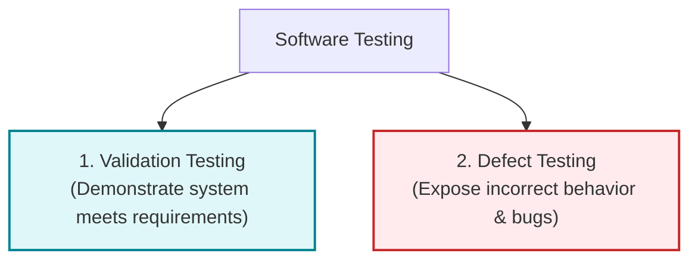
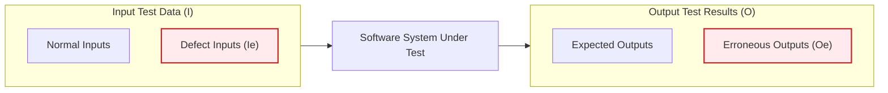
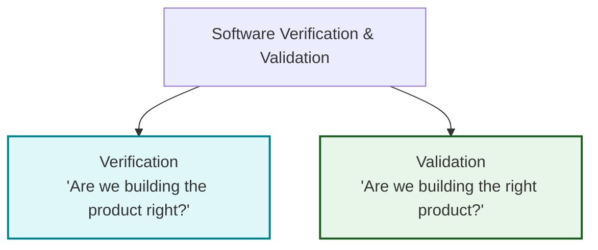
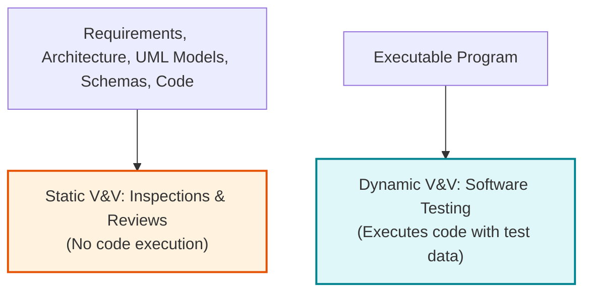
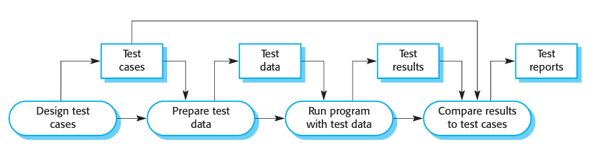
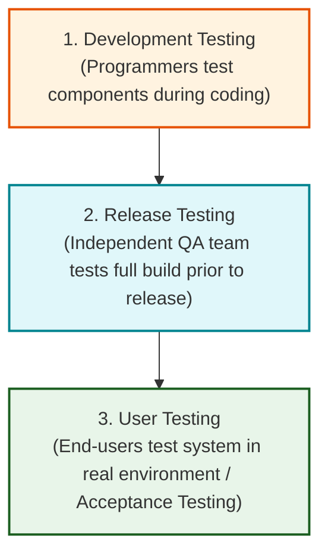

# Software Testing, Verification, and Validation
*(Based on Ian Sommerville, "Software Engineering" - Chapter 8, Introduction & Section 8.1)*

**Software testing** is the process of executing a program using artificial test data to demonstrate that the system meets its requirements and to discover program defects before the software is put into operational use.

---

## 1. Fundamentals of Software Testing

### 1.1 The Two Primary Goals of Testing

1.  **Validation Testing:** Demonstrates to developers and customers that the software meets its specified functional and non-functional requirements. Test cases reflect expected, normal system usage.
2.  **Defect Testing:** Deliberately uncovers input sequences where program behavior is incorrect, undesirable, or non-conforming to specification (e.g., system crashes, data corruption, unwanted component interactions).

---

### 1.2 Input-Output Model of Program Testing

*   **Defect Testing Priority:** Focuses on isolating input subset $I_e$ that triggers erroneous output set $O_e$.
*   **Validation Testing Focus:** Tests using correct inputs outside $I_e$ to generate expected outputs.

> [!IMPORTANT]
> **Edsger Dijkstra's Fundamental Principle (1972):**
> *"Software testing can only show the presence of errors, not their absence."*
> No amount of testing can ever guarantee that a software system is 100% free of bugs.

---

## 2. Verification vs. Validation (V & V)

Verification and Validation are complementary static and dynamic checking processes designed to ensure a software system is **"fit for purpose."**

### 2.1 Barry Boehm's Distinction (1979)

*   **Verification:** Checks whether the software conforms strictly to its stated functional and non-functional specifications (*Conformity to Specs*).
*   **Validation:** Checks whether the software meets customer expectations and real operational needs (*Meeting User Expectations*).

---

### 2.2 Three System "Fit for Purpose" Confidence Factors

1.  **Software Purpose:** Safety-critical software (e.g., flight control) requires significantly higher V&V confidence than rapid prototypes or demonstrator apps.
2.  **User Expectations:** Users tolerate minor flaws in low-cost software, but demand near-zero defect rates in mature, enterprise-grade products.
3.  **Marketing Environment:** Commercial release schedules, competitor pricing, and "time-to-market" pressures often dictate acceptable testing thresholds.

---

## 3. Static V&V (Inspections) vs. Dynamic V&V (Testing)

### 3.1 Three Key Advantages of Inspections over Testing
1.  **Eliminates Error Masking:** In dynamic testing, an early error can mask or hide subsequent errors. Static inspections evaluate source text directly, allowing programmers to discover dozens of independent errors in a single review session.
2.  **No Test Harness Overhead:** Incomplete program modules can be inspected without writing specialized test stubs, harnesses, or mock drivers.
3.  **Evaluates Broader Code Quality Attributes:** Inspections evaluate non-functional attributes such as coding standard compliance, maintainability, portability, and algorithmic inefficiencies.

> [!NOTE]
> **Limitation of Inspections:**
> Inspections cannot discover defects arising from complex runtime component timing interactions, real-time race conditions, or performance bottlenecks.

---

## 4. The Abstract Software Testing Process

### 4.1 Key Testing Terminology
*   **Test Case:** Specification of test inputs, expected output (predicted result), and tested condition.
*   **Test Data:** The actual input data provided to the system during a test run.
*   **Test Results:** Output data produced by the system, compared against test case predictions.

---

### 4.2 The Testing Process Pipeline

#### Equivalent UML Process Flow:

```mermaid
graph LR
    Design["Design Test Cases"] --> TestCases["Test Cases"]
    TestCases --> PrepData["Prepare Test Data"]
    PrepData --> TestData["Test Data"]
    TestData --> RunProg["Run Program with Test Data"]
    RunProg --> TestResults["Test Results"]
    TestResults --> CompRes["Compare Results to Test Cases"]
    CompRes --> TestReports["Test Reports"]

    style Design fill:#fff3e0,stroke:#e65100,stroke-width:2px
    style RunProg fill:#e0f7fa,stroke:#00838f,stroke-width:2px
    style CompRes fill:#e8f5e9,stroke:#1b5e20,stroke-width:2px
```

1.  **Design Test Cases:** Define input specifications and expected results.
2.  **Prepare Test Data:** Generate test inputs corresponding to test case specifications.
3.  **Run Program with Test Data:** Execute system under test and collect actual test results.
4.  **Compare Results to Test Cases:** Evaluate actual vs. expected results to create Test Reports.

---

### 4.3 Automated vs. Manual Testing & Regression Testing
*   **Manual Testing:** A human tester manually inputs test data and compares output against expected results.
*   **Automated Testing:** Tests are encoded in code (e.g., JUnit) executed automatically. Essential for **Regression Testing**—re-running previous test suites whenever source code changes to ensure existing functionality remains uncorrupted.

---

## 5. The Three Stages of Commercial Software Testing

1.  **Development Testing:** Designers and programmers test components, interfaces, and integrated subsystems during development.
2.  **Release Testing:** An independent testing (QA) team tests a complete version of the software before public release to verify compliance with stakeholder requirements.
3.  **User Testing:** Customers or end-users evaluate the system in their target environment (**Acceptance Testing**) to decide whether to accept the delivered system.
