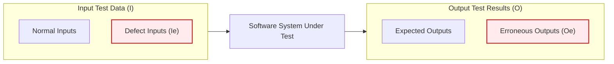
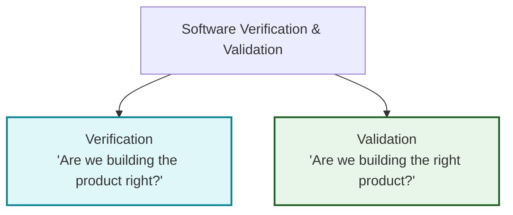
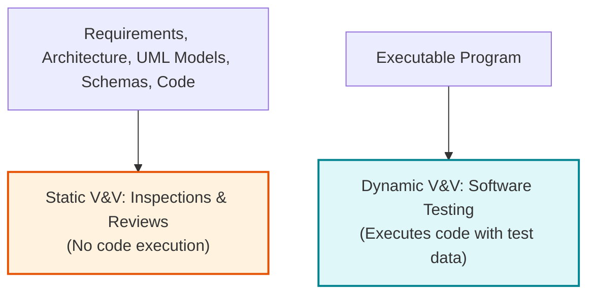
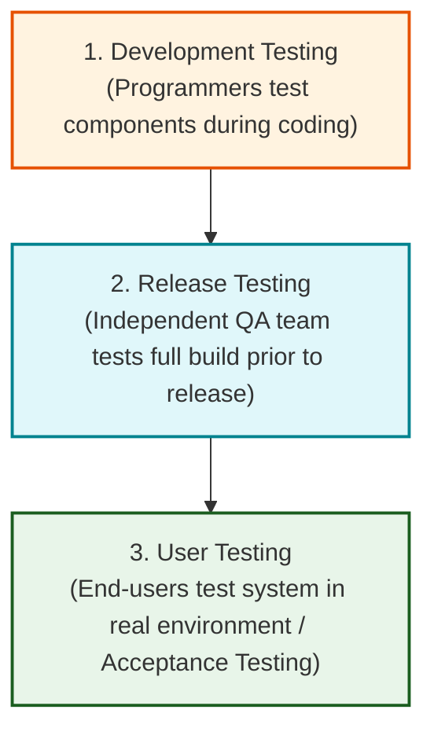

# Software Testing, Verification, and Validation

Software Testing is the process of executing a software program with test data to verify that it satisfies its specified requirements and to identify defects before deployment.

---

## 1. Fundamentals of Software Testing

### 1.1 The Two Primary Goals of Testing

1.  **Validation Testing:** Validation Testing checks whether the software satisfies its functional and non-functional requirements by using normal and expected inputs.
2.  **Defect Testing:** Defect Testing is performed to discover defects by executing the software with invalid, unexpected, or extreme inputs.

---

### 1.2 Input-Output Model of Program Testing

- **Defect Testing Priority:** Focuses on isolating input subset $I_e$ that triggers erroneous output set $O_e$.
- **Validation Testing Focus:** Tests using correct inputs outside $I_e$ to generate expected outputs.

> [!IMPORTANT]
> **Edsger Dijkstra's Fundamental Principle (1972):**
> _"Software testing can only show the presence of errors, not their absence."_
> No amount of testing can ever guarantee that a software system is 100% free of bugs.

---

## 2. Verification vs. Validation (V & V)

| Validation Testing      | Defect Testing              |
| ----------------------- | --------------------------- |
| Checks correct behavior | Finds bugs                  |
| Uses valid inputs       | Uses invalid/extreme inputs |
| Confirms requirements   | Discovers defects           |

### 2.1 Barry Boehm's Distinction (1979)

- **Verification:** Verification is the process of checking whether the software matches its specified functional and non-functional requirements.
- **Validation:** Validation is the process of checking whether the software satisfies customer needs and intended use.

| Verification            | Validation              |
| ----------------------- | ----------------------- |
| Checks specifications   | Checks customer needs   |
| Build the product right | Build the right product |
| Focus on correctness    | Focus on usefulness     |

---

### 2.2 Three System "Fit for Purpose" Confidence Factors

1.  **Software Purpose:** Safety-critical software (e.g., flight control) requires significantly higher V&V confidence than rapid prototypes or demonstrator apps.
2.  **User Expectations:** Users tolerate minor flaws in low-cost software, but demand near-zero defect rates in mature, enterprise-grade products.
3.  **Marketing Environment:** Commercial release schedules, competitor pricing, and "time-to-market" pressures often dictate acceptable testing thresholds.

---

## 3. Static V&V (Inspections) vs. Dynamic V&V (Testing)

Static Verification and Validation checks software artifacts without executing the program.
Dynamic Verification and Validation checks software by executing it with test data.

### 3.1 Three Key Advantages of Inspections over Testing

1.  **Eliminates Error Masking:** In dynamic testing, an early error can mask or hide subsequent errors. Static inspections evaluate source text directly, allowing programmers to discover dozens of independent errors in a single review session.
2.  **No Test Harness Overhead:** Incomplete program modules can be inspected without writing specialized test stubs, harnesses, or mock drivers.
3.  **Evaluates Broader Code Quality Attributes:** Inspections evaluate non-functional attributes such as coding standard compliance, maintainability, portability, and algorithmic inefficiencies.

> [!NOTE]
> **Limitation of Inspections:**
> Inspections cannot discover defects arising from complex runtime component timing interactions, real-time race conditions, or performance bottlenecks.

---

## 4. The Abstract Software Testing Process

### 4.1 Key Testing Terminology

- **Test Case:** Specification of test inputs, expected output (predicted result), and tested condition.
- **Test Data:** The actual input data provided to the system during a test run.
- **Test Results:** Output data produced by the system, compared against test case predictions.

---

### 4.2 The Testing Process Pipeline

1.  **Design Test Cases:** Define input specifications and expected results.
2.  **Prepare Test Data:** Generate test inputs corresponding to test case specifications.
3.  **Run Program with Test Data:** Execute system under test and collect actual test results.
4.  **Compare Results to Test Cases:** Evaluate actual vs. expected results to create Test Reports.

---

### 4.3 Automated vs. Manual Testing & Regression Testing

- **Manual Testing:** Manual Testing is performed by human testers who execute test cases and compare the results manually.
- **Automated Testing:** Automated Testing uses software tools or scripts to execute test cases automatically and compare the actual and expected results.
- **Regression Testing:** Regression Testing is the process of re-running previously executed test cases after software changes to ensure that existing functionality still works correctly.

---

## 5. The Three Stages of Commercial Software Testing

1.  **Development Testing:** Development Testing is performed by developers during software development to test individual components, interfaces, and integrated modules.
2.  **Release Testing:** Release Testing is performed by an independent testing team to verify that the complete software system satisfies its specified requirements before release.
3.  **User Testing:** User Testing is performed by customers or end-users in the actual operating environment to determine whether the software is acceptable for use.
