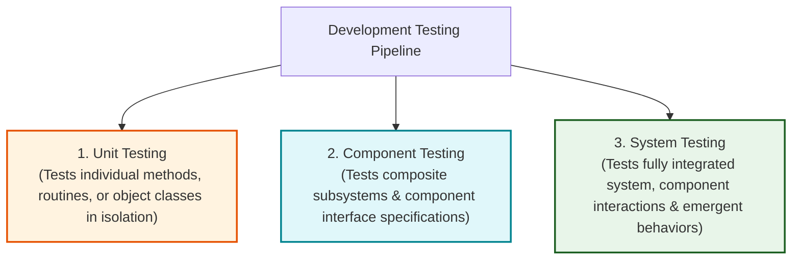
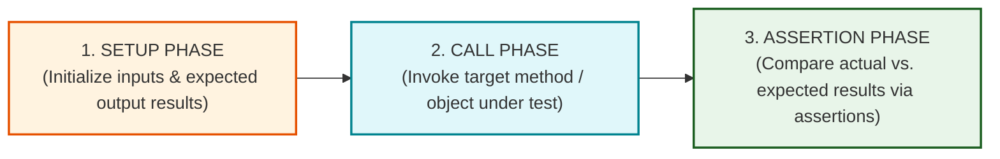
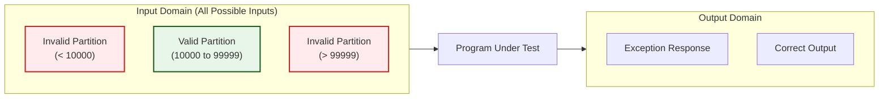
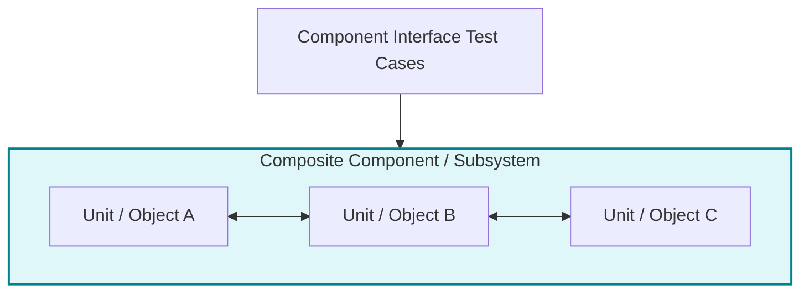
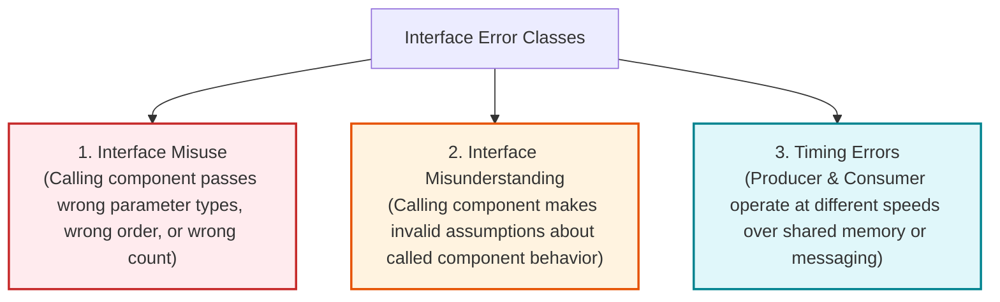
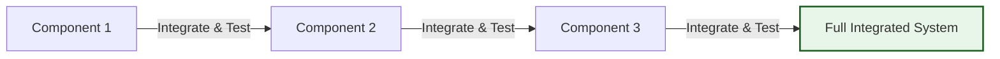

# Development Testing: Unit, Component, and System Testing

Development Testing is the testing carried out by developers during software development to detect defects and verify that software components work correctly before release.

---

## 1. Development Testing Overview and Organization

Development testing can be organized using programmer self-testing, **programmer/tester pairing** (where each programmer works alongside a dedicated tester to design test cases), or dedicated internal testing groups for safety-critical systems.

### 1.1 The Three Sequential Stages of Development Testing

### 1.2 Comparison Matrix of Development Testing Stages

| Testing Stage            | Primary Testing Target                                     | Focus & Objectives                                                                                     | Primary Responsibility                    |
| :----------------------- | :--------------------------------------------------------- | :----------------------------------------------------------------------------------------------------- | :---------------------------------------- |
| **1. Unit Testing**      | Individual methods, functions, or complete object classes. | Verifies single-unit functionality, state transitions, and attribute coverage in isolation.            | Individual Developer / Programmer         |
| **2. Component Testing** | Integrated composite components (clusters of objects).     | Verifies component **interfaces** (parameter passing, shared memory, procedural, message passing).     | Developer / Subsystem Team                |
| **3. System Testing**    | Integrated complete software system.                       | Verifies inter-component interactions, end-to-end use case threads, and **emergent system behaviors**. | Integrated Dev Team / Independent QA Team |

---

## 2. Unit Testing Deep-Dive

**Unit testing** is the process of testing the smallest testable parts of an application—typically individual methods or complete object classes.

### 2.1 what all tested

1.  **Testing Operations / Methods**
2.  **Testing Attributes**
3.  **Testing Object States**

### 2.2 Automated Unit Testing Frameworks (JUnit)

Automated unit testing frameworks like **JUnit** allow developers to write test suites that execute in seconds, providing instant GUI feedback.

#### The Three-Part Structure of an Automated Unit Test:

1.  **Setup Phase:** Initializes the test environment, instantiating the target object, input test data, and expected outputs.
2.  **Call Phase:** Invokes the specific method or operation being tested.
3.  **Assertion Phase:** Evaluates an assertion statement (e.g., `assertEquals(expected, actual)`). If true, the test passes; if false, it records a failure.

---

### 2.3 Mock Objects in Unit Testing

When a unit under test depends on external systems (e.g., database connections, external hardware clocks, network services) that are slow or unconstructed:

- **Definition:** **Mock objects** are simulated objects that imitate the behavior of real external components so that units can be tested independently.
- **Benefits:**
  - _Speed:_ Replaces slow disk/database operations with fast in-memory array lookups.
  - _Exception Simulation:_ Simulates rare or abnormal events (e.g., database connection timeouts or specific system clock times) that are difficult to trigger in production.

---

## 3. Strategies for Choosing Unit Test Cases

### 3.1 Equivalence Partitioning (Domain Testing)

Input data and output results are divided into **Equivalence Partitions (Domains)**—sets of values where the system processes every member in an identical manner.

#### Boundary Value Analysis Rule:

- Programmers routinely write correct logic for typical midpoint values, but frequently commit **off-by-one errors** at partition boundaries.
- _Test Selection Rule:_ Select test values at the **extreme boundaries (edges)** of each partition, plus one value near the **midpoint**.

#### Comprehensive Partition Example:

- _Specification:_ A program accepts 4 to 10 inputs, where each input is a 5-digit integer between 10,000 and 99,999.

| Input Variable        | Partition Category | Equivalence Partition Range       | Test Values Selected         | Test Selection Rationale                     |
| :-------------------- | :----------------- | :-------------------------------- | :--------------------------- | :------------------------------------------- |
| **Input Value Range** | Invalid (Too Low)  | $< 10,000$                        | `9,999`                      | Boundary edge value                          |
| **Input Value Range** | **Valid Range**    | $10,000 \text{ to } 99,999$       | `10,000`, `50,000`, `99,999` | Lower boundary, Midpoint, Upper boundary     |
| **Input Value Range** | Invalid (Too High) | $> 99,999$                        | `100,000`                    | Boundary edge value                          |
| **Number of Inputs**  | Invalid (Too Few)  | $< 4 \text{ inputs}$              | `3`                          | Boundary edge count                          |
| **Number of Inputs**  | **Valid Count**    | $4 \text{ to } 10 \text{ inputs}$ | `4`, `7`, `10`               | Minimum count, Midpoint count, Maximum count |
| **Number of Inputs**  | Invalid (Too Many) | $> 10 \text{ inputs}$             | `11`                         | Boundary edge count                          |

- **Black-Box Testing:** Black-box testing designs test cases from the software requirements without examining the source code.
- **White-Box Testing (Path Testing):** White-box testing designs test cases by examining the internal program structure, execution paths, and source code.

---

### 3.2 Guideline-Based Testing Rules

Guideline-Based Testing is a testing technique where testers design test cases using proven rules of thumb, best practices, and past experience about common mistakes programmers make.
ex: array index out of bound

---

## 4. Component Testing and Interface Defects

**Component testing** integrates several individual units into composite components and verifies that integrated units or objects work correctly together through their interfaces.

### 4.1 The Four Types of Component Interfaces

1.  **Parameter Interfaces:** A Parameter Interface is an interface where data values or function references are passed directly between methods during function calls.
2.  **Shared Memory Interfaces:** A Shared Memory Interface is an interface that allows multiple components to communicate by reading and writing data to a common, shared block of memory.
3.  **Procedural Interfaces:** A Procedural Interface is a collection of callable functions provided by a component so that other components can call them directly to perform tasks.
4.  **Message Passing Interfaces:** A Message Passing Interface is an interface where components communicate by sending structured data packets (messages) to request services from each other.

---

### 4.2 Three Classes of Interface Errors (Lutz 1993)

1.  **Interface Misuse:** Occurs when a calling component passes incorrect parameters, such as the wrong data type, wrong order, or missing parameters.
2.  **Interface Misunderstanding:** Interface Misunderstanding occurs when a calling component makes false assumptions about how the called component operates or behaves.
3.  **Timing Errors:** Timing Errors occur in shared memory or messaging systems when components operate at different speeds, causing a component to read outdated or uninitialized data.

---

### 4.3 Five Guidelines for Interface Testing

1.  **Extreme Parameter Testing:** Design tests where parameter values are set to the extreme ends of their valid ranges.
2.  **Null Pointer Testing:** Always test pointer and reference parameters using `null` values.
3.  **Deliberate Failure Stressing:** Design tests that deliberately cause a called component to fail, ensuring the caller handles exceptions correctly.
4.  **Message Stress Testing:** In message-passing systems, generate message volumes significantly higher than normal to expose timing and buffer capacity faults.
5.  **Activation Order Variation:** In shared-memory systems, vary the activation order of components to reveal implicit assumptions about data production and consumption ordering.

---

## 5. System Testing and Use-Case Thread Testing

**System testing** involves integrating all composite components into a complete application to verify component compatibility, inter-component interactions, and **emergent system behaviors**.

### 5.1 Planned vs. Unplanned Emergent Behaviors

- _Planned Emergent Behavior:_ Features that only exist when components are combined (e.g., combining an authentication component with a database update component to create an authorized data modification feature).
- _Unplanned Emergent Behavior:_ Undesirable side effects arising from component integration (e.g., memory leaks, system performance degradation, or security vulnerabilities).

---

### 5.3 Incremental Integration and Testing

Instead of integrating all components simultaneously ("Big Bang Integration"), system testing must be conducted **incrementally**:

- **Process:** Integrate one component, run regression tests, integrate another component, and test again.
- _Key Advantage:_ If a test fails, the defect is almost certainly located within the newly integrated component or its immediate interfaces, making bug diagnosis immediate and straightforward.

| Big Bang                      | Incremental                 |
| ----------------------------- | --------------------------- |
| Everything integrated at once | Components added one by one |
| Difficult to find defects     | Easier to locate defects    |

---
