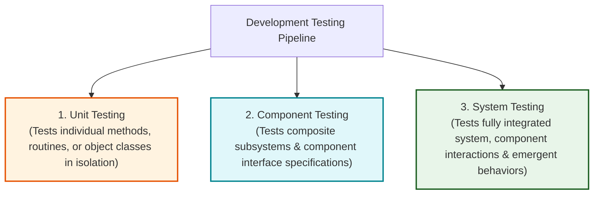
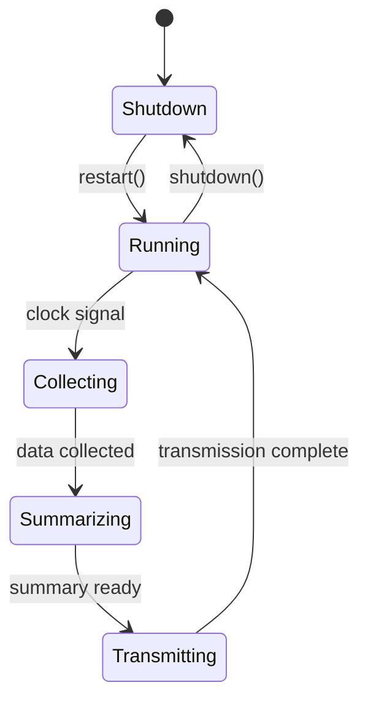
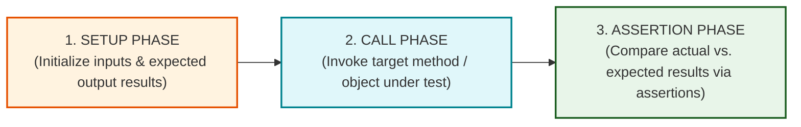
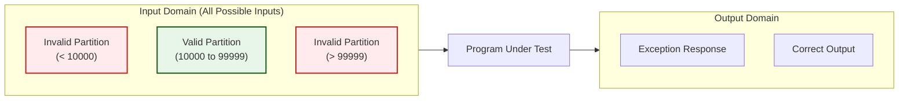
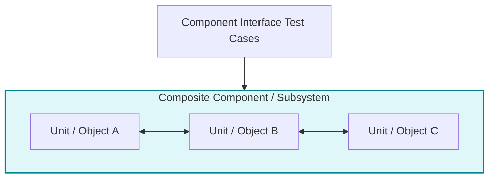
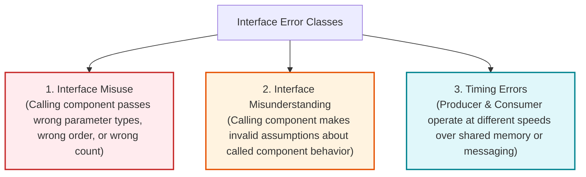
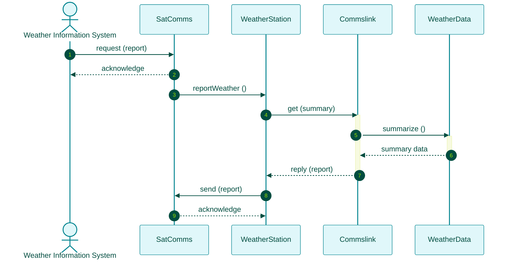
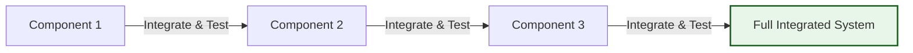

# Development Testing: Unit, Component, and System Testing
*(Based on Ian Sommerville, "Software Engineering" - Chapter 8, Section 8.1)*

**Development testing** encompasses all software verification and validation activities conducted by the software development team (programmers and internal testers) to discover bugs, flaws, and unexpected behaviors prior to system release. It is fundamentally a **defect testing process** interleaved directly with **debugging**—the diagnostic process of locating, analyzing, and repairing discovered software defects.

---

## 1. Development Testing Overview and Organization

Development testing can be organized using programmer self-testing, **programmer/tester pairing** (where each programmer works alongside a dedicated tester to design test cases), or dedicated internal testing groups for safety-critical systems.

### 1.1 The Three Sequential Stages of Development Testing

### 1.2 Comparison Matrix of Development Testing Stages

| Testing Stage | Primary Testing Target | Focus & Objectives | Primary Responsibility |
| :--- | :--- | :--- | :--- |
| **1. Unit Testing** | Individual methods, functions, or complete object classes. | Verifies single-unit functionality, state transitions, and attribute coverage in isolation. | Individual Developer / Programmer |
| **2. Component Testing** | Integrated composite components (clusters of objects). | Verifies component **interfaces** (parameter passing, shared memory, procedural, message passing). | Developer / Subsystem Team |
| **3. System Testing** | Integrated complete software system. | Verifies inter-component interactions, end-to-end use case threads, and **emergent system behaviors**. | Integrated Dev Team / Independent QA Team |

---

## 2. Unit Testing Deep-Dive

**Unit testing** is the process of testing the smallest testable parts of an application—typically individual methods or complete object classes.

### 2.1 Testing Object Classes
When testing an object class, test cases must be designed to provide 100% feature coverage across three distinct dimensions:
1.  **Testing Operations / Methods:** Invoking every operation and method associated with the class under different input conditions.
2.  **Testing Attributes:** Setting, modifying, and inspecting the values of all attributes encapsulated within the object.
3.  **Testing Object States:** Simulating event sequences that trigger state transitions, ensuring the object correctly transitions between all valid internal states.

#### Case Study: WeatherStation Object Testing
*   *Attribute Testing:* The `WeatherStation` class contains a single constant attribute `identifier` set upon installation. Test cases verify proper initialization.
*   *Method Testing:* Tests are defined for operations such as `reportWeather()`, `reportStatus()`, `powerSave()`, `remoteControl()`, `reconfigure()`, `restart()`, and `shutdown()`.
*   *Execution Prerequisites:* Certain methods require prerequisite execution sequences (e.g., executing `restart()` before invoking `shutdown()`).
*   *State Transition Testing:* Test cases force execution along valid state transition paths (e.g., `Shutdown` $\rightarrow$ `Running` $\rightarrow$ `Shutdown`, or `Running` $\rightarrow$ `Collecting` $\rightarrow$ `Summarizing` $\rightarrow$ `Transmitting` $\rightarrow$ `Running`).

> [!WARNING]
> **Exam Warning: Inheritance & Generalization Complexity in Unit Testing**
> Inheritance makes object class testing significantly more complex. You **cannot** test an inherited operation in a base superclass and assume it works correctly across all derived subclasses. 
> *Reason:* Inherited operations often rely on assumptions regarding other methods and attributes. If a subclass overrides these methods or alters attribute assumptions, the inherited operation can fail. Therefore, inherited operations **must be re-tested in every subclass context where they are inherited or used**.

---

### 2.2 Automated Unit Testing Frameworks (JUnit)
Automated unit testing frameworks like **JUnit** allow developers to write test suites that execute in seconds, providing instant GUI feedback.

#### The Three-Part Structure of an Automated Unit Test:

1.  **Setup Phase:** Initializes the test environment, instantiating the target object, input test data, and expected outputs.
2.  **Call Phase:** Invokes the specific method or operation being tested.
3.  **Assertion Phase:** Evaluates an assertion statement (e.g., `assertEquals(expected, actual)`). If true, the test passes; if false, it records a failure.

---

### 2.3 Mock Objects in Unit Testing
When a unit under test depends on external systems (e.g., database connections, external hardware clocks, network services) that are slow or unconstructed:
*   **Definition:** **Mock objects** are lightweight simulated objects that implement the exact interface of external dependencies but return pre-configured test responses.
*   **Benefits:**
    *   *Speed:* Replaces slow disk/database operations with fast in-memory array lookups.
    *   *Exception Simulation:* Simulates rare or abnormal events (e.g., database connection timeouts or specific system clock times) that are difficult to trigger in production.

---

## 3. Strategies for Choosing Unit Test Cases

Effective unit test case design relies on two complementary goals:
1.  Demonstrating that the component functions correctly under normal expected usage.
2.  Exposing defects using abnormal, boundary, or unexpected inputs.

### 3.1 Equivalence Partitioning (Domain Testing)
Input data and output results are divided into **Equivalence Partitions (Domains)**—sets of values where the system processes every member in an identical manner.

#### Boundary Value Analysis Rule:
*   Programmers routinely write correct logic for typical midpoint values, but frequently commit **off-by-one errors** at partition boundaries.
*   *Test Selection Rule:* Select test values at the **extreme boundaries (edges)** of each partition, plus one value near the **midpoint**.

#### Comprehensive Partition Example:
*   *Specification:* A program accepts 4 to 10 inputs, where each input is a 5-digit integer between 10,000 and 99,999.

| Input Variable | Partition Category | Equivalence Partition Range | Test Values Selected | Test Selection Rationale |
| :--- | :--- | :--- | :--- | :--- |
| **Input Value Range** | Invalid (Too Low) | $< 10,000$ | `9,999` | Boundary edge value |
| **Input Value Range** | **Valid Range** | $10,000 \text{ to } 99,999$ | `10,000`, `50,000`, `99,999` | Lower boundary, Midpoint, Upper boundary |
| **Input Value Range** | Invalid (Too High) | $> 99,999$ | `100,000` | Boundary edge value |
| **Number of Inputs** | Invalid (Too Few) | $< 4 \text{ inputs}$ | `3` | Boundary edge count |
| **Number of Inputs** | **Valid Count** | $4 \text{ to } 10 \text{ inputs}$ | `4`, `7`, `10` | Minimum count, Midpoint count, Maximum count |
| **Number of Inputs** | Invalid (Too Many) | $> 10 \text{ inputs}$ | `11` | Boundary edge count |

*   **Black-Box Testing:** Derives equivalence partitions strictly from requirements specifications without viewing code.
*   **White-Box Testing (Path Testing):** Analyzes internal source code paths to identify execution branches, loops, and exception-handling partitions.

---

### 3.2 Guideline-Based Testing Rules
Testing guidelines encapsulate historical engineering experience regarding common programmer errors:

1.  **Sequence / Array Testing Guidelines:**
    *   *Single-Element Sequences:* Test software with arrays containing only 1 element (exposes assumptions that sequences always contain multiple items).
    *   *Variable Sequence Sizes:* Test using sequences of varying lengths to prevent accidental correct outputs caused by fixed array assumptions.
    *   *Boundary Access:* Design tests that access the **first, middle, and last** elements of arrays.
2.  **General System Testing Guidelines (Whittaker):**
    *   Force all system error messages to be generated.
    *   Supply inputs that trigger input buffer overflows.
    *   Repeat the exact same input or input sequence multiple times sequentially.
    *   Force invalid outputs to be computed.
    *   Force computation results to be excessively large (arithmetic overflow) or small (underflow).

---

## 4. Component Testing and Interface Defects

**Component testing** integrates several individual units into composite components and tests the **interfaces** providing access to component functions.

### 4.1 The Four Types of Component Interfaces

1.  **Parameter Interfaces:** Data values or function references are passed directly between methods (e.g., standard object method calls).
2.  **Shared Memory Interfaces:** A common block of memory is shared between components; one subsystem writes data while others retrieve it (common in real-time embedded systems).
3.  **Procedural Interfaces:** A component encapsulates a set of procedures that external components can call (e.g., reusable class libraries).
4.  **Message Passing Interfaces:** Components request services by sending message packets asynchronously or synchronously to another component (e.g., client-server and distributed OO systems).

---

### 4.2 Three Classes of Interface Errors (Lutz 1993)

1.  **Interface Misuse:** A calling component makes an error in passing parameters to an interface (e.g., passing parameters of the wrong data type, in the wrong order, or omitting required parameters).
2.  **Interface Misunderstanding:** A calling component misunderstands the specification of the called component and makes false assumptions about its behavior (e.g., passing an unsorted array to a binary search component).
3.  **Timing Errors:** Occur in real-time or distributed systems with shared memory or message passing, where data producers and consumers run at different speeds, causing consumers to read stale or un-updated data.

---

### 4.3 Five Guidelines for Interface Testing
1.  **Extreme Parameter Testing:** Design tests where parameter values are set to the extreme ends of their valid ranges.
2.  **Null Pointer Testing:** Always test pointer and reference parameters using `null` values.
3.  **Deliberate Failure Stressing:** Design tests that deliberately cause a called component to fail, ensuring the caller handles exceptions correctly.
4.  **Message Stress Testing:** In message-passing systems, generate message volumes significantly higher than normal to expose timing and buffer capacity faults.
5.  **Activation Order Variation:** In shared-memory systems, vary the activation order of components to reveal implicit assumptions about data production and consumption ordering.

---

## 5. System Testing and Use-Case Thread Testing

**System testing** involves integrating all composite components into a complete application to verify component compatibility, inter-component interactions, and **emergent system behaviors**.

### 5.1 Planned vs. Unplanned Emergent Behaviors
*   *Planned Emergent Behavior:* Features that only exist when components are combined (e.g., combining an authentication component with a database update component to create an authorized data modification feature).
*   *Unplanned Emergent Behavior:* Undesirable side effects arising from component integration (e.g., memory leaks, system performance degradation, or security vulnerabilities).

---

### 5.2 Use-Case & Sequence Diagram-Based Testing
System testing uses UML Use Cases and Sequence Diagrams to trace execution threads across multiple integrated components.

#### WeatherStation Data Reporting Sequence Thread:

#### Execution Thread & Test Case Derivation:
1.  **Execution Path:** `SatComms:request` $\rightarrow$ `WeatherStation:reportWeather` $\rightarrow$ `Commslink:get(summary)` $\rightarrow$ `WeatherData:summarize`.
2.  **Test Case Design:**
    *   *Input Request Verification:* Test that issuing a data report request returns an immediate acknowledgment and triggers data extraction.
    *   *Data Summarization Test:* Supply raw instrument data to `WeatherData` and check that `WeatherStation` generates an accurately structured summary report.
    *   *Exception Handling Test:* Test execution paths when satellite links fail or raw data is corrupted.

---

### 5.3 Incremental Integration and Testing
Instead of integrating all components simultaneously ("Big Bang Integration"), system testing must be conducted **incrementally**:

*   **Process:** Integrate one component, run regression tests, integrate another component, and test again.
*   *Key Advantage:* If a test fails, the defect is almost certainly located within the newly integrated component or its immediate interfaces, making bug diagnosis immediate and straightforward.

---

### 5.4 System Testing Policies & Feature Combination Defects
Because exhaustive testing of every program path is impossible, organizations define **System Testing Policies**:

1.  **Menu Function Policy:** All system functions accessible through top-level menus must be tested individually.
2.  **Menu Combination Policy:** Combinations of functions accessed through the same menu must be tested together.
3.  **Input Function Policy:** All user input functions must be tested with both valid and invalid input data.

> [!IMPORTANT]
> **Whittaker's Feature Combination Rule:**
> Individual software features usually work correctly when tested in isolation. Major commercial software defects occur when **combinations of less commonly used features are executed together** (e.g., Whittaker's example of a word processor failing when footnotes are combined with a multi-column layout).
