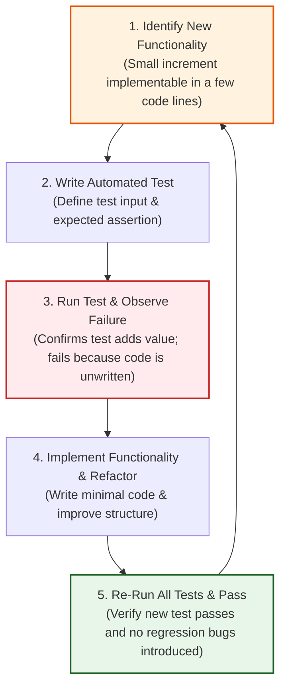
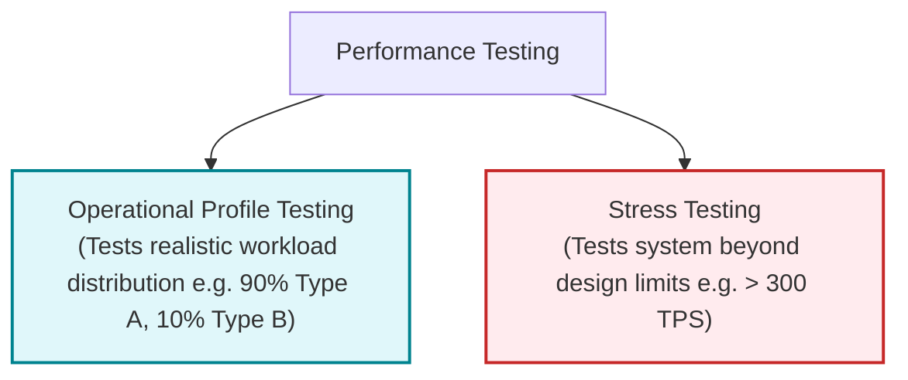
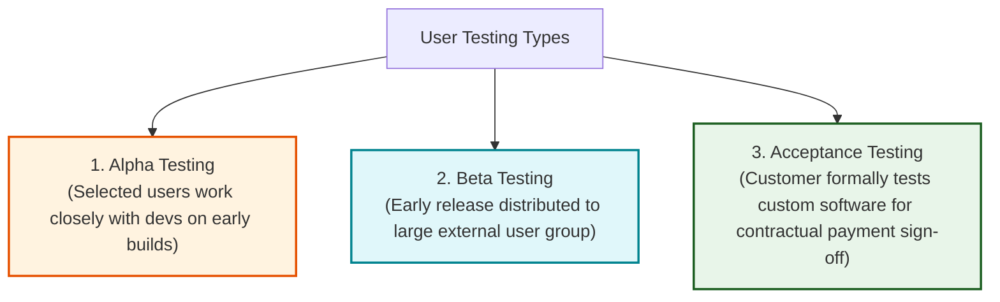
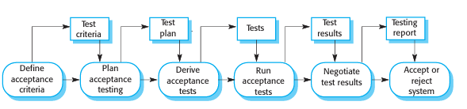
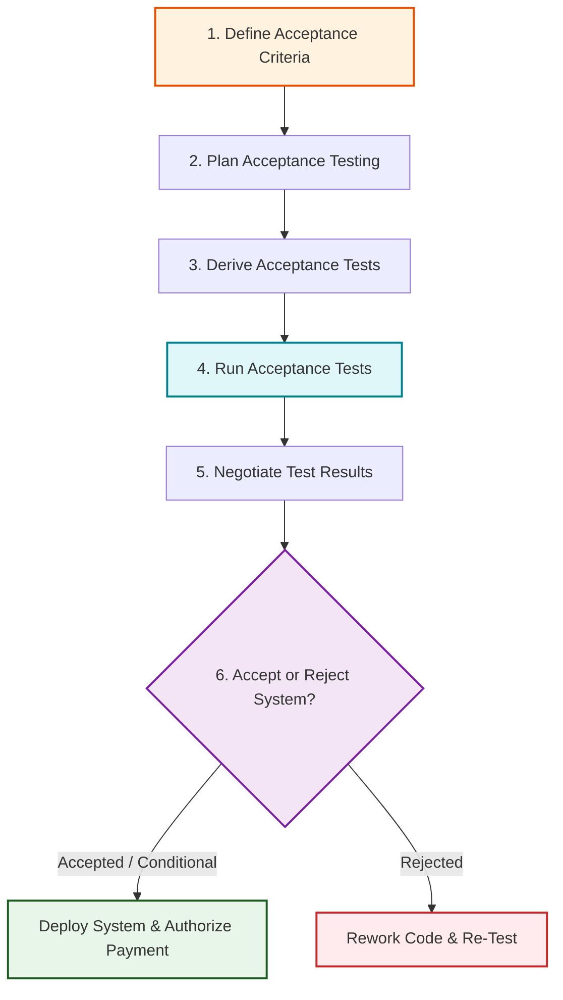

# Test-Driven Development, Release Testing, and User Testing
*(Based on Ian Sommerville, "Software Engineering" - Chapter 8, Sections 8.2, 8.3, 8.4)*

**Software testing** extends beyond developer component checks to encompass **Test-Driven Development (TDD)**, independent **Release Testing**, and real-world **User Acceptance Testing**.

---

## 1. Test-Driven Development (TDD)

Introduced as a central practice in **Extreme Programming (XP)**, **Test-Driven Development (TDD)** has become a mainstream development approach in both agile and plan-driven processes.

### 2.1 The 5-Step TDD Process Lifecycle

1.  **Identify New Functionality:** Select a small, discrete increment of functionality (implementable in a few lines of code).
2.  **Write Automated Test:** Implement an automated test case (e.g., using JUnit) specifying inputs and expected assertion outputs.
3.  **Run Test & Observe Failure:** Execute the test suite. The new test **must fail** initially, proving that it tests new behavior and adds value to the test suite.
4.  **Implement Functionality & Refactor:** Write the minimal code required to pass the test, refactoring existing code to maintain high structural quality.
5.  **Re-Run All Tests & Pass:** Execute the complete test suite. Once all tests pass cleanly, proceed to the next functional increment.

---

### 2.2 Four Major Benefits of TDD

1.  **Near 100% Code Coverage:** Because tests are written before code, every implemented code block has at least one associated test case, ensuring early defect discovery.
2.  **Dramatically Reduced Regression Testing Costs:** An automated test suite grows incrementally alongside the application, allowing hundreds of regression tests to execute in seconds.
3.  **Simplified Debugging:** When a test fails, the location of the bug is immediately obvious—it lies within the newly written or modified code increment. Traditional automated debuggers are rarely needed (Martin 2007).
4.  **Living System Documentation:** The automated test cases act as executable documentation describing precise code behavior and interface expectations.

---

### 2.3 Limitations of TDD
*   *Legacy Systems & Large COTS Components:* Difficult to apply to large monolithic systems that cannot easily be decomposed into small, isolated unit increments.
*   *Multithreaded Systems:* Ineffective for multithreaded software because non-deterministic thread interleaving can cause tests to pass or fail unpredictably across different runs.
*   *System Testing Gap:* TDD verifies unit functionality but **does not replace system testing**, which is required to evaluate performance, reliability, and unplanned emergent behaviors.

---

## 2. Release Testing

**Release testing** is the process of testing a complete system release intended for deployment outside the development team.

### 3.1 Two Core Differences: Release Testing vs. Development System Testing

| Feature / Dimension | Development System Testing | Release Testing |
| :--- | :--- | :--- |
| **Responsible Team** | Internal System Developers / Programmers | **Independent Testing Team** (No dev team involvement) |
| **Primary Goal** | **Defect Testing:** Rooting out bugs, crashes, and internal errors. | **Validation Testing:** Convincing stakeholders that the system meets requirements and is fit for release. |
| **Testing Approach** | Structural White-Box & Dynamic Unit Integration | **Black-Box Functional Testing** derived strictly from specifications. |

---

### 3.2 Requirements-Based Testing
Requirements-based testing is a systematic validation testing approach where individual test cases are derived directly from written requirements specifications.

#### Case Study: Mentcare Drug Allergy Warning Requirements
*   *Requirement 1:* If a patient is allergic to a medication, prescribing it shall issue a warning message.
*   *Requirement 2:* If a prescriber ignores an allergy warning, they must provide a recorded reason explaining why it was overruled.

#### Derived Requirements Test Suite:
1.  **No-Allergy Baseline Test:** Prescribe medication for a patient with no recorded allergies; verify *no warning* is issued.
2.  **Single-Allergy Test:** Prescribe a medication to a patient with a recorded allergy to that drug; verify the *correct warning message* is displayed.
3.  **Multiple Separate Allergy Test:** Record allergies to 2 separate drugs; prescribe each drug independently and verify specific warnings.
4.  **Dual Simultaneous Allergy Test:** Prescribe 2 allergic drugs simultaneously; verify *two distinct warnings* are issued.
5.  **Warning Overrule Test:** Trigger an allergy warning and overrule it; verify the system *forces the user to enter explanatory justification text* before proceeding.

---

### 3.3 Scenario Testing (Kaner 2003)
Scenario testing evaluates system performance by running realistic narrative user stories that trigger multiple integrated system features simultaneously.

#### Mentcare Case Study: Nurse George Home Visit Scenario
*   *Narrative:* Nurse George logs into Mentcare, downloads daily patient visit schedules to his laptop, enters an encryption keyphrase, visits patient Jim at home, queries the drug database for insomnia side effects, updates Jim's record, re-encrypts data, returns to the clinic, uploads records, and generates an automated call list.
*   *Integrated Features Tested Simultaneously:*
    1. System Authentication & Authorization.
    2. Data Import/Export & Mobile Laptop Synchronization.
    3. Mobile Data Encryption / Decryption Security.
    4. Patient Medical Record Modification.
    5. Clinical Drug Side-Effect Database Lookups.
    6. Automated Follow-Up Appointment & Call Prompting.

---

### 3.4 Performance Testing and Stress Testing

*   **Operational Profile:** A suite of test cases structured to reflect the actual statistical mix of transactions in real-world usage (e.g., if 90% of production transactions are read requests and 10% are writes, the test suite replicates this exact ratio).
*   **Stress Testing:** Subjecting a system to extreme loads exceeding specified design limits (e.g., subjecting a system designed for 300 transactions/sec to 500 transactions/sec until failure).

#### Two Critical Objectives of Stress Testing:
1.  **Verifying Fail-Soft Behavior:** Ensures that extreme overloading causes graceful degradation of non-critical services rather than catastrophic system crashes or data corruption.
2.  **Exposing Network & Load Bottlenecks:** Uncovers severe performance degradation and communication lockups in distributed systems when network channels become saturated.

---

## 3. User Testing and Acceptance Testing

**User testing** involves real target users or customers testing a software system in their operational working environment. It is essential because developer testing environments are artificial and cannot replicate workplace disruptions, clinical interruptions, or human operational habits.

### 4.1 The Three Types of User Testing

1.  **Alpha Testing:** Users work directly alongside the development team to evaluate early software releases, providing feedback on operational practicality.
2.  **Beta Testing:** An early build is released to a large external population of users/early adopters operating across diverse hardware/software configurations to uncover environmental bugs and compatibility flaws.
3.  **Acceptance Testing:** A formal contractual testing process where a customer tests a custom system using real operational data to verify contractual compliance and authorize final deployment payment.

---

### 4.2 The Six Stages of the Acceptance Testing Process

#### Equivalent UML Acceptance Testing Pipeline:

1.  **Define Acceptance Criteria:** Contractual criteria agreed upon between customer and developer defining acceptable performance and functional standards.
2.  **Plan Acceptance Testing:** Establishes testing schedules, resource allocation, coverage requirements, and risk mitigation strategies.
3.  **Derive Acceptance Tests:** Designs functional and non-functional test cases covering all specified user requirements.
4.  **Run Acceptance Tests:** Executes test cases in the actual or simulated target operational environment.
5.  **Negotiate Test Results:** Customer and developer evaluate open defects, determining whether bugs block deployment or can be resolved via follow-up patches.
6.  **Accept or Reject System:** Formal contractual meeting resulting in full acceptance, **conditional acceptance**, or rejection requiring developer rework.

> [!NOTE]
> **Acceptance Testing in Agile (XP):**
> In Extreme Programming (XP), acceptance testing is continuous. An **embedded customer/user** is part of the agile team, writing user stories and defining automated acceptance tests that must pass before any story is declared complete.
