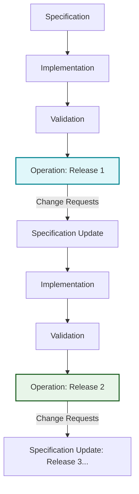
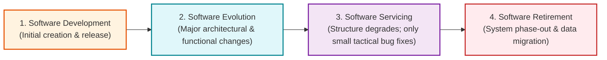
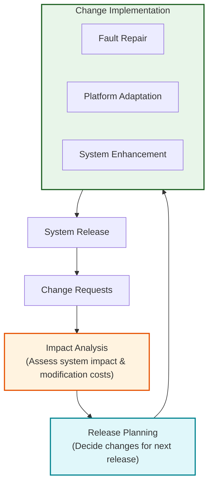
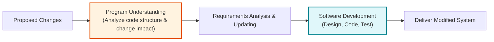
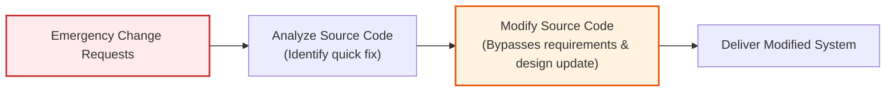
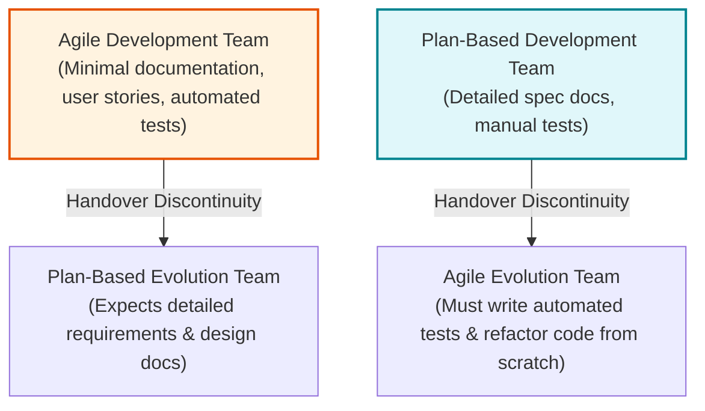

# Software Evolution and Evolution Processes

Software Evolution is the continuous modification and enhancement of software by the original development organization throughout its operational life.

---

## 1. Fundamentals of Software Evolution

### 1.2 Brownfield Software Development (Hopkins & Jenkins 2008)

-Brownfield Software Development is the development and modification of software within an existing operational environment where new systems depend on existing software systems.

---

### 1.3 The Spiral Model of Development and Evolution

Modern competitive pressures have reduced the time between spiral iterations from years to weeks, allowing continuous delivery of web applications and mobile apps.

---

### 1.4 Software Evolution vs. Software Maintenance

- Software Evolution is the continuous modification and enhancement of software by the original development organization throughout its operational life.
- Software Maintenance is the modification of software after delivery, often by a separate maintenance team, to correct faults or implement changes.

---

### 1.5 The Four Stages of the Software Life Cycle (Rajlich & Bennett 2000)

1.  **Software Development:** Initial software architecture design, implementation, and first deployment.
2.  **Software Evolution:** Major functional enhancements, structural architectural changes, and platform adaptations implemented in response to stakeholder demands.
3.  **Software Servicing:** As system structure degrades and changes become cost-ineffective, the system transitions to servicing. Only minor, tactical bug fixes and workarounds are implemented as the organization plans for system replacement.
4.  **Software Retirement:** The software is taken out of service, incurring data migration costs to transition records to a replacement system.

---

## 2. Software Evolution Processes

System evolution is driven by **Change Proposals** generated by bug reports, un-implemented original requirements, business environment shifts, and developer improvement ideas.

---

### 2.1 General Model of the Software Evolution Process

1.  **Change Requests:** Stakeholders submit formal change proposals.
2.  **Impact Analysis:** Evaluates how proposed changes affect system components, dependencies, and cost budgets.
3.  **Release Planning:** Prioritizes and bundles accepted changes (_fault repairs, platform adaptations, system enhancements_) into an upcoming release schedule.
4.  **Change Implementation:** Source code is modified, refactored, and tested.
5.  **System Release:** The new version is deployed to customers, and the process repeats.

---

### 2.2 The Change Implementation Process & Program Understanding

> [!IMPORTANT]
> **Program Understanding:**
> Program Understanding is the process of analyzing an existing software system to understand its structure, functionality, and dependencies before implementing changes.

---

### 2.3 Emergency System Repair Process

Urgent emergency patches are triggered by critical system failures, severe security vulnerabilities, unexpected operating system/hardware updates, or emergency legal/business changes.

#### Dangers of Emergency Patching:

- **Documentation-Code Inconsistency:** Bypassing requirements and design updates causes system documentation to become outdated and inaccurate.
- **Accelerated Software Aging:** Quick, temporary code fixes degrade internal software architecture, making future maintenance exponentially more expensive.
- _Best Practice:_ Following emergency deployment, the patch code should be refactored and system documentation updated to realign representations.

---

## 3. Agile Methods in Software Evolution

Applying agile principles to software evolution allows seamless continuous delivery, but requires modifications during post-delivery maintenance.

### 3.1 Handover Discontinuities Between Teams

1.  **Agile Development $\rightarrow$ Plan-Based Evolution:** The evolution team struggles due to the absence of formal requirements specifications and architectural UML documentation.
2.  **Plan-Based Development $\rightarrow$ Agile Evolution:** The evolution team must spend significant effort constructing automated unit/regression test suites and re-engineering legacy code before agile sprints can commence.

---

### 3.2 Three Modifications to Agile Methods During Maintenance

1.  **User Involvement Adaptation:** Direct embedded user participation becomes difficult when change requests originate from diverse multi-stakeholder groups.
2.  **Sprint Interruptions:** Short development cycles must accommodate emergency bug repairs outside planned sprint backlogs.
3.  **Extended Release Intervals:** Release intervals must often be lengthened beyond typical 2-week sprints to prevent disrupting customer business operations.
