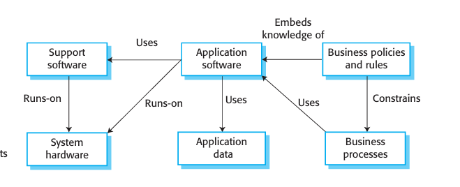
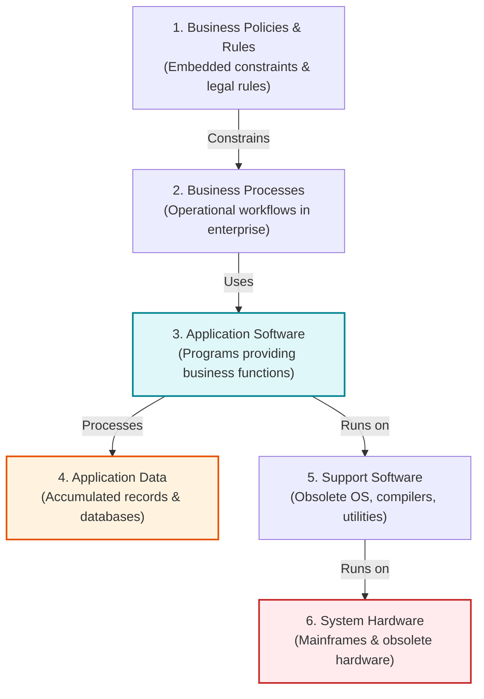
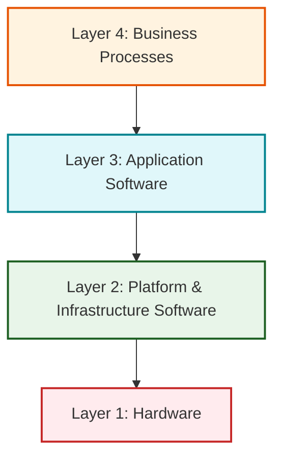
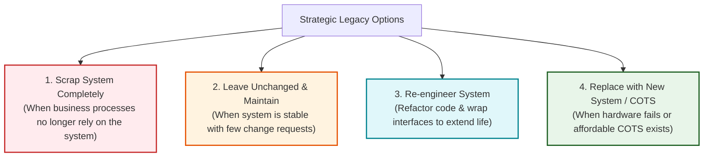
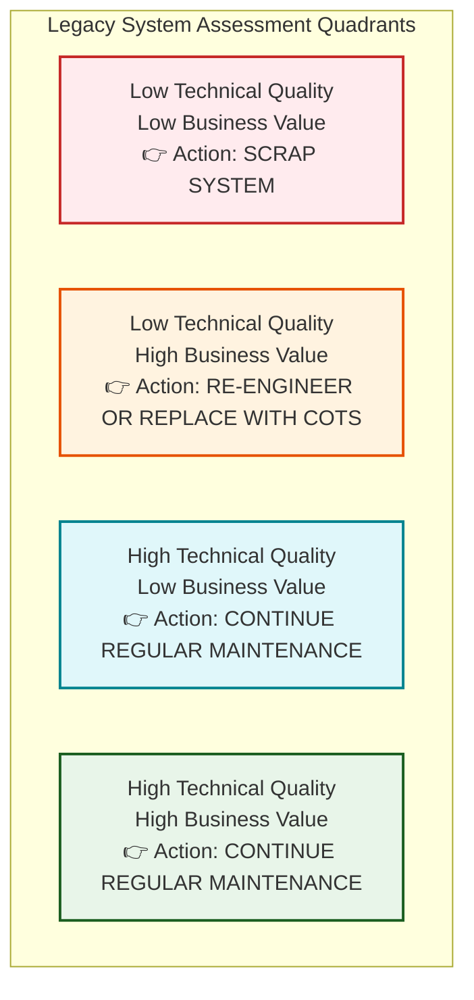

# Legacy Systems and System Management
*(Based on Ian Sommerville, "Software Engineering" - Chapter 9, Section 9.2)*

**Legacy systems** are older software systems that remain critical to business operations but rely on obsolete hardware, programming languages, compilers, or operating systems that are no longer used for new development.

---

## 1. The Sociotechnical Nature of Legacy Systems

Legacy systems are not just software applications; they are complex **sociotechnical systems** containing interdependent hardware, software, data, operational procedures, and organizational rules.

### 1.1 The Six Elements of a Legacy System

#### Equivalent Component Relationship Diagram:

1.  **System Hardware:** Mainframe computers or obsolete server hardware that is expensive to maintain and unsupported by original vendors.
2.  **Support Software:** Obsolete operating systems, compilers, database management systems, and utility libraries.
3.  **Application Software:** Core business programs developed at different times over decades, often lacking consistent architecture.
4.  **Application Data:** Massive volumes of accumulated business data spread across incompatible files and legacy databases (often inconsistent, duplicated, or corrupted).
5.  **Business Processes:** Operational enterprise workflows designed around the legacy system's capabilities and constraints.
6.  **Business Policies and Rules:** Business guidelines and regulatory constraints directly embedded within the application source code.

---

### 1.2 The Four-Layer Legacy System Architecture

*   **Layer Ripple Effects:** Modifying one layer introduces new capabilities or performance changes that force ripple-effect modifications up and down adjacent layers (e.g., upgrading database support software requires modifying application queries and business workflows).

---

## 2. Why Replacing Legacy Systems is High Cost & High Risk

Industry estimates indicate there are **over 200 billion lines of COBOL code** still operating in core financial and business infrastructure. Replacing these systems is fraught with immense risk.

> [!WARNING]
> **Case Study: The £10 Million ERP Replacement Failure**
> A major enterprise attempted to replace over 150 legacy systems with a single modern ERP suite. After spending over £10 million, the replacement project failed, delivering a system that worked less effectively than the legacy tools. Users reverted to the legacy systems, incurring massive manual processing overhead.

### 2.1 Four Major Replacement Risks
1.  **Missing or Outdated Specifications:** Original specifications are lost or un-updated, making it impossible to write complete requirements for a replacement system.
2.  **Intertwined Business Processes:** Enterprise business processes have evolved to work around legacy software bugs and capabilities; replacing the software disrupts organizational operations.
3.  **Embedded Undocumented Business Rules:** Critical business rules (e.g., insurance risk assessment rules) exist *only* inside the legacy code text and are un-documented elsewhere.
4.  **Inherent Software Project Risk:** New large-scale software development projects carry high probabilities of budget overruns, delivery delays, or complete failure.

---

### 2.2 Six Drivers of Legacy Maintenance Costs
1.  **Inconsistent Programming Styles:** Decades of changes by different programmers result in fragmented, hard-to-read code.
2.  **Obsolete Languages & Developer Shortages:** Written in obsolete languages (COBOL, FORTRAN); original developers are retiring, creating severe skill shortages.
3.  **Inadequate System Documentation:** Source code is often the sole surviving system documentation.
4.  **Structural Degradation ("Spaghetti Code"):** Years of ad-hoc patching destroy structural modularity.
5.  **Low-Level Hardware Optimizations:** Machine-specific space/speed tricks written for 1970s hardware confuse modern software engineers.
6.  **Data Errors & Duplication:** Inconsistent data formats spread across incompatible databases.

---

## 3. Legacy System Management Strategies

Organizations with limited maintenance budgets must systematically evaluate their legacy portfolio to select the optimal evolution strategy.

### 3.1 Four Strategic Options for Legacy Systems

---

### 3.2 Legacy System Assessment Matrix (Figure 9.9)

1.  **Low Technical Quality, Low Business Value:** High maintenance costs with minimal business return. **Scrap immediately.**
2.  **Low Technical Quality, High Business Value:** Critical to business operations but expensive to maintain. **Re-engineer to improve quality or replace with COTS.**
3.  **High Technical Quality, Low Business Value:** Stable and inexpensive to maintain. **Continue normal maintenance; scrap if major expensive changes are requested.**
4.  **High Technical Quality, High Business Value:** Core business asset functioning smoothly. **Continue normal maintenance.**

---

## 4. Assessing Business Value and Environment Quality

### 4.1 Four Business Value Assessment Factors
1.  **System Usage:** Frequency and volume of user access (infrequent but critical seasonal use, like student registration, still represents high business value).
2.  **Business Processes Supported:** Degree to which the system enables efficient operational workflows.
3.  **System Dependability:** Impact of system failures on business operations and customer satisfaction.
4.  **System Outputs:** Strategic importance of reports and data produced by the system for enterprise decision-making.

---

### 4.2 Environment Quality Assessment Factors (Figure 9.10)

| Environment Factor | Critical Assessment Questions |
| :--- | :--- |
| **Supplier Stability** | Is the hardware/software vendor solvent and actively providing support? |
| **Failure Rate** | Does the hardware or support software suffer frequent crashes forcing system restarts? |
| **System Age** | How old is the hardware/software? Older platforms incur severe obsolescence penalties. |
| **Performance** | Is system throughput adequate or creating operational bottlenecks? |
| **Support & License Costs** | Are annual hardware maintenance contracts and support software licenses excessively high? |
| **Interoperability** | Can support software (compilers/OS) interface cleanly with modern target environments? |

---

### 4.3 Application Technical Quality Assessment Factors (Figure 9.11)
1.  **Volume of Change Requests:** A high volume of change requests indicates structural degradation and low technical quality.
2.  **Number of User Interfaces:** Inconsistent forms-based user interfaces increase operational user errors.
3.  **Data Volume & Inconsistency:** Accumulated data inconsistencies and multi-database duplication reduce application technical quality.
