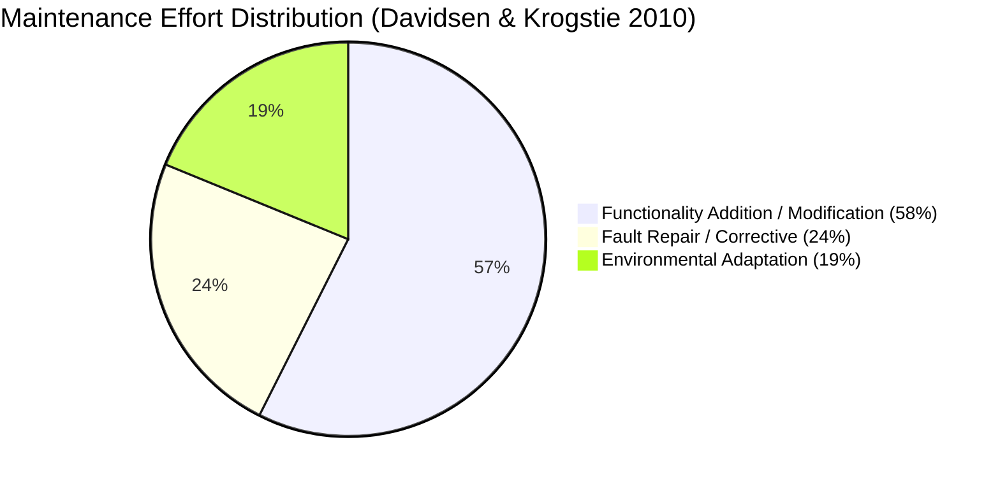
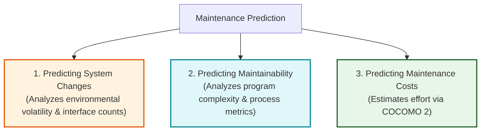
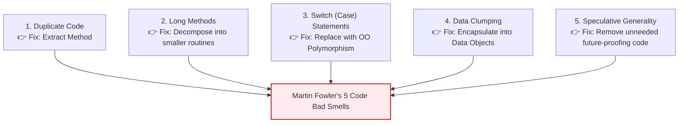

# Software Maintenance, Reengineering, and Refactoring
*(Based on Ian Sommerville, "Software Engineering" - Chapter 9, Section 9.3)*

**Software maintenance** is the general process of modifying a custom software system after it has been delivered and deployed to correct errors, adapt to new operating environments, or implement new business requirements.

---

## 1. Fundamentals of Software Maintenance

### 1.1 Lehman's Laws of Program Evolution Dynamics (Lehman & Belady - 1970s)
Lehman and Belady formulated five fundamental laws governing all large-scale evolving software systems:

1.  **Law of Continuing Change:** A software system must continually change and adapt to remain useful in an operational environment.
2.  **Law of Increasing Complexity:** As an evolving program changes, its structural modularity degrades ("spaghetti code"), requiring explicit refactoring effort to maintain understandability.
3.  **Law of Self Regulation:** Program evolution processes are self-regulating; system attribute metrics (e.g., release size) remain roughly constant over time.
4.  **Law of Conservation of Organizational Stability:** The average effective global activity rate (incremental change per release) remains constant regardless of resource allocation.
5.  **Law of Conservation of Familiarity:** Incremental functionality additions in each release must remain stable to preserve stakeholder familiarity.

---

### 1.2 The Three Types of Software Maintenance

| Maintenance Category | Industry Term | Primary Focus & Description | Cost Impact |
| :--- | :--- | :--- | :--- |
| **1. Fault Repair** | **Corrective Maintenance** | Fixes coding bugs, design flaws, and security vulnerabilities. | **24% of effort.** Coding bugs are cheap; requirement errors are expensive. |
| **2. Environmental Adaptation** | **Adaptive Maintenance** | Modifies software to adapt to new hardware, operating systems, or support software. | **19% of effort.** Triggered by external platform upgrades. |
| **3. Functionality Addition** | **Perfective Maintenance** | Implements new business requirements, user features, and system enhancements. | **58% of effort.** Consumes the majority of lifetime maintenance budgets. |

---

### 1.3 Four Reasons Maintenance is More Expensive than Initial Development
1.  **Program Understanding Overhead:** Maintenance teams must spend substantial time reading and analyzing existing code to understand design decisions before implementing changes.
2.  **Lack of Developer Maintainability Incentives:** Initial development teams are rarely contracted for maintenance, creating no incentive to write clean, maintainable code during initial build.
3.  **Maintenance Unpopularity:** Maintenance is frequently perceived as low-prestige work and delegated to junior software engineers lacking domain experience.
4.  **Structural Degradation Over Time:** Repeated patching without refactoring degrades software architecture, making subsequent modifications progressively harder.

---

## 2. Maintenance Prediction

**Maintenance prediction** uses metrics to evaluate future system change requests, maintainability degradation, and expected maintenance budgets.

### 2.1 Four Process Metrics for Predicting Maintainability
1.  **Corrective Maintenance Request Volume:** A rising rate of bug reports indicates new defects are being introduced faster than fixes are applied.
2.  **Impact Analysis Time:** Increasing time required to analyze change impacts indicates growing component coupling and declining maintainability.
3.  **Change Implementation Time:** Increasing time required to code and document changes signifies structural code degradation.
4.  **Outstanding Change Request Backlog:** A growing backlog of unfulfilled change requests signals declining maintenance capacity.

---

## 3. Software Reengineering

**Software reengineering** is the process of restructuring and reorganizing legacy source code and data structures to improve maintainability **without altering external functional behavior**.

### 3.1 Two Key Advantages over System Replacement
1.  **Reduced Risk:** Avoids the high risk of total failure, schedule delays, and specification loss inherent in new custom development.
2.  **Reduced Cost:** Significantly cheaper than total replacement (e.g., Ulrich 1990 case study: $50M replacement cost vs. $12M reengineering cost).

---

### 3.2 The Five Activities in the Reengineering Process

#### Equivalent UML Reengineering Process Pipeline:

```mermaid
graph LR
    OrigCode["Original Legacy Program"] --> CodeTrans["1. Source Code Translation\n(Automated syntax conversion)"]
    CodeTrans --> RevEng["2. Reverse Engineering\n(Extract docs & design models)"]
    RevEng --> StructImp["3. Program Structure Improvement\n(Restructure control flow)"]
    StructImp --> Modular["4. Program Modularization\n(Group routines & refactor arch)"]
    Modular --> DataReeng["5. Data Reengineering\n(Clean & convert database schemas)"]
    DataReeng --> ReengCode["Reengineered System"]

    style OrigCode fill:#ffebee,stroke:#c62828,stroke-width:2px
    style DataReeng fill:#fff3e0,stroke:#e65100,stroke-width:2px
    style ReengCode fill:#e8f5e9,stroke:#1b5e20,stroke-width:2px
```

1.  **Source Code Translation:** Converting source code from an obsolete language (e.g., COBOL) to a modern language using automated translation tools.
2.  **Reverse Engineering:** Automatically analyzing source code to extract architectural documentation, dependencies, and design models.
3.  **Program Structure Improvement:** Restructuring control flow (e.g., un-nesting deep loops and replacing goto statements with structured conditionals).
4.  **Program Modularization:** Grouping related subroutines into coherent modules and eliminating redundant code blocks.
5.  **Data Reengineering:** Cleaning up duplicated/corrupted data records and updating database schemas to match restructured code.

> [!NOTE]
> **Legacy Wrapping (Adapter Services):**
> Instead of modifying internal legacy code, developers construct **Adapter Services** that encapsulate legacy interfaces and expose modern RESTful / Web API endpoints for new applications.

---

## 4. Software Refactoring

**Refactoring** is the continuous process of making structural code improvements during development and evolution to slow down code degradation.

### 4.1 Reengineering vs. Refactoring

| Feature / Dimension | Software Reengineering | Software Refactoring |
| :--- | :--- | :--- |
| **Timing & Trigger** | Post-hoc process performed after years of maintenance when costs skyrocket. | Continuous, incremental process performed during daily development and agile sprints. |
| **Tool Usage** | Automated translation and restructuring tools applied to legacy systems. | Editor transformations supported by IDEs (Eclipse) and verified by automated unit regression test suites. |
| **Primary Scope** | System-wide legacy code & database overhaul. | Localized code cleanup ("preventative maintenance"). |

---

### 4.2 Martin Fowler's Five "Code Bad Smells" (1999)

Fowler defined stereotypical code structures ("bad smells") that indicate refactoring is required:

1.  **Duplicate Code:** Identical or similar code blocks repeated across multiple methods. *Refactoring Fix:* Extract duplicate code into a single reusable method (`Extract Method`).
2.  **Long Methods:** Methods that perform too many actions. *Refactoring Fix:* Decompose long methods into multiple shorter, focused methods.
3.  **Switch (Case) Statements:** Scattered conditional switch statements checking type values. *Refactoring Fix:* Replace switch statements with Object-Oriented **Polymorphism**.
4.  **Data Clumping:** Groups of data fields or method parameters that reoccur together across multiple classes. *Refactoring Fix:* Encapsulate the data clump into a single dedicated parameter object.
5.  **Speculative Generality:** Unused "future-proofing" hooks included for hypothetical future requirements. *Refactoring Fix:* Delete unused speculative code.

> [!NOTE]
> **Design Refactoring (Kerievsky 2004):**
> Extends code refactoring to structural design by replacing degraded, complex code constructs with formal **Gang of Four (GoF) Design Patterns**.
