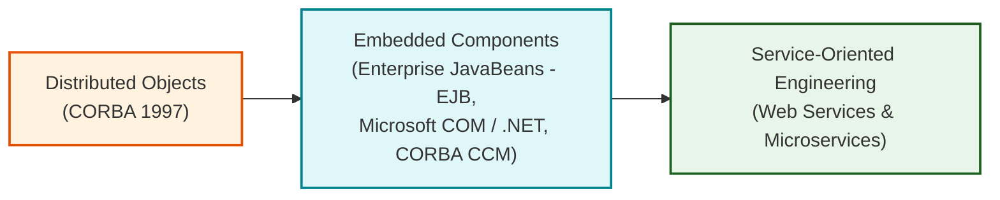
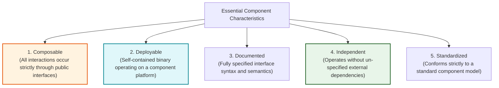
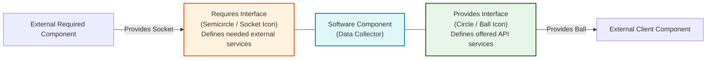
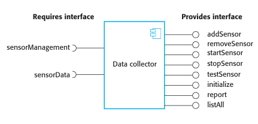
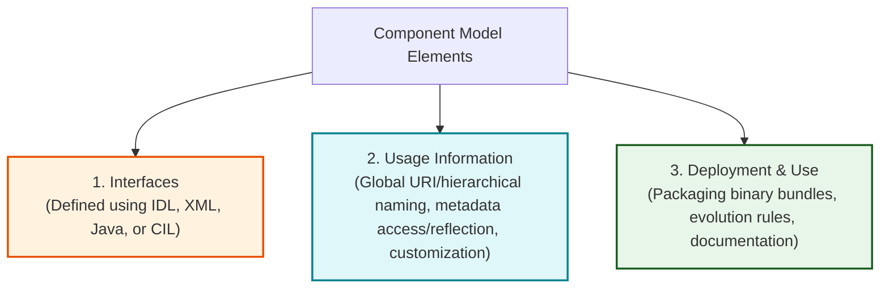
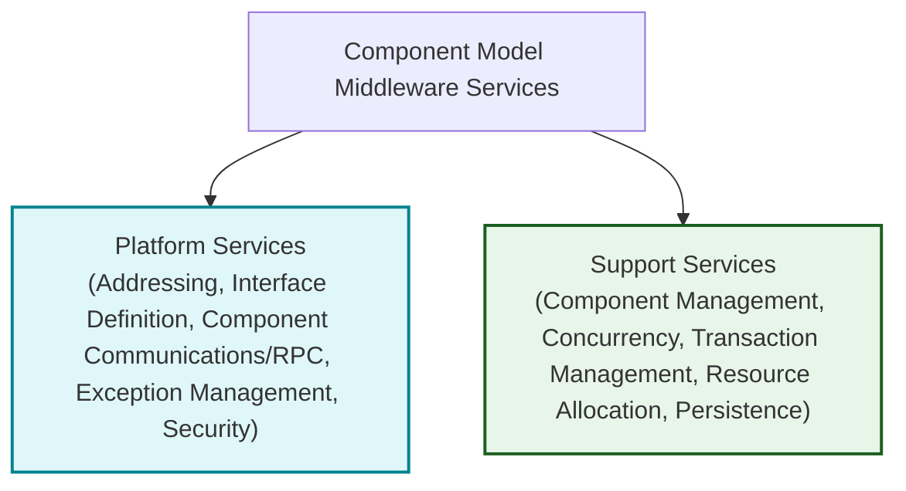

# Component-Based Software Engineering and Component Models

_(Based on Ian Sommerville, "Software Engineering" - Chapter 16, Introduction & Section 16.1)_

**Component-Based Software Engineering (CBSE)** is an approach to software development focused on defining, implementing, and integrating loosely coupled, independent reusable software components into large-scale software systems.

---

### 1.1 Four Essentials of CBSE

1.  **Independent Components:** Software units completely specified by public interfaces, allowing implementation swapping without affecting other system parts.
2.  **Component Standards & Models:** Standard rules defining interface specifications and interaction mechanisms across different programming languages.
3.  **Middleware Integration Support:** Execution infrastructure managing low-level component communications, resource allocation, security, transactions, and concurrency.
4.  **Component-Oriented Development Process:** Development workflows designed to adapt system requirements to available commercial/reusable components.

---

### 1.2 The Evolution of Component Technologies

---

## 2. Component Definitions and Characteristics

### 2.1 Formal Definitions of a Software Component

> [!NOTE]
> **Councill and Heineman (2001) - Standards-Based Definition:**
> _"A software element that conforms to a standard component model and can be independently deployed and composed without modification according to a composition standard."_

> [!NOTE]
> **Szyperski (2002) - Contract-Based Definition:**
> _"A software component is a unit of composition with contractually-specified interfaces and explicit context dependencies only. A software component can be deployed independently and is subject to composition by third parties."_

---

### 2.2 Five Essential Characteristics of Reusable Components (Figure 16.1)

---

### 2.3 Key Differences: Software Components vs. Object Classes

| Dimension               | Object Classes                                       | Software Components                                                               |
| :---------------------- | :--------------------------------------------------- | :-------------------------------------------------------------------------------- |
| **Deployability**       | Source/compiled files bound at compile/link time.    | **Independently deployable binary units** executing on a component platform.      |
| **Language Dependency** | Language-specific (Java, C++).                       | **Language-independent** (interfaces defined via IDL, XML, or CIL).               |
| **State Exposure**      | Defines types; exposes internal state via instances. | Encapsulates state; accessed strictly through parameterized interface operations. |
| **Communication**       | Direct local method calls.                           | **Remote Procedure Calls (RPCs)** across distributed network boundaries.          |

---

## 3. Component Interfaces: "Provides" vs. "Requires"

All reusable components communicate through two distinct UML interface types:

1.  **The "Provides" Interface (Ball / Circle Icon):** Defines the component API—the set of services offered to external clients and calling components.
2.  **The "Requires" Interface (Socket / Semicircle Icon):** Specifies external services and interfaces that other system components must provide for the component to function correctly.

---

### 3.1 Case Study: Data Collector Component Model (Figure 16.3)

---

## 4. Component Models and Middleware Infrastructure

A Component Model defines the rules for creating, connecting, deploying, and managing software components. (e.g., Enterprise JavaBeans, Microsoft .NET, WSDL Web Services).

### 4.1 Basic Elements of a Component Model (Figure 16.4)

---

### 4.2 Middleware Infrastructure Services (Figure 16.5)

To enable component execution, component model implementations provide container middleware offering two categories of shared services:

1.  **Platform Services:**provides basic info about locate, communicate, and handle security/exceptions across distributed networks.
2.  **Support Services:** Shared application services provided by component execution **Containers** (e.g., managing database transactions, thread concurrency, and object persistence).
