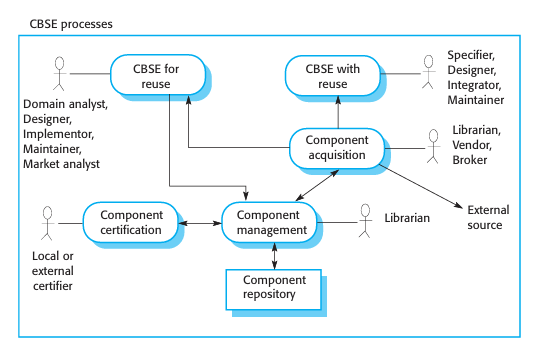
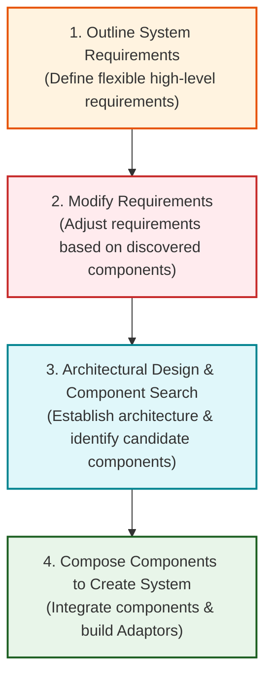
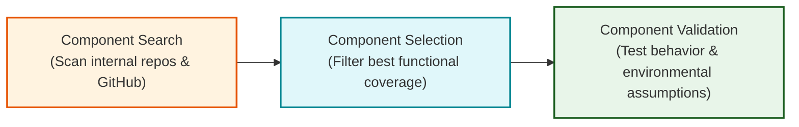

# CBSE Processes: Development for Reuse and Development with Reuse

**Component-Based Software Engineering (CBSE) processes** are specialized software development lifecycles that explicitly incorporate component reuse, component generalization, and third-party integration into software engineering workflows.

---

## 1. Overview of CBSE Processes (Kotonya 2003)

### 1.1 Development for Reuse vs. Development with Reuse

| Development FOR Reuse              | Development WITH Reuse                   |
| ---------------------------------- | ---------------------------------------- |
| Creates reusable components        | Builds systems using reusable components |
| Source code available              | Often only binary/API available          |
| Generalizes components             | Selects suitable components              |
| Focus on reusable business objects | Focus on satisfying user requirements    |

---

### 1.2 Three Supporting CBSE Processes

1.  **Component Acquisition:** Sourcing reusable components from internal repositories or trusted external open-source libraries.
2.  **Component Management:** Cataloging, indexing, storing, and managing component versions within an organizational repository.
3.  **Component Certification:** Independent verification testing checking that candidate components strictly comply with specified quality standards.

---

## 2. CBSE for Reuse

**CBSE for reuse** is the process of generalizing internal application-specific components into reusable assets and storing them in a managed repository.

To be reusable, a component must implement a **Stable Domain Abstraction**—a fundamental domain concept that changes slowly over time.

- _Banking Domain Abstractions:_ Accounts, Account Holders, Statements, Transactions.

---

### 2.2 Six Code Transformations to Make Components Reusable

1.  **Remove Application-Specific Methods:** Strip out unique rules peculiar to a single project.
2.  **Generalize Identifier Names:** Replace project-specific terminology with standard domain names.
3.  **Broaden Functional Coverage:** Add missing operations to cover all standard domain use-cases.
4.  **Standardize Exception Handling:** Make error definitions consistent across all interface methods.
5.  **Add Configuration Interfaces:** Provide parameters allowing users to customize deployment limits (e.g., maximum buffer size).
6.  **Bundle Required Dependencies:** Integrate required sub-components to increase standalone component independence.

> [!IMPORTANT]
> **Pragmatic Exception Handling Rules in Components:**
>
> - _Technical Exceptions_ (where recovery is required for component operation) must be handled **locally** within the component.
> - _Business Function Exceptions_ should be published in the component interface and **passed to the calling application** for resolution.

---

### 2.3 The Reusability vs. Understandability Trade-Off

Broadening component functionality increases its **reusability** across diverse applications. However, adding generic operations increases interface complexity, thereby reducing **component understandability** and making it harder for developers to evaluate suitability.

---

## 3. CBSE with Reuse

**CBSE with reuse** tailors software engineering workflows to compose pre-existing components into a target system.

### 3.1 The Four Sequential Activities of CBSE with Reuse (Figure 16.7)

1.  **Outline System Requirements:** Stakeholders specify flexible requirements. Specific, inflexible requirements artificially exclude valid candidate components.
2.  **Modify Requirements according to Discovered Components:** Requirements are modified early based on features offered by available components, trading custom design for faster, cheaper delivery.
3.  **Architectural Design & Candidate Search:** Defines system distribution (Jacobsen et al. 1997) and selects compatible candidate components.
4.  **Compose Components to Create System:** Integrates components with middleware containers, constructing **Adaptor Components** to reconcile interface mismatches.

---

### 3.2 Component Identification Lifecycle (Figure 16.8)

---
