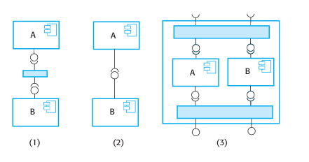
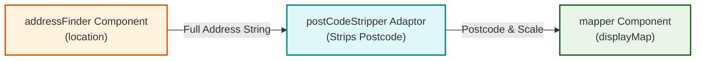
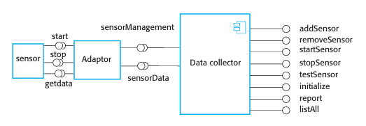
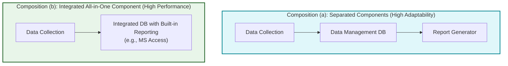

# Component Composition, Adaptors, and Formal Specifications
*(Based on Ian Sommerville, "Software Engineering" - Chapter 16, Section 16.3)*

**Component composition** is the process of integrating independent software components with each other using intermediate "glue code" to assemble complete software applications or composite components.

---

## 1. Fundamentals of Component Composition

### 1.1 Three Types of Component Composition (Figure 16.10)



#### Equivalent Component Composition Flowchart:

graph TD
    CompTypes["Types of Component Composition"] --> Seq["1. Sequential Composition\n(Component A executes first; output passed to Component B by external caller)"]
    CompTypes --> Hier["2. Hierarchical Composition\n(Component A calls Component B directly to consume B's provided services)"]
    CompTypes --> Add["3. Additive Composition\n(Components A & B combined into a composite unit exposing merged interfaces)"]

    style Seq fill:#fff3e0,stroke:#e65100,stroke-width:2px
    style Hier fill:#e0f7fa,stroke:#00838f,stroke-width:2px
    style Add fill:#e8f5e9,stroke:#1b5e20,stroke-width:2px
```

1.  **Sequential Composition:** Component A executes, and its returned output is passed as input to Component B by an external orchestrating application. Neither component calls the other directly.
2.  **Hierarchical Composition:** Component A directly calls Component B to consume its provided services. Component B's "provides" interface must match Component A's "requires" interface. (Not applicable to Web Services).
3.  **Additive Composition:** Two independent components are combined into a higher-level composite component. The composed component exposes the merged "provides" and "requires" interfaces of both sub-components.

---

## 2. Interface Incompatibilities and Adaptor Components

When composing independently developed components, interface mismatches frequently occur.

### 2.1 Three Types of Interface Incompatibility
1.  **Parameter Incompatibility:** Operation names match, but parameter data types, parameter order, or argument counts differ.
2.  **Operation Incompatibility:** Operation names in the "provides" and "requires" interfaces are entirely different.
3.  **Operation Incompleteness:** The "provides" interface of one component is a partial subset of another's "requires" interface (or vice versa).

---

### 2.2 Adaptor Components ("Glue Code")
An **Adaptor Component** acts as an intermediate proxy or wrapper that converts one interface specification into another compatible format, reconciling parameter, operation, and structural mismatches.

#### Case Study 1: Emergency Services Address & Map System (Figure 16.11)
*   `addressFinder` provides `location(phoneNumber)`, returning a full street address string.
*   `mapper` requires `displayMap(postCode, scale)`, expecting a postcode string and integer scale.



```java
// Sequential Composition Glue Code using Adaptor
address = addressFinder.location(phoneNumber);
postCode = postCodeStripper.getPostCode(address);
mapper.displayMap(postCode, 10000);
```

---

#### Case Study 2: WeatherStation Data Collector & Sensor Adaptor (Figure 16.12)



*   `DataCollector` uses generic command strings (`sensorData("collect")`).

*   Physical hardware sensors provide specific operations (`start()`, `stop()`, `getdata()`).
*   *Adaptor Role:* The adaptor parses command text, invokes `sensor.getdata()`, and returns string results to `DataCollector`.

---

## 3. Formal Component Specification via OCL

Informal natural language component documentation is often ambiguous. To establish component trust, developers utilize **Design by Contract (Bertrand Meyer 1992/2003)** to formally specify component obligations.

### 3.1 Object Constraint Language (OCL) Specifications (Figure 16.14)
OCL (part of UML) uses **invariants**, **preconditions** (`pre:`), and **postconditions** (`post:`) to define formal semantic constraints. The `@pre` modifier references variable values prior to method execution.

#### OCL Specification for Photo Library Component (`addItem` & `delete`):

```ocl
context addItem
pre:
    PhotoLibrary.libSize() > 0
    PhotoLibrary.retrieve(pid) = null
post:
    libSize() = libSize()@pre + 1
    PhotoLibrary.retrieve(pid) = p
    PhotoLibrary.catEntry(pid) = photodesc

context delete
pre:
    PhotoLibrary.retrieve(pid) <> null
post:
    PhotoLibrary.retrieve(pid) = null
    PhotoLibrary.catEntry(pid) = PhotoLibrary.catEntry(pid)@pre
    PhotoLibrary.libSize() = libSize()@pre - 1
```

*   *Precondition Analysis:* `addItem` requires that the photo ID does not already exist in the library.
*   *Postcondition Analysis:* `delete` removes the photo and reduces library size by 1, but explicitly **preserves catalog metadata** (`PhotoLibrary.catEntry(pid) = PhotoLibrary.catEntry(pid)@pre`) for audit tracking.

---

## 4. Architectural Trade-Offs in Component Composition

Designing composite systems requires evaluating conflicts between functional requirements, development speed, and emergent non-functional properties (performance and dependability).

### 4.1 Separation of Concerns vs. All-in-One Composition (Figure 16.15)



*   **Composition (a) - Separated Components:**
    *   *Advantage:* Strict **Separation of Concerns**. Highly flexible and adaptable; database or reporting engine can be upgraded independently.
    *   *Disadvantage:* Slower execution speed due to inter-component IPC/RPC communication overhead.
*   **Composition (b) - Integrated All-in-One Component:**
    *   *Advantage:* High execution performance (zero IPC overhead) and enforced built-in data integrity rules.
    *   *Disadvantage:* Inflexible; difficult to modify or swap individual reporting functions as business requirements evolve.
