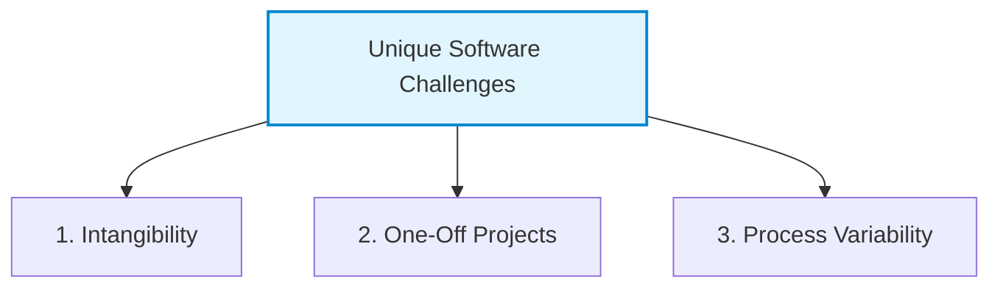

# Introduction to Software Project Management
*(Based on Ian Sommerville, "Software Engineering" - Chapter 22)*

## 1. Overview: The Importance of Project Management
Software project management is an essential discipline within professional software engineering. Because software development is constrained by organizational budgets and schedule limits, project managers are needed to steer projects to success. 

While good management cannot guarantee project success, **bad management almost always results in project failure**—leading to late deliveries, cost overruns, and software that fails to meet customer expectations.

### 1.1 Success Criteria for Software Projects
For most software projects, the primary success criteria are:
*   **On-Time Delivery:** Delivering the software to the customer at the agreed time.
*   **On-Budget Execution:** Keeping the overall costs within the allocated budget.
*   **Meeting Expectations:** Delivering software that conforms to the customer’s requirements and quality expectations.
*   **Coherent Development Team:** Fostering and maintaining a well-functioning, highly motivated, and collaborative development team.

---

## 2. Why Software Management is Uniquely Challenging
Software engineering differs fundamentally from other engineering disciplines (such as civil or mechanical engineering). These unique characteristics introduce specific challenges for project managers:

1.  **The Product is Intangible:** 
    *   *Contrast:* In a construction project (e.g., building a bridge), progress is visually obvious. If a schedule slips, unfinished structures are visible.
    *   *Software Reality:* Software cannot be seen or touched. Managers cannot check progress simply by looking at the artifact. They must rely on reports, metrics, and secondary artifacts (like completed code commits, design documents, and test logs) to verify progress.
2.  **Projects are Often "One-Off" (Unique):**
    *   *Contrast:* Many physical engineering projects repeat established processes with minor variations.
    *   *Software Reality:* Every large software project is unique due to varying requirements, differing organizational environments, and rapid changes in technology/platforms. Experience gained on a past project might become obsolete or non-transferable to a new project due to different technologies.
3.  **Processes are Variable and Organization-Specific:**
    *   *Contrast:* Engineering processes for physical structures are standardized and well-understood.
    *   *Software Reality:* Different organizations use vastly different development processes (ranging from highly structured plan-driven systems to lightweight Agile methods). It is difficult to reliably predict when process variations will lead to development bottlenecks.

---

## 3. Factors Affecting Project Management Style
A project manager cannot follow a single, standardized job description. Management styles vary depending on six crucial situational factors:

| Factor | Description & Management Implications |
| :--- | :--- |
| **1. Company Size** | Small companies operate with informal communication and low overhead. Large companies require formal reporting hierarchies, strict budgeting, and approval processes. |
| **2. Software Customers** | Internal customers allow informal communication. External customers require formal communication channels. Government clients demand bureaucratic, policy-compliant procedures. |
| **3. Software Size** | Small teams can collaborate informally in one room. Large systems require multiple distributed teams, needing structured communication and coordination. |
| **4. Software Type** | Consumer products need less formal documentation of decisions. Safety-critical systems require exhaustive records and justifications for all decisions to verify safety audits. |
| **5. Organizational Culture** | Affects risk tolerance (risk-seeking vs. risk-averse) and team dynamics (individual-focused vs. group-focused). |
| **6. Development Processes** | Agile processes favor lightweight, informal management. Formal plan-driven processes require constant monitoring to ensure compliance. |

---

## 4. Fundamental Project Management Activities
Regardless of the organization, five core activities are common to all software project managers:

1.  **Project Planning:** Planning, estimating, and scheduling project milestones. Assigning tasks to appropriate team members, monitoring progress, and ensuring work aligns with budget and quality standards.
2.  **Risk Management:** Identifying risks that might delay or compromise the project, monitoring those risks, and establishing mitigation plans to resolve issues when they occur.
3.  **People Management:** Selecting team members, resolving conflicts, and building team cohesion to ensure high productivity and morale.
4.  **Reporting:** Writing concise, technical and executive progress summaries for company management and external customers during periodic reviews.
5.  **Proposal Writing:** Winning contracts by writing proposals that describe the project's objectives, how it will be executed, and providing justified cost and schedule estimates.
