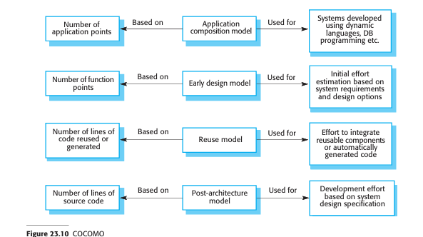

# COCOMO Cost Modeling: Part 1
*(Based on Ian Sommerville, "Software Engineering" - Chapter 23)*

## 1. Overview of COCOMO II
The **COCOMO II (COnstructive COst MOdel II)** is the most widely known empirical, algorithmic software cost estimation model. Derived by Barry Boehm and his collaborators, it was built by collecting and analyzing historical data from a large number of completed software projects.

### 1.1 Evolution from COCOMO 81
*   **Original COCOMO (COCOMO 81):** Focused primarily on custom code development from scratch (Organic, Semi-detached, and Embedded modes).
*   **COCOMO II:** Updated to match modern software engineering practices, such as rapid software development (using dynamic languages), database programming, and component reuse.

---

## 2. The Four COCOMO II Submodels
To produce increasingly detailed estimates as the project moves through its lifecycle, COCOMO II provides four distinct submodels:

1.  **Application Composition Model:** Used for prototyping and projects built via database programming, scripting, or composing existing components. Size is measured in **Application Points**.
2.  **Early Design Model:** Used during the early design stage after requirements are agreed. Size is estimated in **Function Points**, converted to **KSLOC**, and adjusted by 7 multipliers.
3.  **Reuse Model:** Used to calculate the effort required to integrate reusable white-box components or automatically generated code.
4.  **Post-Architecture Model:** The most detailed model, used once the system architecture is designed. Size is estimated in KSLOC and adjusted by **17 cost drivers** and **5 scale factors**.

---

## 3. The Application Composition Model
This model is designed for rapid prototyping or systems built from database/reusable scripting components.

### 3.1 Sizing via New Application Points (NAP)
Size is calculated in **Application Points** (or Object Points) based on four metrics:
1.  The number of separate screens or web pages.
2.  The number of reports produced.
3.  The number of imperatively programmed modules (e.g., Java files).
4.  The number of lines of scripting or database code.

These application points are adjusted for complexity and developer/tool productivity (**PROD**):

| Developer Experience & Tool Capability | Very Low | Low | Nominal | High | Very High |
| :--- | :---: | :---: | :---: | :---: | :---: |
| **PROD (NAP / Month)** | 4 | 7 | 13 | 25 | 50 |

### 3.2 Effort Formula
$$\text{Effort (PM)} = \frac{\text{NAP} \times \left(1 - \frac{\%\text{reuse}}{100}\right)}{\text{PROD}}$$

Where:
*   **PM:** Effort in Person-Months.
*   **NAP:** Number of Application Points.
*   **%reuse:** The percentage of code drawn from pre-existing reusable components.
*   **PROD:** Productivity rate from the table above.

---

### 3.3 Solved Numerical Example: Application Composition
**Problem:** A team is developing a prototype system estimated to contain **80 Application Points**. The project is expected to utilize **30% pre-existing reusable components**. The development team has **Nominal** experience and tool capability. 
Calculate the estimated development effort.

*   **Given:**
    *   $\text{NAP} = 80$
    *   $\%\text{reuse} = 30$
    *   $\text{PROD} = 13$ (from the Nominal rating)

*   **Calculation:**
$$\text{PM} = \frac{80 \times \left(1 - \frac{30}{100}\right)}{13}$$
$$\text{PM} = \frac{80 \times 0.7}{13} = \frac{56}{13} \approx \mathbf{4.31 \text{ Person-Months}}$$

---

## 4. The Early Design Model
Used before architectural design details are finalized, when user requirements are agreed and initial options are being compared.

### 4.1 Effort Formula
$$\text{Effort (PM)} = 2.94 \times \text{Size}^B \times M$$

Where:
*   **Size:** Expressed in **KSLOC** (Thousands of Lines of Source Code), estimated by converting Function Points to code size based on the target programming language.
*   **B (Complexity Exponent):** Varies from **1.1 to 1.24** depending on organizational scale factors (novelty, flexibility, maturity, etc.).
*   **M (Multiplier):** Calculated by multiplying **7 early design multipliers**:
$$M = \text{PERS} \times \text{PREX} \times \text{RCPX} \times \text{RUSE} \times \text{PDIF} \times \text{SCED} \times \text{FSIL}$$

*   **Cost Multipliers (1 to 6 scale: Very Low to Very High):**
    *   `PERS`: Personnel capability.
    *   `PREX`: Personnel experience.
    *   `RCPX`: Product reliability and complexity.
    *   `RUSE`: Reuse required.
    *   `PDIF`: Platform difficulty.
    *   `SCED`: Schedule constraints.
    *   `FSIL`: Support facilities.

---

### 4.2 Solved Numerical Example: Early Design Model
**Problem:** A system is estimated to be **40 KSLOC**. The complexity exponent $B$ is calculated to be **1.15**. The multiplier product $M$ is computed as **0.90** (due to highly capable personnel). 
Calculate the estimated development effort.

*   **Given:**
    *   $\text{Size} = 40 \text{ KSLOC}$
    *   $B = 1.15$
    *   $M = 0.90$

*   **Calculation:**
$$\text{PM} = 2.94 \times (40)^{1.15} \times 0.90$$
*   First calculate $40^{1.15}$:
$$40^{1.15} \approx 69.64$$
*   Multiply factors:
$$\text{PM} = 2.94 \times 69.64 \times 0.90 \approx \mathbf{184.27 \text{ Person-Months}}$$
