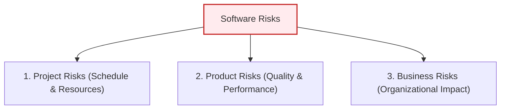
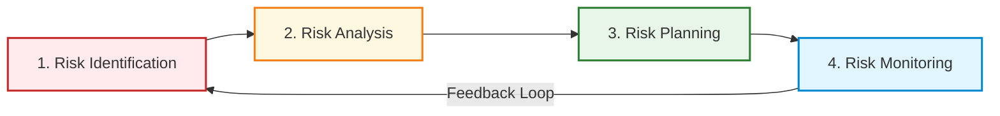

# Risk Management in Software Projects
*(Based on Ian Sommerville, "Software Engineering" - Chapter 22)*

## 1. Introduction to Risk Management
Risk management is one of the most critical responsibilities of a software project manager. A **risk** is defined as an undesirable event that has some probability of occurring and, if it does occur, will negatively impact the project schedule, cost, software quality, or the organization.

Risk management involves **anticipating** potential risks, understanding their potential impact, and taking proactive actions to either avoid them or minimize their disruption.

---

## 2. Classification of Risks

### 2.1 Classification by What They Affect
Sommerville classifies software risks into three primary categories based on their direct impact:

1.  **Project Risks:**
    *   *Definition:* Threaten the project schedule or resources.
    *   *Example:* An experienced system architect leaves the team. Recruiting and training a replacement takes time, delaying the software design phase.
2.  **Product Risks:**
    *   *Definition:* Threaten the quality, reliability, or performance of the software being developed.
    *   *Example:* A third-party database component fails to process transactions at the expected speed, slowing down the overall system performance.
3.  **Business Risks:**
    *   *Definition:* Threaten the organization developing or procuring the software.
    *   *Example:* A competitor releases a similar, cheaper software product before our project is completed, making our product economically unviable.

> [!NOTE]
> **Risk Overlap:** Risk categories often overlap. For instance, the loss of a key developer is a **Project Risk** (schedule delay), a **Product Risk** (the replacement may make more programming errors), and a **Business Risk** (the developer's reputation was key to winning new contracts).

---

## 3. The Risk Management Process
Risk management is an **iterative process** that runs continuously throughout the lifecycle of the project.

### 3.1 Stage 1: Risk Identification
This stage involves brainstorming and documenting all potential risks. Teams often use checklists based on historical data.

#### The Six Categories of Risks (Sommerville's Checklist):
1.  **Estimation Risks:** Errors in estimating resources, schedules, or sizes (e.g., underestimating the development time or defect repair rate).
2.  **Organizational Risks:** Issues arising from the corporate environment (e.g., company restructuring, budget cuts due to corporate financial issues).
3.  **People Risks:** Team-related problems (e.g., key staff illness, inability to recruit skilled engineers, lack of training).
4.  **Requirements Risks:** Customer-driven changes (e.g., major requirements changes requiring rework, customers failing to understand the impact of changes).
5.  **Technology Risks:** Issues with hardware/software platforms (e.g., database performance bottlenecks, reusable component faults).
6.  **Tools Risks:** Software development environment tools underperforming or failing to integrate.

---

### 3.2 Stage 2: Risk Analysis
In this stage, the project manager assesses the **probability** and **effects (seriousness)** of each identified risk using bands instead of exact numbers.

*   **Risk Probability Bands:** `Insignificant`, `Low`, `Moderate`, `High`, `Very High`.
*   **Risk Effect Bands:**
    *   `Catastrophic`: Threatens the survival of the project.
    *   `Serious`: Causes major schedule delays or performance issues.
    *   `Tolerable`: Delays can be absorbed within allowed contingency reserves.
    *   `Insignificant`: Negligible impact.

#### Example Risk Ranking Table (Sorted by Seriousness):
| Risk Event | Category | Probability | Effect |
| :--- | :--- | :--- | :--- |
| **Organizational budget cuts** | Organizational | Low | **Catastrophic** |
| **Unable to recruit skilled staff** | People | High | **Catastrophic** |
| **Key staff ill at critical times** | People | Moderate | **Serious** |
| **Faults in reusable components** | Technology | Moderate | **Serious** |
| **Major requirements changes** | Requirements | Moderate | **Serious** |
| **Underestimating development time** | Estimation | High | **Serious** |
| **Integration tools failure** | Tools | High | **Tolerable** |
| **Underestimating software size** | Estimation | High | **Tolerable** |

---

### 3.3 Stage 3: Risk Planning
The manager devises strategies to handle key risks (specifically those ranked *Catastrophic* or *Serious*). Strategies fall into three main categories:

1.  **Avoidance Strategies (Reduce Probability):**
    *   *Goal:* Take actions that make it less likely the risk will occur.
    *   *Example:* To avoid defects in reusable components, replace questionable open-source code with components of known commercial reliability.
2.  **Minimization Strategies (Reduce Impact):**
    *   *Goal:* Actions that reduce the damage if the risk occurs.
    *   *Example:* To handle staff illness, reorganize the team so that there is an overlap of responsibilities (cross-training) so members understand each other’s jobs.
3.  **Contingency Plans (Recovery):**
    *   *Goal:* Clear plans of action to execute if the worst happens.
    *   *Example:* If organizational budget cuts strike, prepare a briefing document showing the critical business value of the project to justify maintaining funding.

---

### 3.4 Stage 4: Risk Monitoring
Risk monitoring is the continuous assessment of risks to see if their probability or impact has changed. Managers use specific **indicators** to track risks:

| Risk Type | Potential Indicators / Clues |
| :--- | :--- |
| **Estimation** | Failure to meet intermediate milestones; failure to clear reported defects. |
| **Organizational** | Organizational gossip; lack of action or direction by senior management. |
| **People** | Poor staff morale; poor relationships among team members; high staff turnover. |
| **Requirements** | High frequency of requirements change requests; increasing customer complaints. |
| **Technology** | Late delivery of hardware/support software; high number of technology failures. |
| **Tools** | Reluctance by developers to use tools; complaints about tool performance. |

---

## 4. Risk Management in Agile Development
In Agile development (e.g., Scrum, Kanban), risk management is integrated and **less formal**:
*   **Agile Advantages:** The iterative nature of Agile automatically mitigates **Requirements Risk** (since requirements are re-evaluated every sprint) and **Estimation Risk** (since velocity is tracked dynamically).
*   **Agile Disadvantages:** Because Agile relies heavily on face-to-face communication and features "lightweight" documentation, it is highly sensitive to **People Risk (Staff Turnover)**. If a key developer leaves an Agile team, the lack of written documentation makes it very difficult to maintain continuity and progress.
