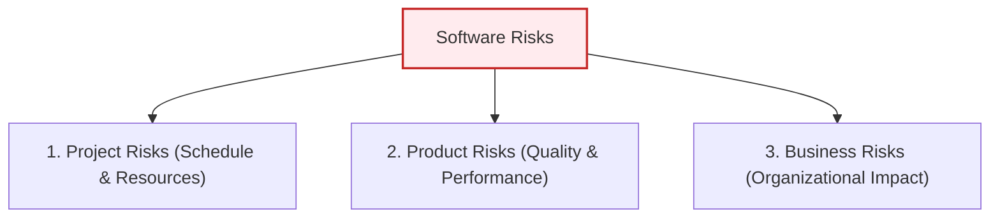
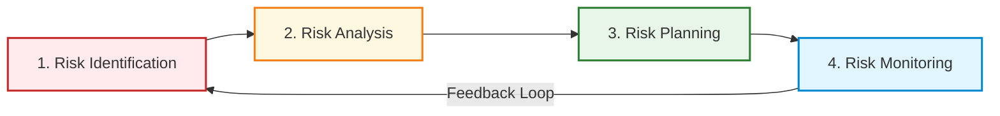

# Risk Management in Software Projects

_(Based on Ian Sommerville, "Software Engineering" - Chapter 22)_

## 1. Introduction to Risk Management

Risk management is one of the most critical responsibilities of a software project manager.
A **risk** is defined as an undesirable event that has some probability of occurring and, if it does occur, will negatively impact the project schedule, cost, software quality, or the organization.

Risk management involves **anticipating** potential risks, understanding their potential impact, and taking proactive actions to either avoid them or minimize their disruption.

---

## 2. Classification of Risks

### 2.1 Classification by What They Affect

Sommerville classifies software risks into three primary categories based on their direct impact:

1.  **Project Risks:**
    - _Definition:_ Threaten the project schedule or resources.
    - _Example:_ An experienced system architect leaves the team. Recruiting and training a replacement takes time, delaying the software design phase.
2.  **Product Risks:**
    - _Definition:_ Threaten the quality, reliability, or performance of the software being developed.
    - _Example:_ Bugs, Poor performance,Low reliability
3.  **Business Risks:**
    - _Definition:_ Threaten the organization developing or procuring the software.
    - _Example:_ Competitor launches a better product, Customer cancels the contract, Market demand decreases.

---

## 3. The Risk Management Process

Risk management is an **iterative process** that runs continuously throughout the lifecycle of the project.

### 3.1 Stage 1: Risk Identification

This stage involves brainstorming and documenting all potential risks. Teams often use checklists based on historical data.

#### The Six Categories of Risks (Sommerville's Checklist):

1.  **Estimation Risks:** Errors in estimating resources, schedules, or sizes (e.g., underestimating the development time or defect repair rate).
2.  **Organizational Risks:** Issues arising from the company environment (e.g., company restructuring, budget cuts due to corporate financial issues).
3.  **People Risks:** Team-related problems (e.g., key staff illness, inability to recruit skilled engineers, lack of training).
4.  **Requirements Risks:** Customer-driven changes (e.g., major requirements changes requiring rework, customers failing to understand the impact of changes).
5.  **Technology Risks:** Issues with hardware/software platforms (e.g., database performance bottlenecks, reusable component faults).
6.  **Tools Risks:** Software development environment tools underperforming or failing to integrate.

---

### 3.2 Stage 2: Risk Analysis

In this stage, the project manager assesses the **probability** and **effects (seriousness)** of each identified risk using bands instead of exact numbers.

- **Risk Probability Bands:** `Insignificant`, `Low`, `Moderate`, `High`, `Very High`.
- **Risk Effect Bands:**
  - `Catastrophic`: Threatens the survival of the project.
  - `Serious`: Causes major schedule delays or performance issues.
  - `Tolerable`: Delays can be absorbed within allowed contingency reserves.
  - `Insignificant`: Negligible impact.

---

### 3.3 Stage 3: Risk Planning

The manager devises strategies to handle major risks (specifically those ranked _Catastrophic_ or _Serious_). Strategies fall into three main categories:

1.  **Avoidance Strategies (Reduce Probability):**
    - _Goal:_ Take action to prevent the risk from happening.
    - _Example:_ Use reliable, well-tested components to avoid software bugs.

2.  **Minimization Strategies (Reduce Impact):**
    - _Goal:_ Reduce the damage if the risk actually occurs.
    - _Example:_ Cross-train team members so work continues if someone falls ill.

3.  **Contingency Plans (Recovery Plan):**
    - _Goal:_ Prepare an action plan to recover if the worst happens.
    - _Example:_ Prepare a backup plan or budget justification if funds are cut.

---

### 3.4 Stage 4: Risk Monitoring

Risk monitoring is the continuous tracking of risks to check if their probability or impact has changed using early warning indicators:

| Risk Type          | Early Warning Indicators                      |
| :----------------- | :-------------------------------------------- |
| **Estimation**     | Missing deadlines, slow defect fixing         |
| **Organizational** | Company rumors, lack of management direction  |
| **People**         | Low team morale, high staff turnover          |
| **Requirements**   | Frequent change requests, customer complaints |
| **Technology**     | Hardware delays, frequent system crashes      |
| **Tools**          | Team complaints about slow or complex tools   |

---

## 4. Risk Management in Agile Development

In Agile, risk management is informal and built directly into daily practices:

- **Advantages (Lowers Risk):**
  - **Requirements Risk:** Reduced because requirements are reviewed and updated every Sprint.
  - **Estimation Risk:** Reduced because progress is tracked dynamically using team velocity.

- **Disadvantages (Increases Risk):**
  - **People Risk (Staff Turnover):** High risk because Agile uses minimal documentation. If a key developer leaves, critical knowledge is easily lost.
