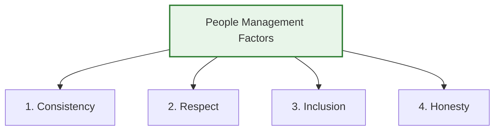
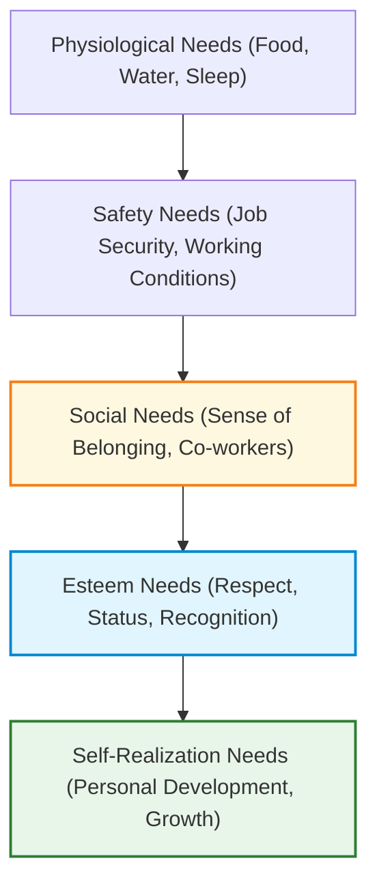

# Managing People in Software Projects

## 1. Introduction: People as the Greatest Asset

The individuals working in a software organization are its greatest assets. Recruiting and retaining talented staff is expensive, and a software project manager's success depends heavily on keeping engineers as productive and motivated as possible.

People Management is the process of motivating, supporting, and managing team members so that they work efficiently and achieve the project's goals.

---

## 2. Four Critical People Management Factors

Project managers must establish a strong relationship with their team by adhering to four fundamental principles:

1.  **Consistency:**
    - Treat every team member fairly.
    - No favoritism.
    - Everyone should receive equal opportunities and responsibilities based on their work.

2.  **Respect:**
    - Every person has different skills and strengths.
    - A manager should respect these differences and assign suitable work.
    - Ex: Database Expert → Database Design

3.  **Inclusion:**
    - Ensure that all viewpoints are listened to and taken into account during discussions, including those of the least experienced team members.
4.  **Honesty:**
    - Be truthful about project progress.
    - Accept mistakes.
    - If you don't know something, ask the expert instead of pretending.

---

## 3. Motivating People: Maslow’s Hierarchy of Needs

According to Abraham Maslow’s motivation theory, human behavior is driven by satisfying a hierarchy of needs. Lower-level physiological and safety needs must be satisfied before individuals become motivated by higher-level needs.

In modern software organizations, basic needs (physiological and safety) are typically met. Therefore, managers must focus on the top three levels:

- **Social Needs:**
  - _Approach:_ Provide social spaces (e.g., Google's offices) and arrange face-to-face team-building events early in projects, especially for remote or hybrid teams, to build relationships.
- **Esteem Needs:**
  - _Approach:_ Offer public recognition of achievements and ensure salaries match skills, experience, and market value.
- **Self-Realization Needs:**
  - _Approach:_ Delegate autonomy, assign demanding (but achievable) tasks, and offer training opportunities to learn new skills.

---

## 5. Personality Classifications & Motivation (Bass & Dunteman)

Bass and Dunteman classified software professionals into three dominant personality types based on what motivates them:

1. **Task-Oriented People:**
   - **Motivation:** Motivated by the work itself.
   - **Key Interests:** They enjoy coding, technical problem-solving, and software design.
   - **Work Preference:** Usually prefer working individually.

2. **Self-Oriented People:**
   - **Motivation:** Motivated by personal success and career progression.
   - **Key Goals:** They strive for promotions, higher salary, and recognition.
   - **Work Preference:** Usually work independently to achieve personal goals.

3. **Interaction-Oriented People:**
   - **Motivation:** Motivated by teamwork and the presence of co-workers.
   - **Key Interests:** They enjoy group discussions, meetings, collaboration, and helping others.
   - **Work Preference:** Thrive working in groups and collaborative environments.

## 6. The People Capability Maturity Model (P-CMM)

The **People Capability Maturity Model (P-CMM)** is a framework used to evaluate and improve how an organization manages, develops, and retains its employees.

### Purpose of P-CMM

It helps organizations:

- Improve employee skills and competencies.
- Develop internal talent and career growth.
- Standardize people management practices across teams.
- Increase overall organizational productivity.

> [!NOTE]
> **Scope:** P-CMM is mainly used in large, structured organizations rather than small companies or informal teams.
