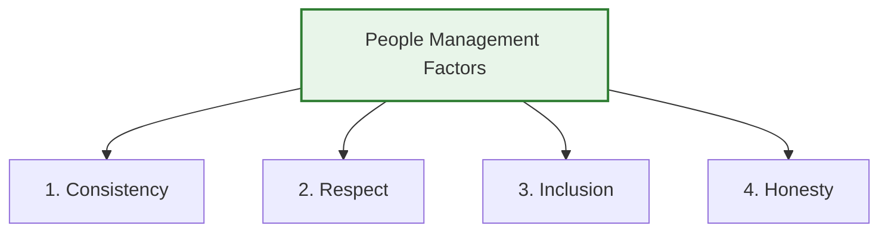
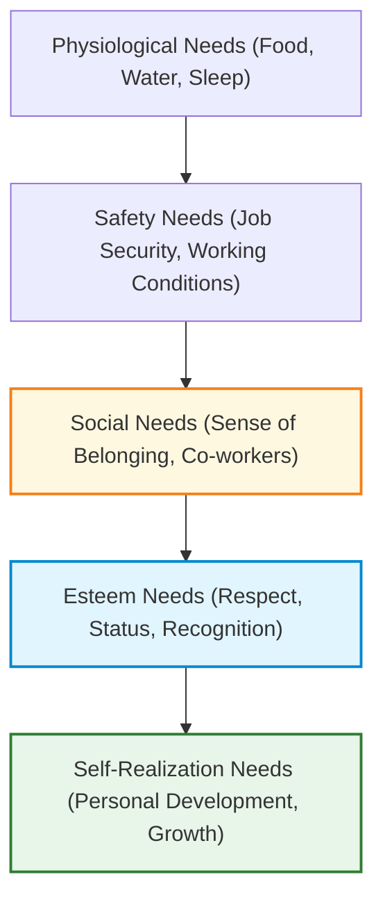

# Managing People in Software Projects
*(Based on Ian Sommerville, "Software Engineering" - Chapter 22)*

## 1. Introduction: People as the Greatest Asset
The individuals working in a software organization are its greatest assets. Recruiting and retaining talented staff is expensive, and a software project manager's success depends heavily on keeping engineers as productive and motivated as possible. 

Good management achieves productivity by showing **respect** for individuals and assigning responsibilities that match their skills and experience. Project managers must possess "soft skills" to lead and motivate teams effectively.

---

## 2. Four Critical People Management Factors
Project managers must establish a strong relationship with their team by adhering to four fundamental principles:

1.  **Consistency:** 
    *   Treat all team members in a comparable, fair manner. No member should feel that their contribution is undervalued compared to others.
2.  **Respect:** 
    *   Recognize that different people have different strengths and skills. Managers must respect these differences and provide opportunities for everyone to contribute.
3.  **Inclusion:** 
    *   Ensure that all viewpoints are listened to and taken into account during discussions, including those of the least experienced team members.
4.  **Honesty:** 
    *   Be completely open about project successes and failures. Managers must also be honest about the limits of their own technical knowledge and defer to specialists when necessary. Ignorance should never be covered up.

---

## 3. Motivating People: Maslow’s Hierarchy of Needs
According to Abraham Maslow’s motivation theory, human behavior is driven by satisfying a hierarchy of needs. Lower-level physiological and safety needs must be satisfied before individuals become motivated by higher-level needs.

In modern software organizations, basic needs (physiological and safety) are typically met. Therefore, managers must focus on the top three levels:

*   **Social Needs:**
    *   *Approach:* Provide social spaces (e.g., Google's offices) and arrange face-to-face team-building events early in projects, especially for remote or hybrid teams, to build relationships.
*   **Esteem Needs:**
    *   *Approach:* Offer public recognition of achievements and ensure salaries match skills, experience, and market value.
*   **Self-Realization Needs:**
    *   *Approach:* Delegate autonomy, assign demanding (but achievable) tasks, and offer training opportunities to learn new skills.

---

## 4. Case Study: Motivating a Demotivated Team Member (Alice & Dorothy)
*   **Context:** Alice is managing a team of six developers building assistive technology products.
*   **The Issue:** Dorothy, an expert in hardware interfacing, starts arriving late, her work quality declines, and she stops communicating.
*   **Root Cause:** Dorothy expected to work on hardware interfacing. However, the product direction shifted to pure software programming (writing C code). Dorothy feared her hardware skills were stagnating, which would hurt her future career prospects.
*   **Alice’s Solution:** Instead of firing Dorothy or ignoring the issue, Alice:
    1.  Addressed the issue immediately through informal, direct communication.
    2.  Framed the software experience as a positive career step to broaden Dorothy’s skill set.
    3.  Granted Dorothy more design autonomy.
    4.  Organized software engineering training courses to help Dorothy feel competent and develop new skills.

---

## 5. Psychological Personality Classifications (Bass & Dunteman)
A person’s personality type significantly influences what motivates them. Bass and Dunteman classified professional workers into three dominant types:

1.  **Task-Oriented People:**
    *   *Motivation:* The work itself. In software, these engineers are driven by the intellectual challenge of coding, designing, and solving complex technical problems.
    *   *Preference:* Usually prefer to work individually.
2.  **Self-Oriented People:**
    *   *Motivation:* Personal success, recognition, and career progression. They view software development as a vehicle to achieve personal goals (e.g., getting a promotion or raise).
    *   *Preference:* Usually prefer to work individually.
3.  **Interaction-Oriented People:**
    *   *Motivation:* The presence and actions of co-workers. They enjoy collaboration, user interface design, and social communication.
    *   *Preference:* Thrive in group settings. (Studies show women are statistically more likely to fall into this category and are often highly effective communicators).

> [!TIP]
> **Personality Dynamism:** Dominant motivation types can shift. For instance, technical task-oriented staff who feel poorly compensated can become self-oriented. Conversely, a highly cohesive group dynamic can help self-oriented individuals become more interaction-oriented.

---

## 6. The People Capability Maturity Model (P-CMM)
*   **Definition:** A maturity framework for assessing how well large organizations manage staff development and optimize people management processes.
*   **Scope:** Best suited to large, structured organizations rather than small, informal companies.
