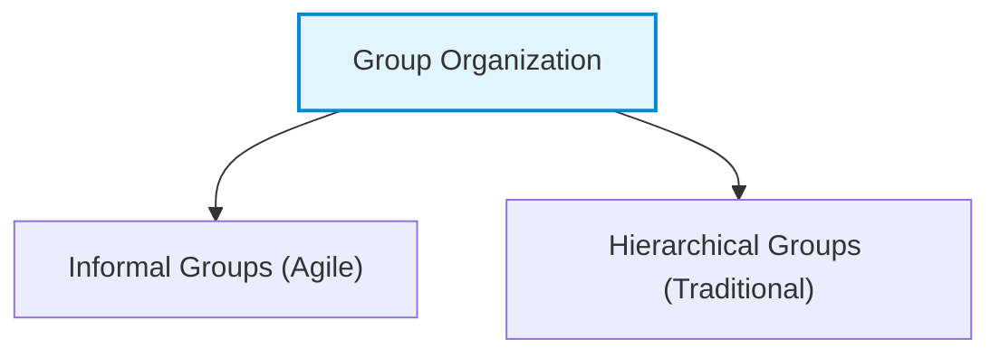

# Teamwork in Software Projects

Large software projects cannot be built by one person. They require a team of developers, testers, designers, and managers working together.

The success of a software project depends on good teamwork, communication, and cooperation

## 1. Introduction: Team Size and Dynamics

The size of a software team directly affects communication efficiency and overall productivity.

- **Ideal Team Size:** 4–6 members
- **Maximum Team Size:** 12 members

### Why Small Teams?

- Better communication.
- Faster decisions.
- Stronger relationships
- Easier coordination

---

## 2. Group Cohesiveness: Definition, Benefits, and Building

Group cohesiveness means team members work together, trust each other, and place the team's success above individual success.

### 2.1 Benefits of Group Cohesiveness

1.  **Better Quality** The team sets its own quality standards. Since everyone agrees, everyone follows them.
2.  **Mutual Learning & Support:** Team members work closely and learn from each other. Ignorance is not punished; instead, mutual learning minimizes inhibitions.
3.  **Knowledge Sharing & Continuity:** If a member leaves, others can easily take over their tasks, maintaining project momentum and reducing key-person dependency.
4.  **Collective Improvement:** Cohesive teams practice collective ownership. They collaborate to refactor code and fix bugs, regardless of who originally wrote the code.

---

## 3. Group Composition: Selecting the Right Mix

Managers must balance technical skills and complementary personality types.
Selecting a team solely based on technical ability can lead to clashing egos ("competing engineers" who rewrite each other's code).

### 3.1 Balancing Personality Types (Bass & Dunteman)

An ideal team features a mix of complementary personalities to drive different aspects of the project:

- **Task-Oriented Members:** Provide technical strength and solve the core problems.
- **Self-Oriented Members:** Drive the project forward to meet deadlines and achieve successful delivery.
- **Interaction-Oriented Members:** Act as social facilitators, detect early interpersonal conflicts, and keep team communication open.

---

## 4. Group Organization Styles

The way a group is organized determines technical leadership, decision-making, and communication flow.

### 4.1 Informal Groups (Agile Style)

- **Structure:** Flat structure. The team leader is a participant in development, and decisions are made by consensus.
- **Agile Approach:** Agile teams are always informal. Schedule and work allocation decisions are devolved directly to team members.
- **Pros:** Highly effective for experienced, competent teams. Promotes high cohesion, speed, and shared responsibility.
- **Cons:** Not suitable for inexperienced teams. Lack of leadership may cause confusion.

### 4.2 Hierarchical Groups (Traditional Style)

- **Structure:** Top-down structure. The leader has formal authority, makes the decisions, and directs the work.
- **Pros:** Fast decision-making; works well for highly structured, predictable, and modular systems (e.g., military software).
- **Cons:** Less communication, Junior members' ideas may be ignored, Slower response to changes.

---

## 5. Group Communications

Good communication is essential for project success.

### 5.1 Factors Affecting Communication

1.  **Group Size ($n$):**
    - The number of one-way communication links grows quadratically: **$Link Count = n \times (n - 1)$**.
    - For a team of 8, there are 56 pathways, making complete communication difficult. Managers and senior staff tend to dominate, intimidating junior members.
2.  **Group Structure:** Informal groups communicate much better than hierarchical ones. Hierarchy tends to restrict communication to up-and-down channels, causing silos between subsystems.
3.  **Group Composition:** Balanced personalities improve teamwork, Conflicting personalities reduce communication.
4.  **Physical Environment:** Standard open-plan offices cause distractions. The best environment is a mix of private offices (for high-concentration programming) and shared spaces (for collaboration).
5.  **Communication Channels:** Formal documents and long emails are inefficient. Effective communication is two-way and informal (e.g., discussions over coffee, teleconferences, and collaborative wikis/blogs for remote teams).
