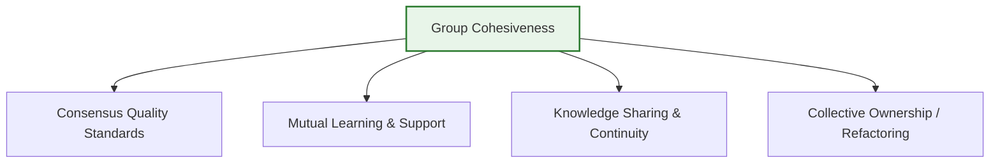
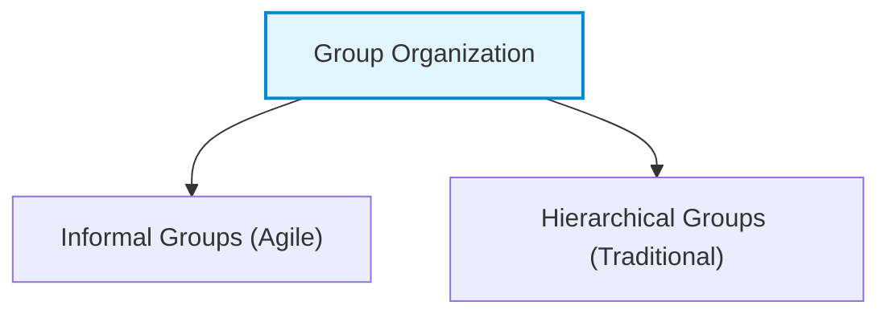

# Teamwork in Software Projects
*(Based on Ian Sommerville, "Software Engineering" - Chapter 22)*

## 1. Introduction: Team Size and Dynamics
Most professional software is developed by teams rather than individuals. For large systems, teams are split into smaller groups to prevent communication bottlenecks.
*   **Optimal Group Size:** 
    *   The ideal size for a software engineering group is **4 to 6 members**.
    *   A group should **never exceed 12 members**.
    *   *Why?* Small groups minimize communication overhead, allow everyone to know each other, and make consensus-based meetings easier to manage.

---

## 2. Group Cohesiveness: Definition, Benefits, and Building
In a **cohesive group**, members view the group's success as more important than their individual goals. Cohesive teams are loyal to one another, share goals, and protect the team from outside interference, making them highly robust.

### 2.1 Benefits of Group Cohesiveness
1.  **Consensus Quality Standards:** The group establishes its own quality standards. Because these are agreed upon by consensus, members are far more likely to follow them compared to externally imposed rules.
2.  **Mutual Learning & Support:** Team members work closely and learn from each other. Ignorance is not punished; instead, mutual learning minimizes inhibitions.
3.  **Knowledge Sharing & Continuity:** If a member leaves, others can easily take over their tasks, maintaining project momentum and reducing key-person dependency.
4.  **Collective Improvement:** Cohesive teams practice collective ownership. They collaborate to refactor code and fix bugs, regardless of who originally wrote the code.

### 2.2 Case Study: Fostering Team Spirit (Alice's Team)
Alice promotes cohesiveness through targeted activities:
*   **Inclusive Decision Making:** Involving team members in product specification (e.g., asking them to interview their own elderly family members to brainstorm ideas).
*   **Social Integration:** Organizing monthly informal team lunches where she shares organizational news, and members discuss their progress.
*   **Off-site "Away Days":** Setting up two-day offsite technology-updating sessions. Team members present new tech topics to their peers, combining learning with social interaction.

---

## 3. Group Composition: Selecting the Right Mix
Managers must balance technical skills and complementary personality types. Selecting a team solely based on technical ability can lead to clashing egos ("competing engineers" who rewrite each other's code).

### 3.1 Balancing Personality Types (Bass & Dunteman)
An ideal team features a mix of complementary personalities to drive different aspects of the project:
*   **Task-Oriented Members:** Provide technical strength and solve the core problems.
*   **Self-Oriented Members:** Drive the project forward to meet deadlines and achieve successful delivery.
*   **Interaction-Oriented Members:** Act as social facilitators, detect early interpersonal conflicts, and keep team communication open.

#### Alice's Group Composition Case Study:
*   *Alice:* Self-oriented (manager driving project success for promotion).
*   *Brian, Fiona, Fred:* Task-oriented (technical developers).
*   *Chun, Ed, Hassan:* Interaction-oriented (facilitating group communication).
*   *Dorothy:* Self-oriented (hardware engineer, whose mismatch in tasks caused a motivation drop).

---

## 4. Group Organization Styles
The way a group is organized determines technical leadership, decision-making, and communication flow.

### 4.1 Informal Groups (Agile Style)
*   **Structure:** Flat structure. The team leader is a participant in development, and decisions are made by consensus.
*   **Agile Approach:** Agile teams are always informal. Schedule and work allocation decisions are devolved directly to team members.
*   **Pros:** Highly effective for experienced, competent teams. Promotes high cohesion, speed, and shared responsibility.
*   **Cons:** Hindrance if the team is inexperienced, as a lack of direction can lead to zero coordination and project failure.

### 4.2 Hierarchical Groups (Traditional Style)
*   **Structure:** Top-down structure. The leader has formal authority, makes the decisions, and directs the work.
*   **Pros:** Fast decision-making; works well for highly structured, predictable, and modular systems (e.g., military software).
*   **Cons:** Fails for complex software engineering because:
    1.  Software changes require cross-level negotiation, which hierarchy slows down.
    2.  Junior staff often understand modern technologies better than senior managers, but top-down communication ignores their insights, causing frustration.

---

## 5. Group Communications
Effective communication is essential for tracking progress, sharing design updates, and strengthening team relationships.

### 5.1 Factors Affecting Communication
1.  **Group Size ($n$):** 
    *   The number of one-way communication links grows quadratically: **$Link Count = n \times (n - 1)$**.
    *   For a team of 8, there are 56 pathways, making complete communication difficult. Managers and senior staff tend to dominate, intimidating junior members.
2.  **Group Structure:** Informal groups communicate much better than hierarchical ones. Hierarchy tends to restrict communication to up-and-down channels, causing silos between subsystems.
3.  **Group Composition:** Clashing personality types inhibit communication. Mixed-sex groups generally communicate better than single-sex groups, with women often acting as interaction controllers.
4.  **Physical Environment:** Standard open-plan offices cause distractions. The best environment is a mix of private offices (for high-concentration programming) and shared spaces (for collaboration).
5.  **Communication Channels:** Formal documents and long emails are inefficient. Effective communication is two-way and informal (e.g., discussions over coffee, teleconferences, and collaborative wikis/blogs for remote teams).
