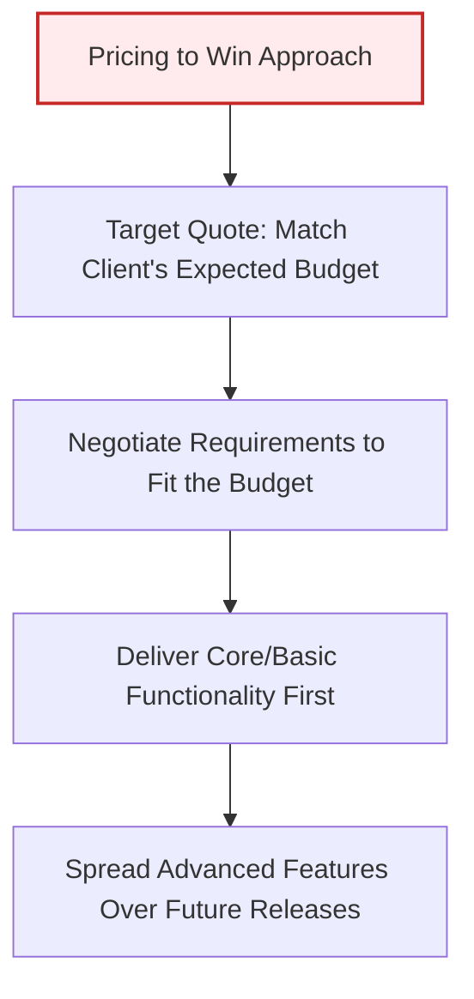

# Project Planning: Software Pricing
*(Based on Ian Sommerville, "Software Engineering" - Chapter 23)*

## 1. Introduction: Pricing in Practice vs. Theory
In theory, the price of a software system developed for a customer is simple:
$$\text{Price} = \text{Development Cost} + \text{Desired Profit}$$

In practice, however, the relationship between development cost and the price quoted to a customer is highly complex. Calculations must take into account broader organizational, economic, political, and business factors.

### 1.1 Pricing Scenario (PharmaSoft Case Study)
*   **The Situation:** PharmaSoft is a small company with 10 engineers. It has just finished a project and only has work for 5 engineers. However, it is preparing to bid for a massive, highly profitable 30 person-year contract starting in 12 months.
*   **The Opportunity:** A short-term project arises requiring 6 people for 10 months. The actual cost (including overheads) is estimated at $1.2 million.
*   **The Strategy:** PharmaSoft bids a low price of $0.8 million. 
*   **The Rationale:** Although it loses $400,000 on this project, the discount allows it to retain its specialist staff during the 12-month gap, ensuring it has the capacity to win and execute the major future contract.

---

## 2. Factors Affecting Software Pricing
Project managers must evaluate five core non-technical factors when calculating the quoted price for a system:

| Factor | Description & Pricing Impact |
| :--- | :--- |
| **1. Contractual Terms** | If the customer allows the developer to retain ownership of the source code and reuse it in other products, the developer may reduce the price because of the code's long-term commercial value. |
| **2. Cost Estimate Uncertainty** | If the team is unsure of its cost estimate (e.g., due to unfamiliar technology), the manager will increase the price by adding a contingency buffer to absorb unexpected costs. |
| **3. Financial Health** | A company experiencing financial difficulties may quote a break-even or loss-making price to win a contract. Maintaining cash flow and keeping staff employed is more important than profit when trying to prevent bankruptcy. |
| **4. Market Opportunity** | A developer may quote a very low price to break into a new market segment, gain domain experience, or build a reputation. Low short-term profits are traded for high long-term returns. |
| **5. Requirements Volatility** | If requirements are highly volatile, the developer may bid a low price to win the contract, planning to charge high profit-margin fees later for every requirements change request. |

---

## 3. The "Pricing to Win" Strategy
**Pricing to win** is an approach where a company estimates the maximum budget the customer expects to pay and sets their bid price to match that expectation, rather than basing it on development cost estimates.

### 3.1 Advantages of Pricing to Win
Although it may appear unbusinesslike or controversial, "pricing to win" offers mutual benefits to both buyers and developers:
1.  **Cost is the Fixed Factor:** In many projects, the budget is fixed while the requirements are flexible. The buyer and seller negotiate functionality so that the project remains within budget.
2.  **Prevents Scope Creep:** Requirements that are difficult to implement and extremely expensive are negotiated out of the initial scope.
3.  **Promotes Software Reuse:** To stay within the budget constraint, developers are forced to reuse existing libraries and components.
4.  **Phased Spending:** The client can spread costs across multiple fiscal years by releasing the software in incremental versions, budgeting for additional features later.

### 3.2 Case Study: Fuel Delivery System (OilSoft)
*   OilSoft bids for a contract to build a fuel scheduling system for an oil company.
*   There is no detailed requirements document. OilSoft estimates that a price of $900,000 is competitive and fits the client's budget.
*   After winning the contract, OilSoft negotiates the detailed system specification with the client so that only the essential core scheduling functionality is built for $900,000. Less critical features are postponed to future paid updates.
