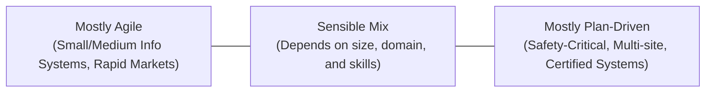

# Plan-Driven Development

_(Based on Ian Sommerville, "Software Engineering" - Chapter 23)_

## 1. Introduction: What is Plan-Driven Development?

Plan-Driven Development is a traditional software development approach in which the entire project is planned in detail before development begins. A comprehensive project plan is prepared to guide project execution, monitoring, and control.

A comprehensive project plan is created to record:

- The work to be done (tasks and activities).
- Who is responsible for each task.
- The development schedule (deadlines, milestones).
- The work products (deliverables).

Project managers use this plan as a key tool for decision-making and as a baseline to measure project progress.

Advantages

- Identifies risks and dependencies early.
- Improves resource allocation.
- Provides better project control and monitoring.

Disadvantages

- Difficult to accommodate changing requirements.
- Early planning assumptions may become invalid, resulting in rework.

### 1.1 The Plan-Driven vs. Agile Balance

| Plan-Driven                      | Agile                              |
| -------------------------------- | ---------------------------------- |
| Planning first                   | Planning throughout development    |
| Detailed documentation           | Minimal documentation              |
| Changes are difficult            | Changes are easy                   |
| Suitable for stable requirements | Suitable for changing requirements |

#### Finding the Right Mix:

---

## 2. Structure of a Project Plan

The details of a project plan vary, but it typically contains the following seven sections:

1.  **Introduction:** Describes the project objectives and defines constraints (e.g., budget, delivery deadline) affecting project management.
2.  **Project Organization:** Outlines how the development team is organized, the people involved, and their specific roles.
3.  **Risk Analysis:** Identifies potential project risks, their probabilities, and mitigation/reduction strategies.
4.  **Hardware and Software Resource Requirements:** Specifies the required hardware and tools, purchase schedules, and delivery dates.
5.  **Work Breakdown:** Breaks the project into individual activities, specifying inputs and outputs for each task.
6.  **Project Schedule:** Lists dependencies between activities, milestones, and resource allocation.
7.  **Monitoring and Reporting Mechanisms:** Defines which progress reports are produced, when they are due, and the monitoring mechanisms used.

### 2.1 Supplementary Project Plans

In addition to the main project plan, managers of large, complex systems develop specialized supplementary plans:

| Supplement Plan                   | Description                                                                                                                   |
| :-------------------------------- | :---------------------------------------------------------------------------------------------------------------------------- |
| **Configuration Management Plan** | Outlines version control procedures, codeline structures, and change-control processes.                                       |
| **Deployment Plan**               | Describes how the system (hardware and software) will be installed at the customer's site, including data migration policies. |
| **Maintenance Plan**              | Estimates long-term maintenance requirements, team sizes, and projected support costs.                                        |
| **Quality Plan**                  | Defines the quality standards, reviews, audits, and procedures the team must follow.                                          |
| **Validation Plan**               | Outlines the testing approach, resources, tools, and schedule for system validation.                                          |

---

## 3. The Project Planning Process

Project planning is an iterative loop. It starts with an initial plan during project startup and is revised throughout the development lifecycle to reflect schedule, requirements, and risk changes.

### 3.1 Workflow of the Planning Process

The planning process starts by identifying constraints, assessing risks, and defining milestones and deliverables:

| Milestone            | Deliverable               |
| -------------------- | ------------------------- |
| Progress checkpoint  | Product given to customer |
| Internal             | External                  |
| No customer delivery | Customer receives it      |

The planning workflow is illustrated in the diagram below:

### 3.2 Handling Deviations and Slippages

A slippage means the project is behind schedule.

- **Pessimistic Scheduling:** Managers should make realistic, pessimistic assumptions rather than optimistic ones. Delays always occur; plans must include contingency buffers to absorb them.
- **Minor Slippages:** Progress is reviewed every 2–3 weeks. Discrepancies are adjusted in the plan.
- **Serious Slippages / Problems:**
  1.  Initiate risk mitigation actions.
  2.  Re-plan the project
  3.  Renegotiate schedule, budget, or features with the customer if needed.
- **Project Cancellation:** A project may be cancelled if:
  - No feasible technical solution exists.
  - The customer's business goals have changed.
