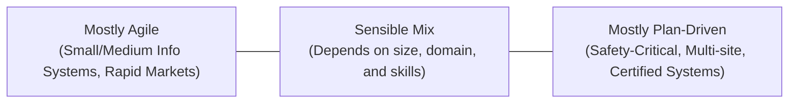
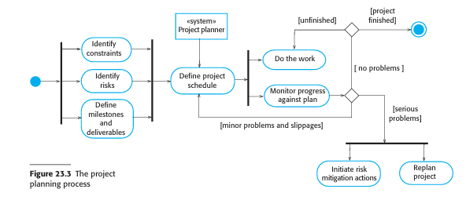

# Plan-Driven Development
*(Based on Ian Sommerville, "Software Engineering" - Chapter 23)*

## 1. Introduction: What is Plan-Driven Development?
**Plan-driven (or plan-based) development** is a traditional software engineering management approach where the development process is planned out in exhaustive detail before work begins. 

A comprehensive project plan is created to record:
*   The work to be done (tasks and activities).
*   Who is responsible for each task.
*   The development schedule (deadlines, milestones).
*   The work products (deliverables).

Project managers use this plan as a key tool for decision-making and as a baseline to measure project progress.

### 1.1 The Plan-Driven vs. Agile Balance
While Agile projects delay planning decisions to avoid early locking, plan-driven development resolves constraints and dependencies up-front:

*   **Pros of Plan-Driven:** Discovers potential issues, resource clashes, and team dependencies *before* the project starts, allowing organizations to allocate resources (staff, office space, other projects) effectively.
*   **Cons of Plan-Driven:** High risk of unnecessary rework. Early planning assumptions often turn out to be wrong because requirements, technologies, and business environments change during development.

#### Finding the Right Mix:

---

## 2. Structure of a Project Plan
The details of a project plan vary, but it typically contains the following seven sections:

1.  **Introduction:** Describes the project objectives and defines constraints (e.g., budget, delivery deadline) affecting project management.
2.  **Project Organization:** Outlines how the development team is organized, the people involved, and their specific roles.
3.  **Risk Analysis:** Identifies potential project risks, their probabilities, and mitigation/reduction strategies.
4.  **Hardware and Software Resource Requirements:** Specifies the required hardware and tools, purchase schedules, and delivery dates.
5.  **Work Breakdown:** Breaks the project into individual activities, specifying inputs and outputs for each task.
6.  **Project Schedule:** Lists dependencies between activities, milestones, and resource allocation.
7.  **Monitoring and Reporting Mechanisms:** Defines which progress reports are produced, when they are due, and the monitoring mechanisms used.

### 2.1 Supplementary Project Plans
In addition to the main project plan, managers of large, complex systems develop specialized supplementary plans:

| Supplement Plan | Description |
| :--- | :--- |
| **Configuration Management Plan** | Outlines version control procedures, codeline structures, and change-control processes. |
| **Deployment Plan** | Describes how the system (hardware and software) will be installed at the customer's site, including data migration policies. |
| **Maintenance Plan** | Estimates long-term maintenance requirements, team sizes, and projected support costs. |
| **Quality Plan** | Defines the quality standards, reviews, audits, and procedures the team must follow. |
| **Validation Plan** | Outlines the testing approach, resources, tools, and schedule for system validation. |

---

## 3. The Project Planning Process
Project planning is an iterative loop. It starts with an initial plan during project startup and is revised throughout the development lifecycle to reflect schedule, requirements, and risk changes.

### 3.1 Workflow of the Planning Process
The planning process starts by identifying constraints, assessing risks, and defining milestones and deliverables:
*   **Milestone:** A point in the schedule used to assess progress (e.g., "Handover of design document"). Milestones have no customer delivery requirement.
*   **Deliverable:** A concrete work product delivered directly to the customer (e.g., "Requirements Specification document").

The planning workflow is illustrated in the diagram below:

### 3.2 Handling Deviations and Slippages
*   **Pessimistic Scheduling:** Managers should make realistic, pessimistic assumptions rather than optimistic ones. Delays always occur; plans must include contingency buffers to absorb them.
*   **Minor Slippages:** Progress is reviewed every 2–3 weeks. Discrepancies are adjusted in the plan.
*   **Serious Slippages / Problems:** 
    1.  Initiate risk mitigation actions.
    2.  Re-plan the project (which may require renegotiating budget, schedule, or features with the customer).
    3.  If renegotiation fails, hold a formal **technical review** to find alternative technical approaches.
*   **Project Cancellation:** If technical reviews show no viable path forward, or if the customer's business objectives shift during the years-long development cycle, management may decide to cancel the project.
