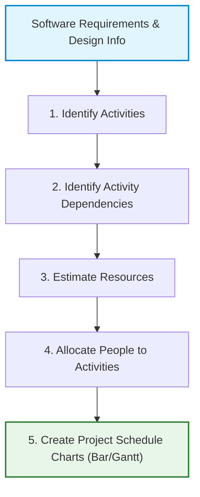

# Project Scheduling

_(Based on Ian Sommerville, "Software Engineering" - Chapter 23)_

## 1. Overview of Project Scheduling

Project Scheduling is the process of breaking down a software project into separate tasks, estimating the duration, effort, staff, and resources required for each task, and organizing them on a calendar timeline for execution and tracking.

Scheduling involves estimating:

- Duration.
- Effort.
- Staff.
- Resources.

An initial project schedule is created during the **project startup phase** and is continually refined throughout development.

---

## 2. Scheduling in Plan-Driven Projects

Plan-driven scheduling involves breaking the total work down into discrete, manageable tasks and estimating resource requirements:

### 2.1 Steps in the Project Scheduling Process

1. **Identify Activities:**
   - Divide the project into individual tasks or activities.
   - _Example:_ Requirements analysis, system design, coding, testing, and deployment.

2. **Identify Activity Dependencies:**
   - Determine the sequence and order of tasks.
   - Identify which tasks must finish before others start, and which can run in parallel.

3. **Estimate Resources for Activities:**
   - Estimate required resources for each task, including developers, hardware, software tools, and effort.

4. **Allocate People to Activities:**
   - Assign suitable team members to each activity based on their skills, experience, and availability.

5. **Create Project Charts:**
   - Prepare visual scheduling charts (such as Gantt Charts or Activity Networks) to track timelines, dependencies, and progress.

---

- **Task Duration Limits:** 1 week to 2 months (6–8 weeks max).
  - _Too small (< 1 wk):_ Excessive tracking overhead.
  - _Too large (> 8 wks):_ Hard to monitor; split into smaller subtasks.

- **Parallelism:** Tasks are carried out in parallel where possible. Managers must coordinate these parallel tracks to optimize the workforce and avoid critical dependency delays.
- **Contingency Estimation:**
  - Project schedules must assume things will go wrong (e.g., staff illness, hardware failure, component delays).
  - _Rule of Thumb:_ Estimate the schedule assuming nothing will go wrong, then add **30% to 50% extra contingency buffer** to cover anticipated and unanticipated problems.

---

## 3. Visualizing Project Schedules

Schedules are usually managed in software planning tools (like Microsoft Project or Basecamp) and visualized in three main formats:

### 3.1 Tabular representation

Tasks, estimated durations, efforts, and dependencies are recorded in a spreadsheet format:

### 3.2 Gantt / Calendar-Based Bar Charts

Bar charts show when tasks are scheduled to start and end relative to a calendar, along with milestones and staff assignments:

An Activity Network is a graphical representation of project activities and their dependencies. It shows the order in which tasks must be performed and identifies tasks that can be executed in parallel.

## 4. Key Scheduling Concepts

### 4.2 Effort vs. Duration

- **Effort < Duration:** People assigned to the task are not working full-time on it (e.g., they have other tasks or projects).
- **Effort > Duration:** Multiple team members are assigned to work on the task simultaneously to speed up completion.

---

## 5. Staff Allocation and Resource Bottlenecks

Managers map staff assignments to tasks using resource charts:

- **Part-time Work:** Shown on staff allocation charts using a diagonal line crossing the bar.
- **Specialist Bottlenecks:** Projects often share specialized staff (e.g., database performance experts or hardware interfaces specialists like Mary).
  - _Risk:_ If Project A is delayed while a specialist is working on it, Project B (which is waiting for the same specialist) will also face delays because the specialist is unavailable.
- **Staff Reassignment Delays:** If Task T is delayed, the staff allocated to it might be temporarily assigned to Work W on another project. When Task T is ready to resume, those developers cannot be immediately pulled back until they finish Work W, resulting in a compounding delay cascade.
