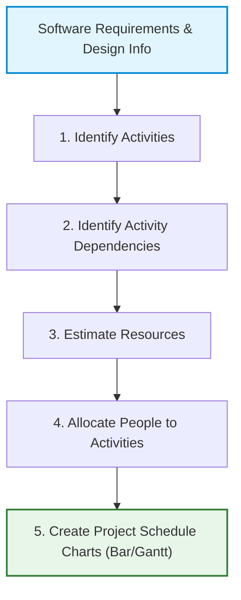
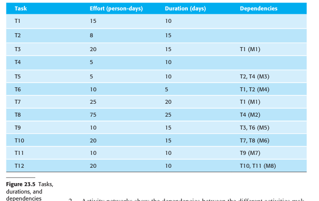
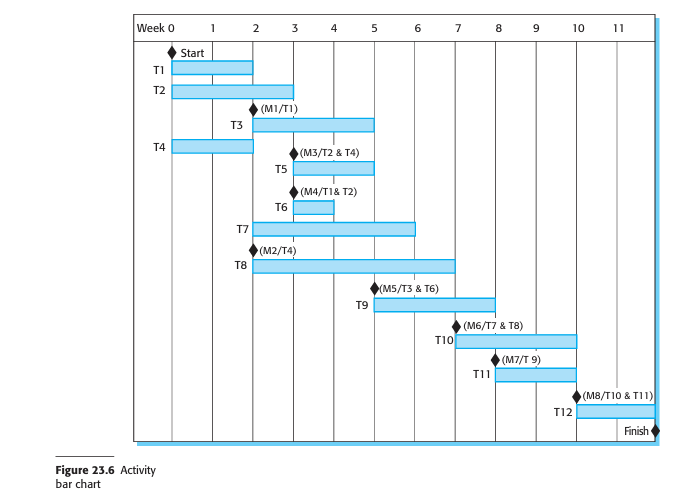
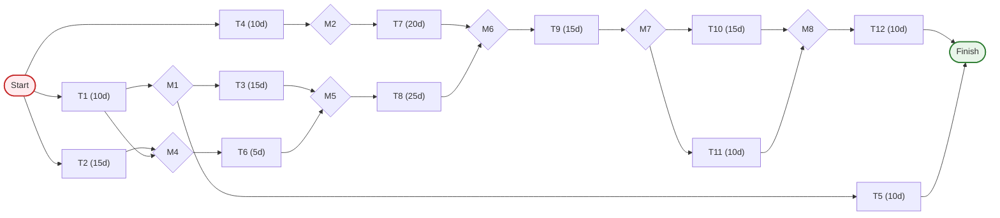
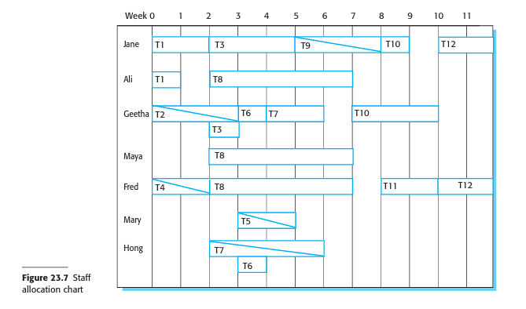

# Project Scheduling
*(Based on Ian Sommerville, "Software Engineering" - Chapter 23)*

## 1. Overview of Project Scheduling
**Project scheduling** is the process of deciding how the overall work in a project will be organized as separate tasks, and when and how these tasks will be executed. 

Scheduling involves estimating:
*   The calendar time needed to complete each task.
*   The effort required (measured in person-days or person-months).
*   Who will be assigned to work on each task.
*   The hardware and software resources required (e.g., system simulator time or specialist hardware access).

An initial project schedule is created during the **project startup phase** and is continually refined throughout development.

---

## 2. Scheduling in Plan-Driven Projects
Plan-driven scheduling involves breaking the total work down into discrete, manageable tasks and estimating resource requirements:

*   **Task Duration Limits:** 
    *   Tasks should normally last **at least 1 week** and **no longer than 2 months** (maximum 6 to 8 weeks).
    *   *Why?* Subdividing tasks into smaller units causes excessive administrative overhead in re-planning and tracking. Tasks longer than 8 weeks are too large to monitor effectively and should be split into smaller subtasks.
*   **Parallelism:** Tasks are carried out in parallel where possible. Managers must coordinate these parallel tracks to optimize the workforce and avoid critical dependency delays.
*   **Contingency Estimation:** 
    *   Project schedules must assume things will go wrong (e.g., staff illness, hardware failure, component delays).
    *   *Rule of Thumb:* Estimate the schedule assuming nothing will go wrong, then add **30% to 50% extra contingency buffer** to cover anticipated and unanticipated problems.

---

## 3. Visualizing Project Schedules
Schedules are usually managed in software planning tools (like Microsoft Project or Basecamp) and visualized in three main formats:

### 3.1 Tabular representation
Tasks, estimated durations, efforts, and dependencies are recorded in a spreadsheet format:

### 3.2 Gantt / Calendar-Based Bar Charts
Bar charts show when tasks are scheduled to start and end relative to a calendar, along with milestones and staff assignments:

### 3.3 Activity Networks
Activity networks present the project schedule as a directed graph. They show which tasks can run in parallel and which must execute in sequence due to dependencies. The **critical path** is the longest sequence of dependent tasks, which defines the absolute minimum duration of the project.

Using the task table in Figure 23.5, we can visualize the Activity Network as follows:

---

## 4. Key Scheduling Concepts

### 4.1 Milestones vs. Deliverables
*   **Milestones:** 
    *   Logical endpoints of a project stage used to review progress.
    *   *Characteristic:* Internal to the project, documented by a brief internal progress report or email. They do not require a delivery to the customer (e.g., Milestone M3 marks the completion of T2 and T4).
*   **Deliverables:** 
    *   Substantial work products delivered directly to the customer.
    *   *Characteristic:* Defined in the contract, and used by the customer to assess project progress (e.g., a formal Requirements Specification document).

### 4.2 Effort vs. Duration
*   **Effort < Duration:** People assigned to the task are not working full-time on it (e.g., they have other tasks or projects).
*   **Effort > Duration:** Multiple team members are assigned to work on the task simultaneously to speed up completion.

---

## 5. Staff Allocation and Resource Bottlenecks
Managers map staff assignments to tasks using resource charts:

*   **Part-time Work:** Shown on staff allocation charts using a diagonal line crossing the bar.
*   **Specialist Bottlenecks:** Projects often share specialized staff (e.g., database performance experts or hardware interfaces specialists like Mary). 
    *   *Risk:* If Project A is delayed while a specialist is working on it, Project B (which is waiting for the same specialist) will also face delays because the specialist is unavailable.
*   **Staff Reassignment Delays:** If Task T is delayed, the staff allocated to it might be temporarily assigned to Work W on another project. When Task T is ready to resume, those developers cannot be immediately pulled back until they finish Work W, resulting in a compounding delay cascade.
